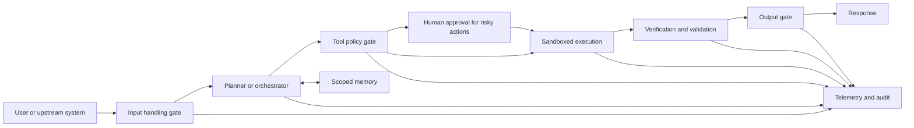
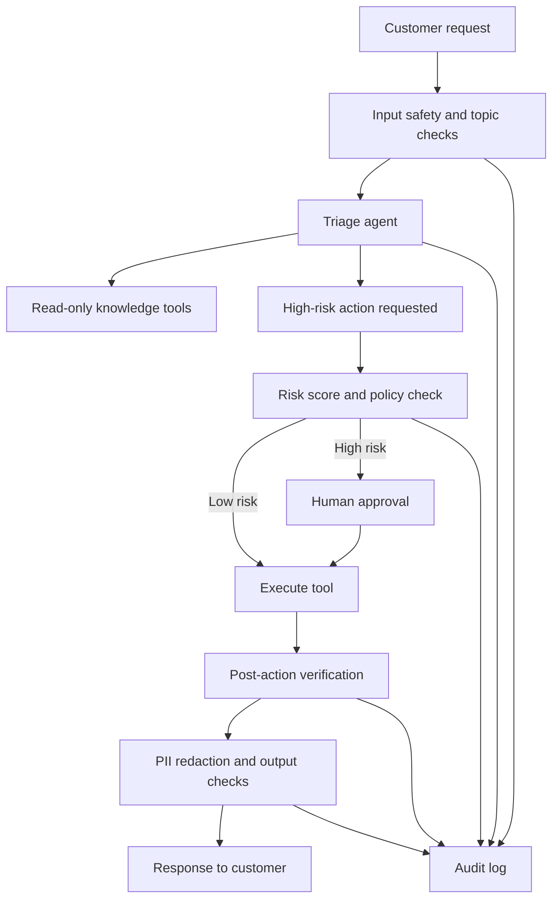
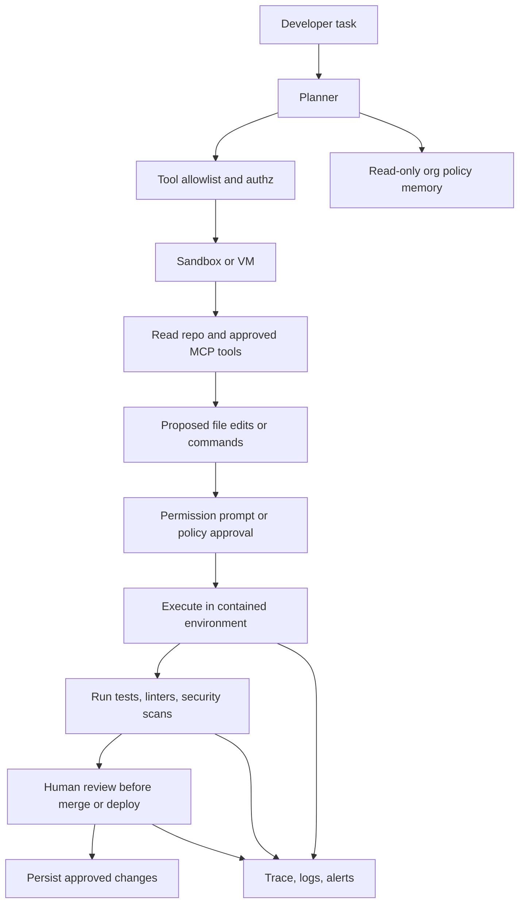

# Guardrailing Agentic Systems

## Executive Summary

Agent guardrailing is best understood as **defense in depth across the full agent loop** rather than as a single moderation filter placed in front of a model. Modern agent stacks typically combine a model, tools, orchestration, and state or memory; once those pieces are allowed to plan, call external systems, and persist information, the risk surface expands from “bad text” to **unsafe decisions, tool misuse, excessive autonomy, prompt injection, privacy leakage, and irreversible side effects**. Recent guidance from Google, OpenAI, Anthropic, NIST, and OWASP is remarkably consistent on this point: safe agents need layered controls, limited powers, observability, and human or policy supervision around risky actions. citeturn24view0turn24view3turn16search7turn23view0turn25view3turn2search3turn21search4

For practical engineering, the most useful mental model is to guardrail **seven lifecycle stages**: input handling, planning, tool use, action execution, output generation, memory, and monitoring. The corresponding control families are: input validation and topic gating; planning constraints and task scoping; authentication, authorization, and tool allow or deny policies; sandboxing and egress limits around side effects; output moderation and structured validation; scoped, read-only, or inspected memory; and end-to-end telemetry with approval interrupts, alerts, and rollback paths. Prompt injection and excessive agency are especially important for agents because untrusted content can influence planning, and plans can trigger real-world actions. citeturn21search9turn21search2turn26view1turn17view2turn18view2turn25view3turn22view1

The tool landscape splits into two broad groups. **General guardrail frameworks** such as NVIDIA NeMo Guardrails and Guardrails AI help developers add programmable input, dialog, execution, and output checks. **Managed security and policy services** such as Amazon Bedrock Guardrails and Check Point AI Guardrails provide hosted policy enforcement, screening, and dashboards. **Specialized components** such as Microsoft Presidio handle privacy-specific controls like PII detection and anonymization. No single tool fully covers agent security, runtime containment, memory governance, and regulatory workflow end to end; in practice, mature deployments combine at least one validation layer, one authorization layer, and one containment or monitoring layer. That last sentence is an analytical synthesis based on the documented scope of these tools. citeturn9search0turn10view0turn33view1turn12view0turn11view1turn25view3

The strongest implementation pattern today is therefore: **minimize what the agent can do; validate what it wants to do; contain what it is allowed to do; verify what it just did; and log everything needed to stop, explain, or recover the workflow**. For high-stakes settings such as healthcare, finance, robotics, and coding agents with shell or production access, human review and hard infrastructure boundaries remain essential because model-layer protections alone are probabilistic. citeturn24view0turn25view3turn17view2turn29view2turn28view2turn27view2turn30search11

## Components

In this report, I use **agentic guardrailing** to mean the controls that shape what an agent may **perceive, plan, call, execute, remember, and say**. That framing follows current agent architecture descriptions from OpenAI and LangChain, which center agents on models, tools, orchestration, and memory or state, and from Google’s secure-agent framework, which emphasizes human control, limited powers, and observability. citeturn2search5turn2search1turn18view0turn24view0

The diagram reflects the control points that appear most consistently across recent documentation and research: pre-model checks, policy-aware orchestration, tool-level controls, execution containment, post-action verification, output checks, memory governance, and observability. citeturn23view0turn17view2turn25view3turn18view2turn22view1

| Component | What it does | Lifecycle mapping | Architecture mapping |
|---|---|---|---|
| **Policy and threat model** | Defines what the agent is allowed to do, prohibited topics, risk tiers, and escalation rules. | Applies to **all stages**; especially planning, tool use, action execution, and monitoring. | Foundational for every architecture; most important in planner-executor, multi-agent, and autonomous-loop systems. citeturn2search3turn15search1turn24view0 |
| **Identity, authentication, and authorization** | Ensures the agent, user, and connected tools act only with approved identities and permissions. | Tool use, action execution, memory access, monitoring. | Critical for MCP-based tools, enterprise copilots, and multi-tenant systems. citeturn16search0turn16search9turn16search12 |
| **Input mediation** | Screens, sanitizes, classifies, or rejects unsafe, off-topic, or malicious inputs before major work begins. | Input handling; sometimes also before planning. | Common in chatbots, support triage, and public-facing assistants. citeturn23view0turn17view2turn21search9 |
| **Planning governance** | Constrains goals, decompositions, autonomy levels, and allowed plan templates. | Planning. | Most valuable in planner-executor, manager-worker, and long-running autonomous agents. citeturn24view0turn21search2turn28view2 |
| **Tool mediation** | Enforces allowlists, deny lists, schema validation, risk scoring, and approval requirements around tool calls. | Tool use. | Essential for tool-using single agents, coding agents, browser agents, and MCP-connected systems. citeturn17view2turn12view0turn27view2turn15search3 |
| **Execution containment** | Limits what executed tools can touch through sandboxes, VMs, filesystem boundaries, and network or credential isolation. | Action execution. | Essential for coding agents, robotics, browser agents, and any workflow with side effects. citeturn25view3turn25view2turn30search11 |
| **Verification and validation** | Checks whether retrieved facts, tool results, or actions satisfy business rules, grounding requirements, or test criteria. | Tool use, action execution, output generation. | Strong fit for RAG agents, analytics agents, developer agents, and regulated workflows. citeturn33view1turn22view1turn27view2 |
| **Output control** | Moderates or transforms final outputs for safety, policy, formatting, privacy, or brand consistency. | Output generation. | Common in customer support, external chatbots, and report-generating agents. citeturn23view0turn10view0turn33view1 |
| **Memory governance** | Scopes memory, controls write permissions, prevents cross-user leakage, and treats shared policy memory as read-only where needed. | Memory. | Especially important in multi-user assistants, long-running agents, and agents that learn over time. citeturn18view0turn18view2turn18view3 |
| **Observability and response** | Captures prompts, tool calls, approvals, outputs, model versions, and incidents so operators can detect drift, audit behavior, and recover. | Monitoring, plus every earlier stage. | Necessary everywhere; particularly important in finance, healthcare, enterprise coding, and autonomous workflows. citeturn22view1turn28view2turn32search13turn8view1 |

A useful architectural distinction is between **soft guardrails** and **hard guardrails**. Soft guardrails influence model behavior through prompts, classifiers, or moderation. Hard guardrails enforce external boundaries—permissions, sandboxes, egress controls, approval interrupts, or read-only memory—regardless of whether the model behaves perfectly. Recent work on secure agents and prompt-injection-resistant design argues that both are needed, and that hard separation between trusted control flow and untrusted data flow is especially promising for high-risk agents. citeturn25view3turn24view0turn34search0turn34search3

## Types

The table below focuses on the guardrail types you asked for and shows where they normally sit in an agent stack.

| Guardrail type | Purpose | Typical controls | Best placement |
|---|---|---|---|
| **Safety** | Blocks harmful, abusive, or exploit-seeking content and behaviors. | Moderation models, harm classifiers, jailbreak or prompt-attack detection. | Input handling, output generation, monitoring. citeturn33view1turn10view0turn12view0 |
| **Content and topic control** | Keeps the agent on-domain and prevents unwanted subject matter. | Relevance classifiers, denied-topic policies, topical rails. | Input handling, planning, output generation. citeturn23view0turn33view1turn9search0 |
| **Authorization and authentication** | Ensures only permitted users, agents, or services can access tools and data. | OAuth, API keys, scoped tokens, RBAC, per-tool permissions. | Tool use, action execution, memory access. citeturn16search0turn12view1turn32search14 |
| **Rate limits and resource bounds** | Prevents abuse, runaway loops, and denial-of-wallet or denial-of-service behavior. | Request quotas, token/time limits, concurrency caps, cost ceilings. | Input handling, planning loop, tool use, monitoring. OWASP explicitly treats “unbounded consumption” as a top LLM risk. citeturn21search1turn21search3 |
| **Tool access control** | Restricts which tools can be called and under what conditions. | Allowlists, deny lists, per-tool risk tiers, directory scope, read-only vs. write access. | Tool use. citeturn12view0turn17view2turn27view2 |
| **Sandboxing** | Reduces blast radius even if the model or a tool is compromised. | Containers, VMs, filesystem boundaries, egress controls, isolated credentials. | Action execution. citeturn25view3turn25view2 |
| **Verification and validation** | Checks correctness, grounding, or conformance before releasing output or committing state. | Rule engines, schema checks, contextual grounding, automated reasoning, tests, policy checks. | Tool use, action execution, output generation. citeturn33view1turn33view2turn22view1 |
| **Human in the loop** | Requires a person to approve risky or irreversible actions. | Approval interrupts, review queues, dual-control steps. | Action execution, sensitive memory writes, deployment steps. citeturn17view2turn17view3turn28view2 |
| **Audit and logging** | Makes decisions reviewable and incidents diagnosable. | Prompt/output logs, traces, tool logs, versioning, screening dashboards. | Monitoring, but should cover the full path. citeturn22view1turn32search13turn8view1turn10view2 |
| **Privacy and data handling** | Prevents PII leakage and enforces appropriate data use, scope, and retention. | PII detection, masking, anonymization, storage scoping, data minimization. | Input handling, output generation, memory, monitoring. citeturn11view0turn22view0turn22view3 |
| **Fail-safe and recovery** | Stops unsafe runs and provides degraded but safe operation. | Kill switches, rollback, read-only mode, alternate prompt, human escalation. | Monitoring and action execution; should also exist at planning boundaries. This is a design synthesis supported by incident-response and approval guidance. citeturn17view3turn22view1turn25view3 |

A practical takeaway is that the “type” of a guardrail is less important than **where it sits relative to side effects**. Input and output filters help, but they do not replace tool-level policy checks, execution containment, or memory controls—especially in agents that browse the web, execute commands, write code, or call business systems. OWASP’s “prompt injection” and “excessive agency” categories capture this shift from merely filtering content to constraining real-world capability. citeturn21search9turn21search2turn25view3

## Use Cases

**Customer support agents.** A mature support agent usually needs: off-topic or abuse filtering on inbound requests; identity-aware access to CRM or order data; strict approval for refunds, cancellations, or account changes; and output privacy checks before returning summaries or sending messages. OpenAI’s current agent guidance uses exactly this pattern for tool approvals, and AWS documents customer support and call-center summarization as core Bedrock Guardrails use cases. citeturn17view2turn17view3turn33view1turn6view1

**Healthcare triage and clinical support.** In healthcare, the most important guardrail is often **not** “make the model safer,” but rather “keep the model from becoming the final decision-maker when it should only support a human clinician.” FDA’s current CDS guidance emphasizes that software should enable a health care professional to independently review the basis of recommendations, surface relevant patient-specific information and missing data, and avoid workflows where automation bias would dominate fast, time-critical decisions. For agent design, that translates to explainability, missing-input detection, human sign-off, and careful separation between triage support and final diagnosis or treatment decisions. citeturn29view2turn29view3

**Finance.** Financial firms face classic agent risks plus explicit supervisory obligations. FINRA’s current guidance highlights hallucinations, bias, privacy, access monitoring, human-in-the-loop oversight, tracking agent actions and decisions, and use-case-specific guardrails to limit or restrict agent behaviors. In practice, that means narrow task scope, strong logging, mandatory approvals for trades or advice-like outputs, and validation of accuracy before information affects customers or internal supervision. citeturn28view2turn28view3

**Developer assistants and coding agents.** Developer agents are unusually powerful because they can read repositories, connect to MCP servers, write files, and execute commands. GitHub’s current Copilot agent documentation stresses directory-scoped access, permission prompts for file modifications and dangerous commands, human review before merge, and explicit caution around connected MCP servers. Anthropic’s recent containment guidance goes further, arguing that shell-capable or browser-capable agents need hard boundaries such as sandboxes, VMs, filesystem boundaries, and egress controls because model-layer defenses are not sufficient on their own. citeturn27view2turn27view3turn25view3

**Robotics and embodied systems.** In robotics, a language model should never be the sole safety boundary. OSHA emphasizes hazard recognition and control measures for robotic systems, while ISO 10218-1 and 10218-2 focus on inherently safe design, risk reduction, safeguarding, and safe integration and operation. For agentic robotics, the practical consequence is that LLM planning should sit *above* deterministic safety systems such as guarded zones, emergency stops, interlocks, speed and separation monitoring, and physically enforced work-cell boundaries. citeturn30search11turn30search5turn30search12turn30search18

**Autonomous web, browser, and research agents.** Browser-use agents face a uniquely hostile environment because every page, document, or embedded script can contain instructions the model may parse. Anthropic’s browser defense write-up explicitly says every webpage an agent visits is a potential attack vector and describes scanning untrusted content with classifiers, plus continued red teaming and model improvements. The broader secure-agent lesson is that untrusted content should be treated as data, not as authority, and the systems that browse or fetch should have tightly limited permissions and network reach. citeturn26view1turn26view2turn24view0turn25view3

## Tool Comparison

The tools below are a practical mix of open-source and commercial options that are either specifically designed for LLM guardrails or are commonly used as part of a production guardrail stack.

| Tool | Deployment and license | Strongest fit | Supported guardrail types | Integration points | Pricing model | Pros | Limitations and maturity |
|---|---|---|---|---|---|---|---|
| **NVIDIA NeMo Guardrails** | Open-source Python package; Apache 2.0. Can run locally, via API server, Docker, or NeMo microservices. citeturn31view2turn8view3turn8view1 | Full conversational and agent workflow control with **input, retrieval, dialog, execution, and output rails**. citeturn9search0turn9search11 | Safety, topic control, tool access control, execution validation, output control, observability; some privacy through built-in or third-party integrations. citeturn9search0turn31view2 | Native Python API; LangChain and LangGraph integration; tools integration; OpenTelemetry logging, tracing, and metrics. citeturn8view1turn9search4 | OSS self-hosted. Public enterprise pricing not posted on the docs pages cited here. citeturn31view2turn8view1 | Broadest agent-lifecycle coverage among OSS options; unusually strong execution-rail concept. | Primarily Python and Colang centered; docs do not make it a full authn/authz or OS-sandbox solution by itself, so pair it with external IAM and containment. That limitation is an analytical reading of the documented feature set. citeturn9search0turn25view3 |
| **Guardrails AI** | Open-source framework; Apache 2.0. Optional server and managed enterprise offering. citeturn31view0turn5search5 | Input and output risk validation, structured generation, reusable validator ecosystem. citeturn10view0turn10view1 | Safety, topic control, PII/privacy, output validation, schema enforcement, monitoring. citeturn10view0turn5search4 | Python and JavaScript; any language model; OpenAI-compatible endpoint via Guardrails Server; OTLP metrics and CLI watch. citeturn10view1turn10view2turn31view0 | OSS self-hosted is free; Guardrails Pro is a managed enterprise offering, but public pricing is not posted in the cited sources. citeturn31view0turn5search5turn5search0 | Fast to adopt when a team mainly needs validators and structured-output controls. | Stronger on validation than on runtime containment or deep tool-side policy enforcement; best used with separate authz and sandbox layers. This is an analytical assessment from the documented scope. citeturn10view0turn10view2turn25view3 |
| **Amazon Bedrock Guardrails** | Managed AWS service. citeturn33view1turn33view2 | Hosted policy enforcement for prompt and response screening, grounding, PII masking, and logical-rule validation. citeturn33view1turn7view1 | Safety, denied topics, word filters, privacy or PII handling, grounding, automated reasoning. citeturn33view1turn7view1 | Bedrock model inference, supported FMs, or direct `ApplyGuardrail` API without invoking a model. citeturn33view2turn33view1 | Public usage pricing: for example text content filters and denied topics are **$0.15 per 1,000 text units**; sensitive information filters are **$0.10 per 1,000 text units**; automated reasoning checks are **$0.17 per 1,000 text units per policy**. citeturn6view1turn6view2turn6view3 | Strong managed option for teams already on AWS; notable built-in grounding and automated reasoning features. | Native scope is mainly input/output and response validation; tool-specific authorization and OS-level containment still need AWS IAM, app logic, or infrastructure controls. That is an analytical assessment. citeturn33view1turn25view3 |
| **Check Point AI Guardrails** | Commercial SaaS or self-hosted deployment. citeturn32search16turn12view1 | Runtime screening of **full agent interactions**, including tool calls, tool responses, and tool descriptions. citeturn12view0turn12view1 | Prompt attack defense, data leakage, content moderation, malicious link detection, off-task action detection, tool allow/deny policies, dashboards and policy management. citeturn12view0turn12view1turn32search13 | HTTP Guard API in any language; dashboard; project and policy APIs; posture and discovery for supported agent platforms. citeturn12view1turn12view0 | Public snippet shows **Community: $0/month with 10k requests/month** and **Enterprise: custom pricing**; self-hosting available for customers. citeturn32search4turn32search16 | Best fit of this set for tool-centric and agent-runtime security, not only prompt moderation. | Commercial and vendor-managed; public pricing details beyond the snippet are limited, and many advanced self-host details are customer-gated. citeturn32search4turn32search16 |
| **Microsoft Presidio** | Open-source SDK; MIT license; runs via code or as an HTTP service. citeturn31view1turn11view1 | Privacy and de-identification layer for text, images, and structured or semi-structured data. citeturn11view0turn11view1 | Privacy/data handling, PII detection, redaction, masking, anonymization, structured-data inspection. citeturn11view0turn11view2turn11view3 | Python API, REST API, OCR/image redaction, batch structured-data workflows, external recognizers. citeturn11view1turn11view2 | OSS self-hosted. Public managed pricing is not relevant for the core open-source project. citeturn31view1 | Excellent specialized component whenever privacy is a first-class requirement. | Not a full agent guardrail framework: it does not natively cover planning, tool policy, HITL approvals, or runtime containment. That is a straightforward reading of its documented scope. citeturn11view1turn11view2 |

**Typical enforcement workflows**

**NVIDIA NeMo Guardrails.** A request enters through input rails, the conversation is steered by dialog rails, retrieved content can be filtered by retrieval rails, tool calls and results can be constrained by execution rails, and the final answer is checked by output rails; the same system can emit logs, traces, and metrics, and it integrates with LangChain and LangGraph workflows. citeturn9search0turn8view1

**Guardrails AI.** A developer composes input or output guards from validators, optionally serves them behind an OpenAI-compatible endpoint, and uses CLI or OTLP-backed telemetry to watch validation outcomes or block failing responses before they leave the application. citeturn10view0turn10view2

**Amazon Bedrock Guardrails.** A team defines a guardrail policy once, then attaches it either to supported FM inference or to the standalone `ApplyGuardrail` API so prompts and responses can be screened for harmful content, denied topics, sensitive information, grounding failures, or logical-rule violations. citeturn33view1turn33view2

**Check Point AI Guardrails.** The application sends each user or agent step to the Guard API together with relevant messages, tool metadata, tool results, and policy context; the service returns threat or policy flags, and the application can block, log, or escalate the step while operators investigate in the dashboard. citeturn12view0turn12view1turn32search13

**Microsoft Presidio.** Presidio typically sits just before storage or just before output, scanning text, images, or structured records for PII and then masking or anonymizing entities before the data is written, sent to a model, or returned to a user. citeturn11view0turn11view1turn11view3

## Example Workflows

The following patterns are the most reusable across stacks: validate **before** the expensive or risky stage, approve **before** an irreversible side effect, and verify **after** execution but **before** user-visible release or state persistence. That pattern is consistent with recent OpenAI approval semantics, AWS guardrail application, Anthropic containment guidance, and read-only memory recommendations in LangChain. citeturn17view2turn33view2turn25view3turn18view2

This pattern suits support, sales, and finance workflows where the support answer itself is low risk but actions such as refunds, cancellations, advice-like responses, or customer record modifications are not. It combines input mediation, tool risk scoring, human review, verification, and output privacy checks. citeturn17view2turn28view2turn33view1

This pattern is a better fit for coding agents than simple prompt moderation because the real risk sits in command execution, repository write access, and third-party MCP connectivity. The strongest documented controls here are directory or scope limits, explicit permission prompts, trusted MCP server selection, temporary or firewalled execution environments, and human review before merge. citeturn27view2turn27view3turn25view3turn15search3

An emerging research pattern goes one step further: **separate trusted plan or control flow from untrusted observations and retrieved content** so hostile content cannot steer privileged actions. The CaMeL line of work is important because it argues that architectural separation and capability-style permissions may offer stronger guarantees than detection-only approaches for prompt injection defense. citeturn34search0turn34search3

## Best Practices and Checklist

The best current practice is to treat agent guardrailing like a combination of **application security, model risk management, and workflow governance**. NIST’s GenAI profile stresses governance, TEVV, privacy, and red teaming; OWASP emphasizes prompt injection, improper output handling, excessive agency, system prompt leakage, and unbounded consumption; recent secure-agent guidance from Google and Anthropic adds a strong case for limited powers, observability, and hard containment. citeturn2search3turn22view1turn21search1turn24view0turn25view3

The most important best practices, in plain terms, are these. First, **write down what the agent is for and what it is not for**; relevance and denied-topic controls are much easier to maintain when the domain boundary is explicit. Second, **default to least privilege** for every tool, credential, directory, dataset, and network destination. Third, **treat external content as untrusted**, including documents, webpages, tool descriptions, MCP servers, and other agents. Fourth, **put validation next to side effects**, not only at the chat boundary. Fifth, **make shared memory read-only by default** and isolate per-user memory namespaces. Sixth, **require human approval** for financial, safety-critical, destructive, regulated, or irreversible actions. Seventh, **log enough context to reconstruct the run**, including policy version, model version, tool requests, tool results, and approval decisions. Eighth, **red-team continuously** because adaptive attackers and real traffic will discover gaps that static benchmarks miss. citeturn23view0turn17view2turn25view3turn18view2turn27view2turn22view1turn15search1

A concise developer checklist follows.

- [ ] Define the agent’s allowed tasks, denied tasks, risk tiers, and escalation paths before implementation. citeturn2search3turn24view0
- [ ] Assign each tool a risk level based on write access, reversibility, credential scope, and financial or safety impact. citeturn23view0turn21search2
- [ ] Implement per-tool authentication and authorization; for MCP, use the protocol’s authorization guidance rather than ad hoc trust. citeturn16search0turn16search9
- [ ] Add input, output, and tool-level validation; do not rely on a single front-door moderation layer. citeturn17view2turn21search4
- [ ] Put command execution, browser use, shell access, and production-writing tools inside containers, VMs, or equally strong isolation with egress controls. citeturn25view3turn25view2
- [ ] Keep sensitive credentials outside the agent sandbox whenever possible. citeturn25view0turn25view3
- [ ] Scope memory by user unless there is a strong reason to share it; use read-only memory for organization policy and compliance rules. citeturn18view2turn18view3
- [ ] Require human approval for refunds, edits, deployments, trades, clinical recommendations, destructive commands, or safety-critical actions. citeturn17view2turn28view2turn29view2
- [ ] Add correctness checks where it matters: tests for code, grounding checks for RAG, business-rule validation for workflows, and explanation or evidence views for CDS-style support. citeturn33view1turn27view2turn29view2
- [ ] Capture logs, traces, approvals, model and policy versions, and screening decisions so you can audit and debug failures. citeturn22view1turn32search13turn8view1
- [ ] Budget for adversarial evaluation after every material prompt, model, tool, or policy change. citeturn22view1turn15search1
- [ ] Prepare fail-safe behavior: stop the run, degrade to read-only or answer-only mode, or escalate to a human rather than allowing ambiguous autonomy. citeturn17view3turn25view3

## References

Key primary and recent sources used in this report include the following.

- **NIST AI Risk Management Framework 1.0** and the **Generative AI Profile**. citeturn0search8turn2search3turn2search11
- **OWASP Top 10 for LLM Applications 2025**, especially prompt injection, excessive agency, and unbounded consumption. citeturn21search1turn21search9turn21search2turn21search3
- **Google’s Approach for Secure AI Agents**. citeturn15search0turn24view0
- **OpenAI Agents SDK docs**, including running agents and guardrails with human review, plus OpenAI’s practical guide to building agents. citeturn16search7turn16search1turn17view2turn23view0
- **Anthropic research and engineering notes** on prompt-injection defenses and containment for browser and computer-use agents. citeturn26view1turn26view2turn25view3
- **LangChain and LangGraph memory documentation** for short-term, long-term, and read-only memory patterns. citeturn18view0turn18view2turn18view3
- **Model Context Protocol** specification and security guidance for authorization and secure tool integration. citeturn16search12turn16search0turn15search3
- Official docs for **NVIDIA NeMo Guardrails**, **Guardrails AI**, **Amazon Bedrock Guardrails**, **Check Point AI Guardrails**, and **Microsoft Presidio**. citeturn9search0turn8view1turn10view0turn10view2turn33view1turn12view0turn12view1turn11view1
- **FDA Clinical Decision Support Software** guidance. citeturn3search8turn29view2
- **FINRA** materials on GenAI, prompt injection, and AI agents in the financial sector. citeturn28view2turn28view3
- **GitHub Copilot Agents** responsible-use documentation. citeturn27view0turn27view2turn27view3
- **OSHA** and **ISO 10218** materials on robotics safety and safeguarding. citeturn30search11turn30search5turn30search12
- Recent research on architectural defenses against prompt injection, especially **Defeating Prompt Injections by Design** and **Design Patterns for Securing LLM Agents against Prompt Injections**. citeturn34search0turn34search3