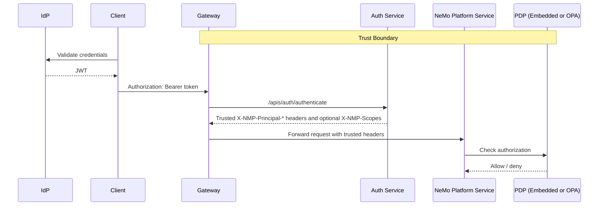

This page describes the security architecture of NeMo Platform authentication and authorization — how requests are authenticated, how access decisions are made, and where trust boundaries lie. It is intended for platform operators and security reviewers evaluating NeMo Platform for production deployment.

For hands-on setup, see [Auth Configuration](/documentation/access-control/deployment). For the authorization model, see [Concepts](/documentation/access-control/concepts).

## Architecture Overview



The request flow:

1. **Client** sends a request with a bearer token in the `Authorization` header.
2. In gateway deployments, **Gateway** calls the auth service's `/apis/auth/authenticate` endpoint; otherwise, the first service validates the token directly.
3. The validating component derives trusted `X-NMP-Principal-*` headers and
   `X-NMP-Scopes` when the token carries scope claims.
4. **PDP** (Policy Decision Point) evaluates authorization — checks the principal's role bindings and token scopes against the operation's requirements.
5. If allowed, the service handles the request.

<Note>

In quickstart deployments without an OIDC provider, the `X-NMP-Principal-*` headers are set directly by the client instead of being derived from a validated JWT. See [Getting Started](/documentation/access-control).

</Note>
## Authentication Modes

NeMo Platform supports two authentication modes: **service-level** bearer-token validation and **gateway bearer-auth callout**.

In both modes, identity arrives in the `Authorization: Bearer <token>` header.
The bearer token is validated exactly once, either by the first NeMo Platform
service or by the auth service behind the gateway callout. After validation, the
authenticated identity is propagated to downstream services via **trusted
`X-NMP-Principal-*` headers**. Downstream services accept these headers without
re-validating the token, but they still run authorization checks.

This "validate once, propagate via headers" design means that **network perimeter security is critical**: anything inside the trust boundary that receives `X-NMP-Principal-*` headers will trust them unconditionally. The gateway must strip these headers from all incoming external requests to prevent clients from forging an identity. See [Gateway Integration](/documentation/access-control/deployment/gateway-integration).

### Service-Level Authentication

The first NeMo Platform service that receives the request validates the bearer token directly:

1. Extracts the `Authorization: Bearer <token>` header
2. Validates the token using the enabled auth configuration
3. Extracts the principal identity (email, subject, groups) and scopes
4. Calls the PDP for an authorization decision
5. Forwards `X-NMP-Principal-*` headers to downstream services

No gateway is required. This is the simplest mode and the default.

### Gateway Bearer-Auth Callout

The gateway (e.g., Envoy with `ext_authz`) authenticates the bearer token before forwarding the request:

1. Gateway calls `/apis/auth/authenticate` with the original `Authorization` header
2. Auth service validates the bearer token and returns trusted `X-NMP-Principal-*` headers, plus `X-NMP-Scopes` when the token carries scope claims
3. Gateway forwards the request with those trusted headers
4. Services skip bearer-token re-validation and run their normal PDP authorization checks

This rejects unauthenticated requests before they reach platform services while keeping authorization decisions in the normal service middleware path.

## Principal Model

A **principal** is an authenticated identity. It can be a human user, a group
identifier used in role bindings, a NeMo service account, or an internal
platform service principal. Each request has exactly one principal.

When OIDC is enabled, the principal is resolved from JWT claims: the `sub` claim becomes the principal ID (or `oid` for Azure AD), the `email` claim provides the email (or `upn` for Azure AD), and group memberships come from the `groups` claim. These claim names are configurable. In gateway deployments, the auth service performs this extraction and the gateway forwards the returned `X-NMP-Principal-*` headers.

Scoped Access Keys can also authenticate as the signed-in user's principal, or
as a NeMo service account when a PlatformAdmin creates the key with
`--service-account <id>`. Service-account keys use the principal ID
`service-account:<id>` and do not require an IdP user or email address.

<Note>

**Quickstart shortcut** — When running without OIDC (`email-as-API-key` mode), the principal is the raw value of the `X-NMP-Principal-Id` header, without any token validation. This is intended for quick testing only.

</Note>
### Trusted Identity Headers

The following headers carry the authenticated identity through the system:

| Header | Description |
|---|---|
| `X-NMP-Principal-Id` | Unique identifier for the principal (required). For OIDC, this is resolved from the JWT `sub` claim or the configured subject claim. For service-account access keys, this is `service-account:<id>`. |
| `X-NMP-Principal-Email` | The principal's email address, when the authenticated token has one. |
| `X-NMP-Principal-Groups` | Comma-separated list of groups the principal belongs to, when the authenticated token has group claims. |
| `X-NMP-Scopes` | Space-separated list of token scopes, when the authenticated token has a `scp` or `scope` claim. Used by the PDP for scope-based authorization checks. |

These headers are set after bearer-token validation and forwarded on every internal service-to-service call. As described in [Authentication Modes](#authentication-modes), services inside the trust boundary accept them unconditionally — they are never re-validated. Services still call the PDP for authorization when `auth.enabled=true`.

### Service Accounts

Service accounts are customer-facing non-human identities for automation. A
PlatformAdmin can create a service-account Scoped Access Key with:

```bash
nemo auth access-keys create --service-account intake-otel-writer
```

The issued token authenticates as `service-account:intake-otel-writer`.
Service-account principals are not privileged by default. Grant them workspace
roles the same way you grant roles to users:

```bash
nemo workspaces members create \
  --principal service-account:intake-otel-writer \
  --roles Editor \
  --workspace ml-team
```

Service accounts do not run `nemo auth login`, do not require email addresses,
and are not Kubernetes service account tokens.

### Internal Service Principals

Not all requests originate from human users. Platform services that need cross-workspace access — for example, the jobs controller monitoring jobs across all users, or the evaluator coordinating evaluations — authenticate as **service principals**.

A service principal's ID has the form `service:<name>` (e.g., `service:jobs`, `service:evaluator`). For normal service routes, service-principal requests still go through the PDP. The policy gives `service:*` principals a default `ServiceSystem` role with broad platform permissions unless explicit policy data narrows that access. Service principals are created internally by the platform and are never exposed to external callers.

PDP endpoints under `/apis/auth/v2/authz/` are the exception: service principals may call them without recursively calling the PDP again.

<Note>

Service principals rely on perimeter security — the gateway strips `X-NMP-Principal-*` headers from incoming requests, so external callers cannot forge a `service:` identity. The gateway must also block external access to `/internal/*` paths. See [Gateway Integration](/documentation/access-control/deployment/gateway-integration).

</Note>
#### On-Behalf-Of Delegation

Some operations require a service to act with its own credentials while preserving the original user's identity for attribution and audit purposes. Two key examples:

- **Secret access**: A user cannot fetch a secret value directly — only the platform can — but the platform still needs to verify that the user has permission to access the secret's workspace.
- **Entity store access**: Feature-specific APIs (Models, Evaluation, etc.) check user permissions at the service level, then access the entity store using service credentials with the user's identity attached for `created_by`/`updated_by` attribution.

In these cases, the calling service sets its own principal plus separate
on-behalf-of headers for the original user's identity:

```http
X-NMP-Principal-Id: service:evaluator
X-NMP-Principal-On-Behalf-Of: user-principal-id
X-NMP-Principal-On-Behalf-Of-Email: alice@example.com
X-NMP-Principal-On-Behalf-Of-Groups: team-ml,data-eng
```

The downstream service constructs a delegated principal from those headers and
evaluates the *user's* permissions, including group-based access, while
accepting the request from the service identity.

#### Job Credential Propagation

Many NeMo Platform operations — customization, evaluation, synthetic data generation — run as asynchronous jobs. When a user submits a job, the platform propagates the submitting user's identity into the job container via the `NMP_PRINCIPAL` environment variable.

<Note>

Job containers need to run inside the trust boundary — they call NeMo Platform APIs using the propagated identity headers and are subject to the same authorization checks as any other caller. The key distinction is that jobs act as the *user*, not as a privileged service principal, so they can only access resources the submitting user is permitted to reach.

</Note>
## Authorization: Workspace-Scoped RBAC

NeMo Platform uses **workspace-scoped Role-Based Access Control (RBAC)**. All resources (models, datasets, jobs, evaluations) belong to exactly one workspace, and access is controlled at the workspace level — not per-resource.

- Users are granted roles (Viewer, Editor, Admin) per workspace via **role bindings**
- The wildcard principal `*` binds a role for all authenticated users at once
- Workspaces are private by default; the creator becomes Admin automatically

On top of RBAC, NeMo Platform supports **API scopes** as a second authorization
layer at the token level. When a bearer token has platform API scopes, an
authorized request must pass two independent checks:

1. **Scope check** (token level): The JWT must carry at least one of the scopes required by the endpoint (e.g., `platform:read` or `platform:write`). Scopes limit what the *token* can do.
2. **Permission check** (role level): The principal must have the necessary permissions via role bindings in the workspace. Roles limit what the *user* can do.

Both must pass when platform API scopes are present. Tokens with no scope claim,
or only standard OIDC scopes such as `openid`, `profile`, and `email`, skip the
scope check for compatibility and rely on the permission check. This enables
least-privilege OIDC token usage, for example an Editor signing in with
`platform:read` only for monitoring scripts.

For details, see [Authorization Concepts](/documentation/access-control/concepts), [Roles & Permissions](/documentation/access-control/authorization/roles-and-permissions), and [API Scopes](/documentation/access-control/authorization/api-scopes).

## What NeMo Platform Does NOT Do

The following are explicitly out of scope for the current implementation:

- **Multi-tenancy with database isolation.** Workspaces provide logical isolation, not separate databases or schemas per tenant.
- **Service mesh mTLS.** Service-to-service encryption and mutual authentication are delegated to the customer's infrastructure (e.g., Istio, Linkerd).
- **Built-in audit logging.** The embedded PDP does not produce a dedicated audit trail. If you need structured decision logs, use [External OPA](/documentation/access-control/authorization/policy-engine#external-opa) — OPA's [decision logging](https://www.openpolicyagent.org/docs/latest/management-decision-logs/) can export every authorization decision to your log aggregator.
- **Custom RBAC at runtime.** Custom roles can be defined at deployment time via YAML configuration, but cannot be created or modified at runtime through the API.

## Related

- [Authorization Concepts](/documentation/access-control/concepts) — Workspaces, roles, bindings, and the RBAC model.
- [Auth Configuration](/documentation/access-control/deployment) — Enabling auth, PDP provider, OIDC settings.
- [Gateway Integration](/documentation/access-control/deployment/gateway-integration) — Gateway-level auth and header configuration.
- [Production Hardening](/documentation/access-control/deployment/production-hardening) — Security checklist for production deployments.
