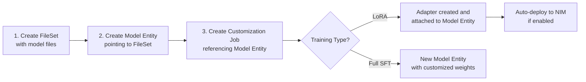
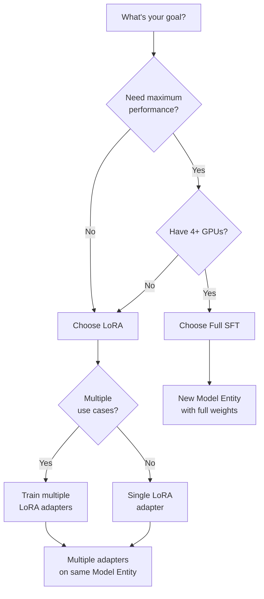

<a id="ft-tut-understand-models"></a>

Learn the fundamentals of how NeMo Customizer works to make informed decisions about your fine-tuning projects. This tutorial covers how models are organized, how adapters attach to base models, training types and GPU requirements, and how to choose the right approach for your use case.

Understanding these basics will help you navigate the fine-tuning process more effectively and avoid common issues. If you're ready to start fine-tuning immediately, you can jump to [SFT Customization Job](/documentation/customizer-reference/tutorials/sft-customization-job) after completing this tutorial.

<Note>

The time to complete this tutorial is approximately 15 minutes.

</Note>

This tutorial focuses on understanding and discovery—no actual training jobs are created.

## Prerequisites

<Markdown src="/snippets/_snippets/tutorials/prereqs.mdx" />
<Markdown src="/snippets/customizer/tutorials/_snippets/customizer-prereqs.mdx" />
---

## Core Concepts

### What is a Model Entity?

A **Model Entity** represents a model registered in the NeMo Platform. It contains:

1. **FileSet Reference**: Points to the model checkpoint files (weights, config, tokenizer)
2. **Model Spec**: Auto-populated metadata about the model architecture (layers, parameters, etc.)
3. **Adapters**: LoRA or other parameter-efficient fine-tuning weights attached to this model
4. **Base Model Link**: Optional reference to a parent model (for fine-tuned models)

Think of a Model Entity as a "model card" that tracks everything about a model—where its files are, what architecture it uses, and what adapters have been trained for it.

### What is an Adapter?

An **Adapter** is a set of parameter-efficient fine-tuning weights (like LoRA) that are attached to a Model Entity. Adapters:

- Are **nested within** the parent Model Entity
- Are **enabled** for inference by default post training
- Have their own FileSet for storing the adapter weights
- Track metadata like fine-tuning type, rank, and alpha values

### What is a FileSet?

A **FileSet** is a collection of files stored in the platform's file service. For customization:

-   **Model FileSet**: Contains the base model checkpoint (config, weights, tokenizer)
-   **Adapter FileSet**: Contains the LoRA adapter weights
-   **Dataset FileSet**: Contains training and validation data

---

## The Customization Workflow



### Step-by-Step Breakdown

**1. Create a FileSet for your base model**

Upload your model checkpoint files (from Hugging Face, NGC, or local storage) to a FileSet:

```python
import os
from nemo_platform import NeMoPlatform
from nemo_platform.types.files import HuggingfaceStorageConfigParam

client = NeMoPlatform(
    base_url=os.environ.get("NMP_BASE_URL", "http://localhost:8080"),
    workspace="default",
)

# Create a FileSet from Hugging Face
fileset = client.files.filesets.create(
    workspace="default",
    name="llama-3-2-1b",
    description="Llama 3.2 1B base model",
    storage=HuggingfaceStorageConfigParam(
        type="huggingface",
        repo_id="meta-llama/Llama-3.2-1B-Instruct",
        repo_type="model",
        token_secret="my-hf-token",  # Secret containing Hugging Face token
    ),
)
```

**2. Create a Model Entity pointing to the FileSet**

```python
model = client.models.create(
    workspace="default",
    name="llama-3-2-1b",
    fileset="default/llama-3-2-1b",  # Reference to the FileSet
    description="Llama 3.2 1B base model",
)

# Wait for model spec to be auto-populated
import time

while not model.spec:
    time.sleep(5)
    model = client.models.retrieve(workspace="default", name="llama-3-2-1b")

print(f"Model architecture: {model.spec.family}")
print(f"Parameters: {model.spec.base_num_parameters:,}")
```

**3. Create a Customization Job**

```python
from nemo_automodel_plugin.schema import AutomodelJobInput

spec = AutomodelJobInput(
    model="default/llama-3-2-1b",
    dataset={"training": "default/email-training-data"},
    training={"training_type": "sft", "finetuning_type": "lora", "lora": {"rank": 8, "alpha": 32}},
    schedule={"epochs": 3},
    batch={"global_batch_size": 32, "micro_batch_size": 1},
)

job = client.customization.automodel.jobs.create(
    workspace="default",
    name="my-email-assistant-lora",
    spec=spec,
)
```

**4. Access the Result**

After training completes:

```python
# For LoRA jobs - adapter is attached to the model
model = client.models.retrieve(workspace="default", name="llama-3-2-1b")

for adapter in model.adapters:
    print(f"Adapter: {adapter.name}")
    print(f" Type: {adapter.finetuning_type}")
    print(f" Enabled: {adapter.enabled}")
    print(f" Files: {adapter.fileset}")
```

---

## Understanding Adapters and Deployment

### How Adapters Work

When you run a LoRA customization job:

1. **Training** produces adapter weights (small compared to base model)
2. **Adapter created** and attached to the parent Model Entity
3. **FileSet created** with the adapter weights
4. **Enabled by default** so NIMs serving the base model automatically load the adapter

### Viewing Adapters on a Model

```python
model = client.models.retrieve(workspace="default", name="llama-3-2-1b")

print(f"Model: {model.name}")
print(f"Adapters:")
for adapter in model.adapters or []:
    print(f" - {adapter.name}")
    print(f" Type: {adapter.finetuning_type}")
    print(f" Enabled: {adapter.enabled}")
    print(f" Created: {adapter.created_at}")
```

### Disabling and Re-enabling Adapters

Adapters are enabled by default, but you can disable an adapter to remove it from inference without deleting it. When you set `enabled=False`, the sidecar running alongside the NIM automatically removes the adapter's files on its next reconciliation pass (every few seconds). Re-enabling the adapter causes the sidecar to re-download and serve it again.

```python
client.models.adapters.update(
    adapter="my-custom-lora",
    model_name="llama-3-2-1b",
    workspace="default",
    enabled=False,
)
```

To re-enable:

```python
client.models.adapters.update(
    adapter="my-custom-lora",
    model_name="llama-3-2-1b",
    workspace="default",
    enabled=True,
)
```

### Creating Adapters Manually

You can also create adapters manually (e.g., from externally trained weights):

```python
model = client.models.adapters.create(
    model_name="llama-3-2-1b",
    workspace="default",
    name="my-custom-lora",
    fileset="default/my-lora-weights",
    finetuning_type="lora",
)
```

---

## Training Types and Resource Requirements

### Available Training Approaches

| Approach | Description | GPU Requirements | Output |
|----------|-------------|------------------|--------|
| LoRA (Low-Rank Adaptation) | Trains small adapter weights while keeping base model frozen | 1-2 GPUs (80GB each) | Adapter attached to parent Model Entity |
| Full SFT (Supervised Fine-Tuning) | Updates all model weights for maximum performance | 4+ GPUs (80GB each) | New Model Entity with full weights |

### GPU Memory Guidelines

| Model Size | LoRA | Full SFT |
|------------|------|----------|
| 1B parameters | 1x 80GB GPU | 1x 80GB GPU |
| 8B parameters | 1x 80GB GPU | 4x 80GB GPUs |
| 70B parameters | 2x 80GB GPUs | 8x 80GB GPUs |

### Storage Requirements

Customization jobs consume disk space on the platform's shared persistent volume for model files, fine-tuning checkpoints, and the final output artifact. Required space depends on the training type:

| Training Type | Approximate Disk Usage | Notes |
|---------------|----------------------|-------|
| LoRA | ~1.5× downloaded base checkpoint size | Stores base model + small adapter weights |
| Full SFT | ~3× downloaded base checkpoint size | Stores base model + intermediate checkpoint + full output model |

<Note>

These estimates cover model weights only and do not include training dataset size.
If the platform disk fills during a job, the job fails with an I/O
error and the job service may return a ``500`` status when you retrieve logs.

Ensure your platform's shared persistent volume has at least **3× the downloaded base checkpoint size**
of free space before starting a full SFT job, or **1.5×** for LoRA jobs.

</Note>
For troubleshooting disk-related failures, see [customizer](/documentation/reference/troubleshooting/customizer).

### Parallelism Parameters Explained

Parallelism is configured via the top-level Automodel `parallelism` block (for example, `parallelism={"num_gpus_per_node": 1}`). These parameters control how training workloads are distributed across GPUs:

| Parameter | Description | Default |
|-----------|-------------|---------|
| `parallelism.num_nodes` | Number of training nodes | `1` |
| `parallelism.num_gpus_per_node` | GPUs per node | `1` |
| `parallelism.tensor_parallel_size` | Number of GPUs to distribute each layer's parameters across | `1` |
| `parallelism.pipeline_parallel_size` | Number of GPUs to distribute layers across sequentially | `1` |
| `parallelism.context_parallel_size` | Number of GPUs to distribute sequence context across | `1` |
| `parallelism.sequence_parallel` | Enable sequence parallelism to distribute activation memory along the sequence dimension | `false` |
| `parallelism.expert_parallel_size` | Number of GPUs to distribute MoE experts across (MoE models only) | `null` |

`data_parallel_size` is automatically derived as `total_gpus / (TP × PP × CP)` and is not set directly.

<Note>

**Recommended parallelism for Experts (MoE) Models**:

The `parallelism.expert_parallel_size` parameter parallelizes a Mixture of Experts (MoE) model's experts across GPUs. For non-MoE models, leave it unset (`null`). A model's model card indicates whether it is a Mixture of Experts model and how many experts it has.

When you set `expert_parallel_size`:
- The number of experts in the model must be divisible by `expert_parallel_size`. For example, if a model has 8 experts, `expert_parallel_size=4` gives each GPU 2 experts.
- `(data_parallel_size × context_parallel_size)` must be divisible by `expert_parallel_size`.
- When `expert_parallel_size > 1`, `tensor_parallel_size` must be `1`.

For example, with 8 total GPUs, `tensor_parallel_size=2`, `pipeline_parallel_size=1`, and `context_parallel_size=1`:
- Derived `data_parallel_size = 8 / (2 × 1 × 1) = 4`
- `data_parallel_size × context_parallel_size = 4`
- Valid `expert_parallel_size` values: `1`, `2`, or `4`
- Invalid `expert_parallel_size` value: `3` (does not divide 4)

</Note>
### Resource Allocation Rules

Training configurations must satisfy mathematical constraints to work properly:

<Note>

**GPU Allocation Rule**: The total number of GPUs (`num_gpus_per_node x num_nodes`) must be a multiple of:
`tensor_parallel_size × pipeline_parallel_size × context_parallel_size`

If this constraint isn't met, your training job will fail with a validation error.

</Note>
**Example Calculations**:

- 8 GPUs with `tensor_parallel_size=4, pipeline_parallel_size=2` ✅ Valid (8 = 4 × 2 × 1)
- 4 GPUs with `tensor_parallel_size=4, pipeline_parallel_size=2` ❌ Invalid (4 ≠ 4 × 2 × 1)

---

## Choosing Your Training Approach

### Decision Framework



### When to Use LoRA

✅ **Choose LoRA when:**
- You have limited GPU resources (1-2 GPUs)
- You want fast training iterations
- You need multiple specialized versions of the same base model
- You want to auto-deploy adapters to existing NIM deployments

### When to Use Full Fine-Tuning

✅ **Choose Full SFT when:**
- You need maximum model performance
- You have sufficient GPU resources (4+ GPUs)
- You want complete control over all model weights
- You're preparing a production deployment

---

## Model Types and Capabilities

### Supported Language Models

| Model Family | Description | Examples |
| --- | --- | --- |
| **Llama Models** | General-purpose language models excellent for instruction following, conversation, and text generation tasks | `llama-3.1-8b-instruct`, `llama-3.2-1b-instruct` |
| **Llama Nemotron Models** | NVIDIA's specialized variants optimized for specific use cases with enhanced reasoning capabilities | Various Nano and Super variants |
| **Phi Models** | Microsoft's efficient models designed for strong reasoning with optimized deployment characteristics | Phi model family configurations |
| **GPT-OSS Models** | Open-weight reasoning models with tested Full SFT and LoRA configurations | `openai/gpt-oss-20b` |

### Specialized Models

| Model Type | Status | Details |
| --- | --- | --- |
| **Embedding Models** | ✅ Supported | **Model**: Llama 3.2 NV EmbedQA 1B for question-answering and retrieval tasks **Use Cases**: Semantic search, document retrieval, question-answering systems, RAG pipelines **Note**: Typically disabled by default—contact your administrator for access |
| **Reranking Models** | ❌ Not Supported | **Alternative**: Use embedding models for retrieval tasks, or implement reranking in your application layer |

### Importing Custom Models

You can import a Hugging Face checkpoint into a FileSet and register it as a Model Entity:

```python
from nemo_platform.types.files import HuggingfaceStorageConfigParam

# Create FileSet from Hugging Face
fileset = client.files.filesets.create(
    workspace="default",
    name="my-custom-model",
    storage=HuggingfaceStorageConfigParam(
        type="huggingface",
        repo_id="organization/model-name",
        repo_type="model",
        token_secret="my-hf-token",
    ),
)

# Create Model Entity
model = client.models.create(
    workspace="default", name="my-custom-model", fileset="default/my-custom-model"
)
```

For detailed guidance, see [Import Hugging Face Model](/documentation/customizer-reference/tutorials/import-hugging-face-models).

<Warning>

Importing a checkpoint does not guarantee that every training or deployment backend supports its architecture. In particular, Automodel LoRA does not support Conv1D-based architectures such as older GPT-2 variants. Confirm the model and fine-tuning regime in the [Tested Models](/documentation/customizer-reference/models/model-catalog) table, and review the import tutorial's known architecture limitations before submitting a job.

</Warning>

---

## Next Steps

Now that you understand how Model Entities and Adapters work, you're ready to proceed:

<Cards>

<Card title="Format Training Dataset" href="/documentation/customizer-reference/tutorials/format-training-dataset">

Learn how to prepare your data for fine-tuning.

</Card>
<Card title="Start a LoRA Job" href="/documentation/customizer-reference/tutorials/lora-customization-job">

Create a parameter-efficient LoRA adapter.

</Card>
<Card title="Start a Full SFT Job" href="/documentation/customizer-reference/tutorials/sft-customization-job">

Use full supervised fine-tuning for maximum performance.

</Card>
<Card title="Import Custom Models" href="/documentation/customizer-reference/tutorials/import-hugging-face-models">

Import and fine-tune private Hugging Face models.

</Card>

</Cards>

---

## Key Takeaways

✅ **Model Entities** contain model metadata and point to FileSet with checkpoint files 
✅ **Adapters** (LoRA) are attached to Model Entities, not stored separately 
✅ **FileSet** is where actual model/adapter files are stored 
✅ **LoRA training** creates an adapter on the parent Model Entity 
✅ **Full SFT training** creates a new Model Entity with full weights 
✅ **Adapters are enabled by default** and automatically loaded by NIMs serving the base model 
✅ **GPU requirements** vary significantly between LoRA and full fine-tuning 
✅ **Custom Hugging Face models** can be imported via FileSet + Model Entity

### Quick Reference Commands

```python
# List all Model Entities
models = client.models.list(workspace="default")

# Get a specific Model Entity with adapters
model = client.models.retrieve(workspace="default", name="llama-3-2-1b")

# Create an Automodel training job
from nemo_automodel_plugin.schema import AutomodelJobInput

spec = AutomodelJobInput(
    model="default/llama-3-2-1b",
    dataset={"training": "default/my-dataset"},
    training={"training_type": "sft", "finetuning_type": "lora"},
)

job = client.customization.automodel.jobs.create(
    workspace="default",
    name="my-job",
    spec=spec,
)

# Add an adapter to a model
client.models.adapters.create(
    model_name="llama-3-2-1b",
    workspace="default",
    name="my-adapter",
    fileset="default/adapter-weights",
    finetuning_type="lora",
)
```

You now have the foundation to make informed decisions about your fine-tuning projects!
