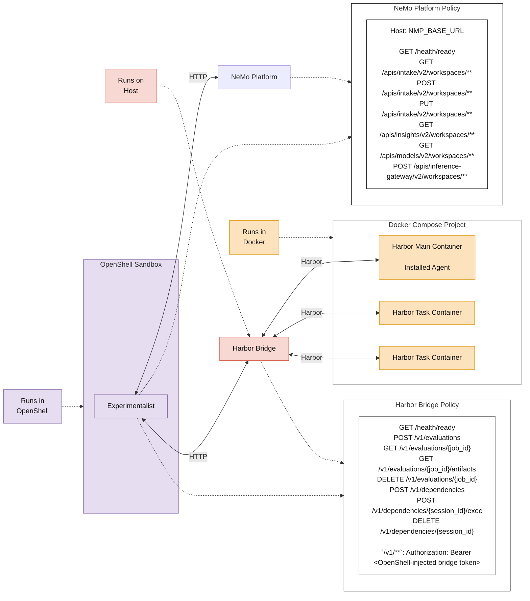

<!-- SPDX-FileCopyrightText: Copyright (c) 2025-2026 NVIDIA CORPORATION & AFFILIATES. All rights reserved. -->
<!-- SPDX-License-Identifier: Apache-2.0 -->

# OpenShell Harbor bridge walkthrough

This document explains how Experimentalist runs Tau3 and Harbor evaluations through OpenShell, why the work is split between a trusted host and an OpenShell sandbox, and how cleanup works.

## Goal

The sandbox should be able to run Experimentalist logic and propose candidate changes without receiving Docker access, host filesystem access, or host inference credentials. Harbor and Docker remain on the trusted host.

```text
Trusted host                         OpenShell sandbox
─────────────                        ─────────────────
Docker + Harbor                      Experimentalist logic
Task datasets                        Candidate source
Inference credential                 No Docker socket
Harbor bridge                        No host filesystem access
```

The sandbox asks the host bridge to evaluate a candidate. The bridge runs Harbor and Docker, then returns sanitized results and approved artifacts.

```mermaid
flowchart LR
    subgraph OS["CONTAINER · OpenShell sandbox"]
        direction TB
        EXP["Experimentalist"]
        CLIENT["Remote Harbor client"]
        ACCESS["Access<br/>RW: /sandbox, /tmp<br/>Platform :&lt;configured port&gt;<br/>Bridge :8765<br/><b>No Docker socket</b><br/><b>No direct internet</b>"]
        EXP --> CLIENT
    end

    PROVIDER["OpenShell provider<br/>injects Bearer token"]

    subgraph HOST["HOST OS · trusted processes"]
        direction TB
        API["Bridge HTTP :8765<br/><br/>GET /health/ready<br/>POST /v1/evaluations<br/>GET /v1/evaluations/:job_id<br/>GET /v1/evaluations/:job_id/artifacts<br/>DELETE /v1/evaluations/:job_id<br/>POST /v1/dependencies<br/>POST /v1/dependencies/:session_id/exec<br/>DELETE /v1/dependencies/:session_id"]
        BRIDGE["Harbor bridge<br/>validate · materialize · redact"]
        HARBOR["Harbor evaluator<br/>TrustedCandidateAgent"]
        DOCKER["Docker daemon"]
        ENV["Exported host environment"]
        API --> BRIDGE --> HARBOR --> DOCKER
        ENV -.->|inherited| BRIDGE
    end

    subgraph TRIALS["DOCKER CONTAINERS · one Compose project per concurrent trial"]
        direction TB
        subgraph T1["Trial 1"]
            direction TB
            MAIN["main service · task image<br/><b>Installed candidate</b><br/>python -m main"]
            RUNTIME["task sidecar<br/>tau3-runtime:8000/mcp"]
            VERIFY["verifier phase<br/>shared or separate environment"]
            MAIN <-->|"MCP"| RUNTIME
            MAIN --> VERIFY
        end
        MORE["Trial 2 … N<br/>same isolated topology"]
    end

    PLATFORM["NeMo Platform :&lt;configured port&gt;<br/><br/>GET /health/ready<br/>GET|POST|PUT /apis/intake/...<br/>GET /apis/insights/...<br/>GET /apis/models/...<br/>POST /apis/inference-gateway/..."]

    CLIENT -->|"request"| PROVIDER --> API
    API -.->|"status · sanitized result · artifacts"| CLIENT
    EXP <-->|"policy-limited HTTP"| PLATFORM
    DOCKER -->|"create / delete"| T1
    DOCKER -->|"create / delete"| MORE
    ENV -.->|AgentConfig.env| MAIN
    ENV -.->|environment.env| RUNTIME
    ENV -.->|verifier.env| VERIFY

    classDef sandbox fill:#eef8f1,stroke:#3f9367,stroke-width:2px,color:#172033;
    classDef host fill:#fff4dd,stroke:#bd812c,stroke-width:2px,color:#172033;
    classDef docker fill:#fff0f0,stroke:#b65b5b,stroke-width:2px,color:#172033;
    classDef interface fill:#eef5ff,stroke:#5685bd,stroke-width:2px,color:#172033;
    class EXP,CLIENT,ACCESS sandbox;
    class API,BRIDGE,HARBOR,DOCKER,ENV host;
    class MAIN,RUNTIME,VERIFY,MORE docker;
    class PROVIDER,PLATFORM interface;
```



The editable Mermaid source is
[`openshell-harbor-bridge-runtime-topology.mmd`](openshell-harbor-bridge-runtime-topology.mmd).

## Simplified network-policy topology

This view focuses on where the processes run and the HTTP policy boundaries.
The bridge health endpoint is a liveness check; bearer authentication applies
to the `/v1/**` routes only.



The [higher-level architecture overview](openshell-harbor-bridge-architecture.svg)
shows the same system organized around lifecycle and ownership.

## Using OpenShell as an optional sandbox

OpenShell is an opt-in execution boundary, not a replacement for the normal
local Experimentalist workflow.  Leave out `--execution-mode` to run locally
with Harbor. Add `--execution-mode openshell` when the optimizer itself should
run in an OpenShell sandbox while Harbor, Docker, and agent-under-test
credentials remain on the trusted host.

### Prerequisites

On the machine that starts Experimentalist, ensure all three host services are
ready:

```bash
export NMP_BASE_URL=http://localhost:8080

curl -fsS "$NMP_BASE_URL/health/ready"
openshell status
docker info
```

`docker info` must show a reachable server, not only client information. If it
reports permission denied for `/var/run/docker.sock`, grant the user access to
the Docker daemon and start a new login session before running Experimentalist.

The default sandbox image is built from this checkout when necessary, so Docker
is required even though the OpenShell sandbox itself never receives Docker
socket access. Run a long optimization in `tmux` or another persistent session.

### Required configuration

OpenShell deliberately has no implicit model or credential defaults. Configure
the following trusted host environment values before launch:

```bash
export NEMO_DEFAULT_MODEL=<platform-model-name>
export NEMO_FAST_MODEL=<platform-model-name>
export INFERENCE_API_KEY=<credential-for-the-agent-under-test>
export INFERENCE_API_BASE=<agent-under-test-inference-endpoint>
export AUT_MODEL_NAME=<agent-under-test-model-name>
```

`NEMO_DEFAULT_MODEL` and `NEMO_FAST_MODEL` identify the models used by
Experimentalist. They are the only model settings made available inside the
sandbox. `INFERENCE_API_KEY`, `INFERENCE_API_BASE`, and `AUT_MODEL_NAME` are
owned by the host Harbor bridge to evaluate the agent under test; the sandbox
does not receive the inference key as a plain environment variable. Keep these
values in the trusted shell environment or platform-level secret/configuration,
never in the agent source or dataset.

The run configuration must disable source-control archival and winner
publication because an OpenShell run cannot safely perform those host actions:

```yaml
storage:
  archive_candidates: false
  publish_winner: false
```

For Harbor concurrency, omit `outcome_evaluator_config.n_concurrent_trials` to
use the host CPU count, or set it explicitly for a lower resource limit. The
same setting is used by the host bridge for every standard Harbor evaluation.

### Start a sandboxed run

Use the usual command and add exactly one opt-in flag:

```bash
uv run nemo agents experimentalist run \
  --execution-mode openshell \
  --no-insight \
  --agent path/to/agent \
  --agent-spec path/to/AGENT-SPEC.md \
  --train-dataset path/to/train-dataset \
  --validation-dataset path/to/validation-dataset \
  --config path/to/experimentalist.yaml \
  --base-url "$NMP_BASE_URL" \
  --experiment-dir path/to/experiment
```

Remove `--no-insight` and provide the normal Insight/task-template inputs for
an Insight-driven run. Dataset preparation, bridge startup, provider setup,
sandbox creation, output download, and normal cleanup are all internal to this
command. Users should not invoke `run.sh` or prepare an OpenShell sandbox by
hand.

When `NMP_BASE_URL` points at `localhost`, the launcher safely rewrites that
host for the sandbox and renders the matching platform port in its network
policy. For a platform outside the local host, use its reachable HTTP(S) base
URL. The hostname and port must be reachable from the OpenShell sandbox and
allowed by its policy; the launcher does not assume port `8080`.

### Observe, cancel, and troubleshoot

The host-side bridge log and per-job results are retained in the experiment
directory while the run is active:

```bash
tail -f path/to/experiment/openshell-runtime/host/bridge/bridge.log
find path/to/experiment/openshell-runtime/host/bridge/jobs -maxdepth 3 -name result.json
```

The wrapper also downloads a best-effort snapshot of the sandbox's public
`/sandbox/output` directory every 15 seconds to
`<experiment-dir>/openshell-live/`. This is useful for following generated
candidates and reports before the run finishes. It may lag by one interval or
contain a file that was being written during the snapshot; the final download
to the experiment directory remains the authoritative completed result. Set
`NEMO_EXPERIMENTALIST_OUTPUT_SYNC_INTERVAL` to a larger positive number to
reduce transfer overhead.

Use Ctrl-C or `kill <experimentalist-pid>` for normal cancellation. The
launcher terminates the bridge, deletes its ephemeral provider, and lets the
OpenShell wrapper delete the temporary sandbox. Avoid `kill -9`: it prevents
that cleanup. If a host failure leaves resources behind, inspect them with the
OpenShell and Docker CLIs, then remove only the sandbox or Compose project that
belongs to the interrupted experiment.

## OpenShell runtime configuration

The public interface is still `nemo agents experimentalist run --execution-mode openshell`.
Most `NEMO_EXPERIMENTALIST_*` variables are implementation wiring and should be
left unset. The supported diagnostic overrides are:

| Variable | Default | Purpose |
| --- | --- | --- |
| `NEMO_EXPERIMENTALIST_IMAGE` | `local/nmp-experimentalist:local` | Selects the image used for the OpenShell sandbox. Set it only to test a rebuilt or alternate runtime image. |
| `NEMO_EXPERIMENTALIST_KEEP_SANDBOX` | `0` | Set to `1` only while debugging to preserve the sandbox after the run. Normal runs delete it. |
| `NEMO_EXPERIMENTALIST_SANDBOX_NAME` | generated `nemo-exp-…` name | Overrides the temporary sandbox name for debugging. |
| `NEMO_EXPERIMENTALIST_OUTPUT_SYNC_INTERVAL` | `15` seconds | Frequency for best-effort snapshots of `/sandbox/output` in `<experiment-dir>/openshell-live/`. |
| `NEMO_EXPERIMENTALIST_POLICY_MODE` | `strict` | Selects the normal restrictive policy. `docker-desktop` is a macOS/Docker Desktop compatibility mode with weaker filesystem enforcement. |

### Policy modes

Both policy templates are default-deny and contain the same process,
filesystem-path, and network-route rules.  The launcher renders a per-run copy
of the selected template with the validated NeMo Platform hostname and port.
The mode changes only Landlock compatibility:

| Mode | Landlock setting | Intended use | Result when Landlock is unavailable |
| --- | --- | --- | --- |
| `strict` (default) | `hard_requirement` | Native Linux hosts where filesystem isolation is required. | Sandbox creation fails. |
| `docker-desktop` | `best_effort` | Docker Desktop, whose Linux VM may not provide the required Landlock support. | Sandbox can start without required Landlock enforcement. |

Use `docker-desktop` only for that compatibility case:

```bash
export NEMO_EXPERIMENTALIST_POLICY_MODE=docker-desktop
```

It is not a broader network-permission mode: it does not add hosts, ports, or
HTTP routes. The runtime emits a warning whenever this weaker mode is selected.

The following are internal values set by the launcher/provider and must not be
copied into user configuration: `NEMO_EXPERIMENTALIST_HARBOR_BRIDGE_URL`,
`NEMO_EXPERIMENTALIST_HARBOR_BRIDGE_TOKEN`,
`NEMO_EXPERIMENTALIST_HARBOR_BRIDGE_PROVIDER`, and
`NEMO_EXPERIMENTALIST_OPEN_SHELL_RUNTIME`. In particular, the bridge token is
a provider-managed credential, not an environment variable users should set.

Model selection is separate. `NEMO_DEFAULT_MODEL` and `NEMO_FAST_MODEL` select
Experimentalist's Platform model entities and are the only model values passed
to the sandbox. `AUT_MODEL_NAME`, `INFERENCE_API_KEY`, and
`INFERENCE_API_BASE` are required host-side bridge settings for the
agent-under-test evaluation; they are not passed to the OpenShell sandbox. The
launcher supplies no model, endpoint, credential, or policy fallback: configure
them through the Platform and trusted host environment before starting a run.

## Normal run lifecycle

1. The user runs the normal public command:

   ```bash
   .venv/bin/nemo agents experimentalist run --execution-mode openshell ...
   ```

2. The Python launcher prepares the run. It writes the non-secret bridge
   resource settings (bind address, storage/catalog directories, attempts, and
   concurrency) to `host/bridge/runtime-config.json`, then starts the bridge
   with that single config path. The bridge token and inference credentials
   remain host environment variables and are never written to this file.

   It copies and validates the selected agent and datasets, creates a trusted catalog of Tau3 tasks, and writes a credential-free sandbox input directory. This prevents the sandbox from choosing arbitrary task paths, Docker options, host mounts, or evaluator settings.

3. The launcher starts the Harbor bridge on the host.

   The bridge has the host's Docker access and the trusted inference configuration. It exposes a narrow authenticated HTTP API:

   ```text
   sandbox → submit candidate/dataset selection → bridge
   sandbox ← status + sanitized result/artifact ← bridge
   ```

4. The launcher configures an ephemeral OpenShell provider.

   The provider lets the sandbox reach only the bridge and the approved inference route. The sandbox does not receive the bridge token or inference key as plain credentials; OpenShell resolves those through its provider mechanism.

5. `run.sh` creates the OpenShell sandbox.

   It attaches the local Experimentalist image, restrictive network policy, bridge provider, and prepared credential-free input directory. It then runs the internal Python entrypoint inside the sandbox.

6. The sandbox runs the Experimentalist.

   The sandbox can generate and evaluate candidate agent changes, but it cannot talk to Docker. For each evaluation, it uploads the candidate source archive, a bounded task overlay if needed, and metadata selecting tasks from the host-prepared catalog.

7. The host bridge runs Harbor.

   Harbor materializes only the approved tasks, creates task Docker Compose environments, runs the candidate, runs the verifier, and stores results under the bridge job directory.

8. Results and artifacts return to the sandbox.

   The bridge redacts secrets and host paths, exports result-owned resources only, and creates an artifact archive and digest. The sandbox downloads the archive, verifies its digest, and extracts it under:

   ```text
   <experiment-dir>/remote-harbor-artifacts/<bridge-job-id>/
   ```

9. `run.sh` downloads the sandbox output to the host experiment directory.

10. The launcher tears down the provider and bridge.

## Cleanup lifecycle

```text
Normal completion / Ctrl-C / SIGTERM
                 │
                 ▼
Python launcher enters cleanup
                 │
                 ├─ stop run.sh
                 │    └─ EXIT trap deletes the OpenShell sandbox
                 │
                 ├─ delete ephemeral bridge provider
                 │
                 └─ stop host Harbor bridge
                      └─ bridge cancels outstanding evaluations
                           └─ Harbor finalizes each trial
                                └─ Docker Compose cleanup:
                                   down --rmi local --volumes --remove-orphans
```

The Harbor job configuration explicitly enables deletion of trial environments. The launcher also converts a normal `SIGTERM` into graceful cancellation, so `kill <experimentalist-pid>` follows the same cleanup path as Ctrl-C.

`SIGKILL` (`kill -9`), a host reboot, and a Docker daemon crash cannot run cleanup code. Those cases require manual cleanup.

## Why preparation is automatic

Preparation remains internal to the public `nemo agents experimentalist run` command. It establishes the security and reproducibility boundary:

- the exact valid agent source and task set;
- the files allowed into the sandbox;
- the bridge endpoint and provider attached to the sandbox;
- the model and credentials owned by the host bridge; and
- the output and artifact locations.

Users configure the command and environment, but do not manually prepare the sandbox or run the internal shell wrapper. Manual preparation could bypass validation and make cleanup or reproduction unreliable.

## Component map

| Component | Responsibility |
| --- | --- |
| `openshell/launcher.py` | Trusted host orchestration: bridge/provider lifecycle and signal handling |
| `openshell/run.sh` | OpenShell CLI lifecycle: create sandbox, run inner process, download output, delete sandbox on exit |
| `openshell/inner.py` | Sandbox-only Experimentalist entrypoint |
| `harbor_bridge/service.py` | Authenticated bridge API, job tracking, result sanitization, artifact archive endpoint |
| `harbor_bridge/runner.py` | Converts a validated bridge request into a Harbor evaluation |
| `remote_harbor.py` | Sandbox-side client: upload candidate, poll bridge, download and verify artifacts |
| `harbor_native.py` | Creates the Harbor job and explicitly enables Docker resource deletion |

## Code review pointers

Review the implementation in this order.

1. **Public CLI and execution-mode selection**

   - [`plugins/nemo-experimentalist/src/nemo_experimentalist_plugin/cli.py`](../plugins/nemo-experimentalist/src/nemo_experimentalist_plugin/cli.py)
   - [`plugins/nemo-experimentalist/tests/test_openshell_runtime.py`](../plugins/nemo-experimentalist/tests/test_openshell_runtime.py)

   This is where `--execution-mode openshell` selects the remote evaluation path instead of local Harbor execution.

2. **Trusted input preparation**

   - [`plugins/nemo-experimentalist/src/nemo_experimentalist_plugin/openshell/preparation.py`](../plugins/nemo-experimentalist/src/nemo_experimentalist_plugin/openshell/preparation.py)
   - [`plugins/nemo-experimentalist/tests/test_openshell_runtime.py`](../plugins/nemo-experimentalist/tests/test_openshell_runtime.py)

   Verify that the sandbox receives only a prepared manifest, agent copy, and selected catalog data; it must not receive host paths or credentials.

3. **Host launcher and cancellation**

   - [`plugins/nemo-experimentalist/src/nemo_experimentalist_plugin/openshell/launcher.py`](../plugins/nemo-experimentalist/src/nemo_experimentalist_plugin/openshell/launcher.py)
   - [`plugins/nemo-experimentalist/src/nemo_experimentalist_plugin/openshell/run.sh`](../plugins/nemo-experimentalist/src/nemo_experimentalist_plugin/openshell/run.sh)
   - [`plugins/nemo-experimentalist/tests/test_openshell_runtime.py`](../plugins/nemo-experimentalist/tests/test_openshell_runtime.py)

   Verify bridge startup, provider deletion, SIGTERM handling, the shell `EXIT` trap, sandbox deletion, and output download order.

4. **OpenShell policy and provider setup**

   - [`plugins/nemo-experimentalist/src/nemo_experimentalist_plugin/openshell/policy.yaml`](../plugins/nemo-experimentalist/src/nemo_experimentalist_plugin/openshell/policy.yaml)
   - [`plugins/nemo-experimentalist/src/nemo_experimentalist_plugin/openshell/policy.docker-desktop.yaml`](../plugins/nemo-experimentalist/src/nemo_experimentalist_plugin/openshell/policy.docker-desktop.yaml)
   - [`plugins/nemo-experimentalist/src/nemo_experimentalist_plugin/openshell/configure-providers.sh`](../plugins/nemo-experimentalist/src/nemo_experimentalist_plugin/openshell/configure-providers.sh)
   - [`plugins/nemo-experimentalist/src/nemo_experimentalist_plugin/openshell/provider-profiles/nemo-experimentalist-harbor-bridge.yaml`](../plugins/nemo-experimentalist/src/nemo_experimentalist_plugin/openshell/provider-profiles/nemo-experimentalist-harbor-bridge.yaml)

   Verify the policy is default-deny, permits only the required Platform, inference, and bridge routes, and does not place host secrets in the sandbox environment. `policy.yaml` requires Landlock; `policy.docker-desktop.yaml` is otherwise identical but makes Landlock best-effort for Docker Desktop compatibility.

5. **Sandbox entrypoint and remote evaluator**

   - [`plugins/nemo-experimentalist/src/nemo_experimentalist_plugin/openshell/inner.py`](../plugins/nemo-experimentalist/src/nemo_experimentalist_plugin/openshell/inner.py)
   - [`plugins/nemo-experimentalist/src/nemo_experimentalist_plugin/experimentalist/components/evaluator/remote_harbor.py`](../plugins/nemo-experimentalist/src/nemo_experimentalist_plugin/experimentalist/components/evaluator/remote_harbor.py)
   - [`plugins/nemo-experimentalist/tests/test_remote_harbor.py`](../plugins/nemo-experimentalist/tests/test_remote_harbor.py)

   Verify uploads are bounded archives, status polling is authenticated, cancellation sends a bridge delete request, and downloaded artifacts are digest-verified before local paths are substituted into results.

6. **Host bridge API and result export**

   - [`plugins/nemo-experimentalist/src/nemo_experimentalist_plugin/harbor_bridge/service.py`](../plugins/nemo-experimentalist/src/nemo_experimentalist_plugin/harbor_bridge/service.py)
   - [`plugins/nemo-experimentalist/src/nemo_experimentalist_plugin/harbor_bridge/contracts.py`](../plugins/nemo-experimentalist/src/nemo_experimentalist_plugin/harbor_bridge/contracts.py)
   - [`plugins/nemo-experimentalist/src/nemo_experimentalist_plugin/harbor_bridge/archives.py`](../plugins/nemo-experimentalist/src/nemo_experimentalist_plugin/harbor_bridge/archives.py)
   - [`plugins/nemo-experimentalist/tests/test_harbor_bridge_service.py`](../plugins/nemo-experimentalist/tests/test_harbor_bridge_service.py)

   Verify request validation, task-envelope enforcement, token authentication, path/secret redaction, artifact size limits, and bridge shutdown cancellation.

7. **Harbor execution and Docker cleanup**

   - [`plugins/nemo-experimentalist/src/nemo_experimentalist_plugin/harbor_bridge/runner.py`](../plugins/nemo-experimentalist/src/nemo_experimentalist_plugin/harbor_bridge/runner.py)
   - [`plugins/nemo-experimentalist/src/nemo_experimentalist_plugin/harbor_bridge/trusted_agent.py`](../plugins/nemo-experimentalist/src/nemo_experimentalist_plugin/harbor_bridge/trusted_agent.py)
   - [`plugins/nemo-experimentalist/src/nemo_experimentalist_plugin/experimentalist/components/evaluator/harbor_native.py`](../plugins/nemo-experimentalist/src/nemo_experimentalist_plugin/experimentalist/components/evaluator/harbor_native.py)
   - [`plugins/nemo-experimentalist/tests/test_harbor_bridge_runner.py`](../plugins/nemo-experimentalist/tests/test_harbor_bridge_runner.py)

   Verify candidates are run through the trusted adapter, credentials are not copied into candidate source, Harbor environment deletion is explicit, and the adapter has finite timeouts.

8. **Bridge-owned dependency sessions**

   - [`plugins/nemo-experimentalist/src/nemo_experimentalist_plugin/harbor_bridge/dependencies.py`](../plugins/nemo-experimentalist/src/nemo_experimentalist_plugin/harbor_bridge/dependencies.py)
   - [`plugins/nemo-experimentalist/tests/test_remote_harbor.py`](../plugins/nemo-experimentalist/tests/test_remote_harbor.py)

   Verify every opened dependency session is stopped on normal exit, bridge shutdown, and failed setup.

## Current Tau3 blocker

The current Tau3 zero-score trials are not caused by Docker cleanup or agent reasoning. Tau3's simulated-user sidecar is configured to use GPT-5 mini, but the `OPENAI_API_KEY` available to that task container only has access to `default-models`.

The agent calls `start_conversation()`, the sidecar fails before a conversation begins, and Harbor correctly gives reward `0`. The next implementation decision is how the bridge should provide a GPT-5-mini-authorized key to Tau3's task environment without exposing it to the candidate agent.
