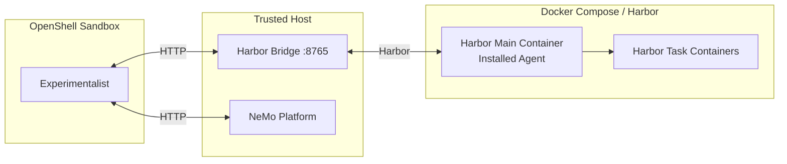
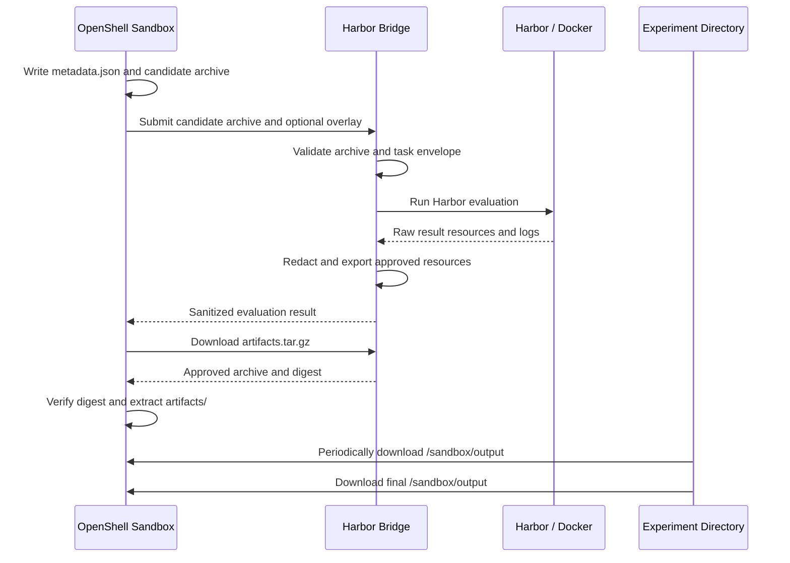

<!-- SPDX-FileCopyrightText: Copyright (c) 2025-2026 NVIDIA CORPORATION & AFFILIATES. All rights reserved. -->
<!-- SPDX-License-Identifier: Apache-2.0 -->

# OpenShell Harbor bridge walkthrough

Problem statement: the experimentalist is a NOOA agent agble to execute python code in the host system, has access to internet both internal and secrets on the host. The AUT is executed in harbor containers which can restrict access to internet (not by default) and have limited access to secrets.

Goal: best effort approach to sandbox the experimentalist and AUT. We use the NVIDIA solution for sandboxing (OpenShell). Openshell cannot run Docker inside of it so we push the docker execution outside the sandbox with a small layer of trust.

## Implementation



The Experimentalist is the only component in OpenShell. The bridge and NeMo
Platform run on the trusted host; Harbor and the agent under test run in the
bridge-owned Docker Compose project. The detailed HTTP permissions for the two
sandbox-facing edges are listed in the network-policy topology below.

# Network policy

The OpenShell sandbox has a default-deny network policy. It may contact only
the configured Harbor bridge and the configured NeMo Platform base URL; it has
no Docker socket, direct Harbor endpoint, or arbitrary internet access.

The policy allows the following HTTP methods and paths.

| Destination | Allowed requests | Purpose |
| --- | --- | --- |
| Harbor bridge | `GET /health/ready` | Liveness probe; no bearer token is required. |
| Harbor bridge | `POST /v1/evaluations` | Submit a Harbor evaluation. |
| Harbor bridge | `GET /v1/evaluations/{job_id}` | Poll an evaluation result. |
| Harbor bridge | `GET /v1/evaluations/{job_id}/artifacts` | Download the verified result archive. |
| Harbor bridge | `DELETE /v1/evaluations/{job_id}` | Cancel an evaluation and remove its Docker resources. |
| Harbor bridge | `POST /v1/dependencies` | Start a short-lived dependency session. |
| Harbor bridge | `POST /v1/dependencies/{session_id}/exec` | Run an allowlisted dependency operation. |
| Harbor bridge | `DELETE /v1/dependencies/{session_id}` | End a dependency session. |
| NeMo Platform | `GET /health/ready` | Verify that the configured platform is ready. |
| NeMo Platform | `GET`, `POST`, `PUT /apis/intake/v2/workspaces/**` | Read and publish Experimentalist traces and evaluator results. |
| NeMo Platform | `GET /apis/insights/v2/workspaces/**` | Read Insights when Insight-driven mode is enabled. |
| NeMo Platform | `GET /apis/models/v2/workspaces/**` | Resolve the configured default and fast models. |
| NeMo Platform | `POST /apis/inference-gateway/v2/workspaces/**` | Make model-inference requests through the platform. |

Every `/v1/**` bridge request requires the bearer token injected by the
OpenShell bridge provider. The provider policy is method- and path-specific,
so a request outside this table is denied before it reaches the bridge.

# Secret policy

The OpenShell sandbox has no direct access to host secrets. Its only injected
secret is `NEMO_EXPERIMENTALIST_HARBOR_BRIDGE_TOKEN`. The ephemeral OpenShell
provider injects it and applies it as `Authorization: Bearer …` on bridge
`/v1/**` requests. The provider definition is
[`nemo-experimentalist-harbor-bridge.yaml`](../plugins/nemo-experimentalist/src/nemo_experimentalist_plugin/openshell/provider-profiles/nemo-experimentalist-harbor-bridge.yaml).

The launcher passes these non-secret settings directly to the sandbox:

- `NMP_BASE_URL`
- `NEMO_EXPERIMENTALIST_HARBOR_BRIDGE_URL`
- `NEMO_DEFAULT_MODEL`
- `NEMO_FAST_MODEL`

The Harbor bridge runs on the trusted host and inherits the launcher's complete
environment. It passes that environment to Harbor as `agent_env`, which Harbor
scopes to the installed candidate-agent process. This supports AUT-specific
configuration and credentials such as `TAVILY_API_KEY` without a bridge-owned
allowlist of variable names. Values whose variable names contain `KEY`,
`TOKEN`, `SECRET`, `PASSWORD`, or `CREDENTIAL` are redacted from bridge results
and artifacts.

Independently, a Harbor task definition controls the environment for its task
and verifier containers (for example, through `environment.env` and
`verifier.env`). Those task-defined credentials are not sent to the OpenShell
sandbox. They should be scoped to the smallest set of containers and
capabilities the benchmark requires.

# Artifact policy

The sandbox sends bounded candidate input. The bridge returns only a verified,
sanitized result archive. Raw Harbor work directories, Docker volumes, host
paths, and unredacted logs remain on the host.



The sandbox stores the bridge submission in `metadata.json` before it submits
the job. On success, it safely extracts approved artifacts under:

```text
<experiment-dir>/eval-and-optimize/results/<candidate>-<dataset>/
├── metadata.json
└── artifacts/
```


## Using OpenShell as an optional sandbox

OpenShell is an opt-in execution boundary, not a replacement for the normal
local Experimentalist workflow.  Leave out `--execution-mode` to run locally
with Harbor. Add `--execution-mode openshell` when the optimizer itself should
run in an OpenShell sandbox while Harbor, Docker, and agent-under-test
credentials remain on the trusted host.

### Prerequisites

On the machine that starts Experimentalist, ensure all three host services are
ready:

```bash
export NMP_BASE_URL=http://localhost:8080

curl -fsS "$NMP_BASE_URL/health/ready"
openshell status
docker info
```

The default sandbox image is built from this checkout when necessary, so Docker
is required even though the OpenShell sandbox itself never receives Docker
socket access. Run a long optimization in `tmux` or another persistent session.

### Required configuration

The run configuration must disable source-control archival and winner
publication because an OpenShell run cannot safely perform those host actions:

```yaml
storage:
  archive_candidates: false
  publish_winner: false
```

For Harbor concurrency, omit `outcome_evaluator_config.n_concurrent_trials` to
use the host CPU count, or set it explicitly for a lower resource limit. The
same setting is used by the host bridge for every standard Harbor evaluation.

### Start a sandboxed run

Use the usual command and add exactly one opt-in flag:

```bash
uv run nemo agents experimentalist run \
  --execution-mode openshell \
  --no-insight \
  --agent path/to/agent \
  --agent-spec path/to/AGENT-SPEC.md \
  --train-dataset path/to/train-dataset \
  --validation-dataset path/to/validation-dataset \
  --config path/to/experimentalist.yaml \
  --base-url "$NMP_BASE_URL" \
  --experiment-dir path/to/experiment
```

Remove `--no-insight` and provide the normal Insight/task-template inputs for
an Insight-driven run. Dataset preparation, bridge startup, provider setup,
sandbox creation, output download, and normal cleanup are all internal to this
command. Users should not invoke `run.sh` or prepare an OpenShell sandbox by
hand.

When `NMP_BASE_URL` points at `localhost`, the launcher safely rewrites that
host for the sandbox and renders the matching platform port in its network
policy. For a platform outside the local host, use its reachable HTTP(S) base
URL. The hostname and port must be reachable from the OpenShell sandbox and
allowed by its policy; the launcher does not assume port `8080`.

### Observe, cancel, and troubleshoot

The host-side bridge log and per-job results are retained in the experiment
directory while the run is active:

```bash
tail -f path/to/experiment/openshell-runtime/host/bridge/bridge.log
find path/to/experiment/openshell-runtime/host/bridge/jobs -maxdepth 3 -name result.json
```

The wrapper also downloads a best-effort snapshot of the sandbox's public
`/sandbox/output` directory every 15 seconds to
`<experiment-dir>/openshell-live/`. This is useful for following generated
candidates and reports before the run finishes. It may lag by one interval or
contain a file that was being written during the snapshot; the final download
to the experiment directory remains the authoritative completed result. Set
`NEMO_EXPERIMENTALIST_OUTPUT_SYNC_INTERVAL` to a larger positive number to
reduce transfer overhead.

Use Ctrl-C or `kill <experimentalist-pid>` for normal cancellation. The
launcher terminates the bridge, deletes its ephemeral provider, and lets the
OpenShell wrapper delete the temporary sandbox. Avoid `kill -9`: it prevents
that cleanup. If a host failure leaves resources behind, inspect them with the
OpenShell and Docker CLIs, then remove only the sandbox or Compose project that
belongs to the interrupted experiment.

## OpenShell runtime configuration

The public interface is still `nemo agents experimentalist run --execution-mode openshell`.
Most `NEMO_EXPERIMENTALIST_*` variables are implementation wiring and should be
left unset. The supported diagnostic overrides are:

| Variable | Default | Purpose |
| --- | --- | --- |
| `NEMO_EXPERIMENTALIST_IMAGE` | `local/nmp-experimentalist:local` | Selects the image used for the OpenShell sandbox. Set it only to test a rebuilt or alternate runtime image. |
| `NEMO_EXPERIMENTALIST_KEEP_SANDBOX` | `0` | Set to `1` only while debugging to preserve the sandbox after the run. Normal runs delete it. |
| `NEMO_EXPERIMENTALIST_SANDBOX_NAME` | generated `nemo-exp-…` name | Overrides the temporary sandbox name for debugging. |
| `NEMO_EXPERIMENTALIST_OUTPUT_SYNC_INTERVAL` | `15` seconds | Frequency for best-effort snapshots of `/sandbox/output` in `<experiment-dir>/openshell-live/`. |
| `NEMO_EXPERIMENTALIST_POLICY_MODE` | `strict` | Selects the normal restrictive policy. `docker-desktop` is a macOS/Docker Desktop compatibility mode with weaker filesystem enforcement. |

### Policy modes

Both policy templates are default-deny and contain the same process,
filesystem-path, and network-route rules.  The launcher renders a per-run copy
of the selected template with the validated NeMo Platform hostname and port.
The mode changes only Landlock compatibility:

| Mode | Landlock setting | Intended use | Result when Landlock is unavailable |
| --- | --- | --- | --- |
| `strict` (default) | `hard_requirement` | Native Linux hosts where filesystem isolation is required. | Sandbox creation fails. |
| `docker-desktop` | `best_effort` | Docker Desktop, whose Linux VM may not provide the required Landlock support. | Sandbox can start without required Landlock enforcement. |

Use `docker-desktop` only for that compatibility case:

```bash
export NEMO_EXPERIMENTALIST_POLICY_MODE=docker-desktop
```

It is not a broader network-permission mode: it does not add hosts, ports, or
HTTP routes. The runtime emits a warning whenever this weaker mode is selected.

The following are internal values set by the launcher/provider and must not be
copied into user configuration: `NEMO_EXPERIMENTALIST_HARBOR_BRIDGE_URL`,
`NEMO_EXPERIMENTALIST_HARBOR_BRIDGE_TOKEN`,
`NEMO_EXPERIMENTALIST_HARBOR_BRIDGE_PROVIDER`, and
`NEMO_EXPERIMENTALIST_OPEN_SHELL_RUNTIME`. In particular, the bridge token is
a provider-managed credential, not an environment variable users should set.

Model selection is separate. `NEMO_DEFAULT_MODEL` and `NEMO_FAST_MODEL` select
Experimentalist's Platform model entities and are the only model values passed
to the sandbox. `AUT_MODEL_NAME`, `INFERENCE_API_KEY`, and
`INFERENCE_API_BASE` are required host-side bridge settings for the
agent-under-test evaluation; they are not passed to the OpenShell sandbox. The
launcher supplies no model, endpoint, credential, or policy fallback: configure
them through the Platform and trusted host environment before starting a run.
