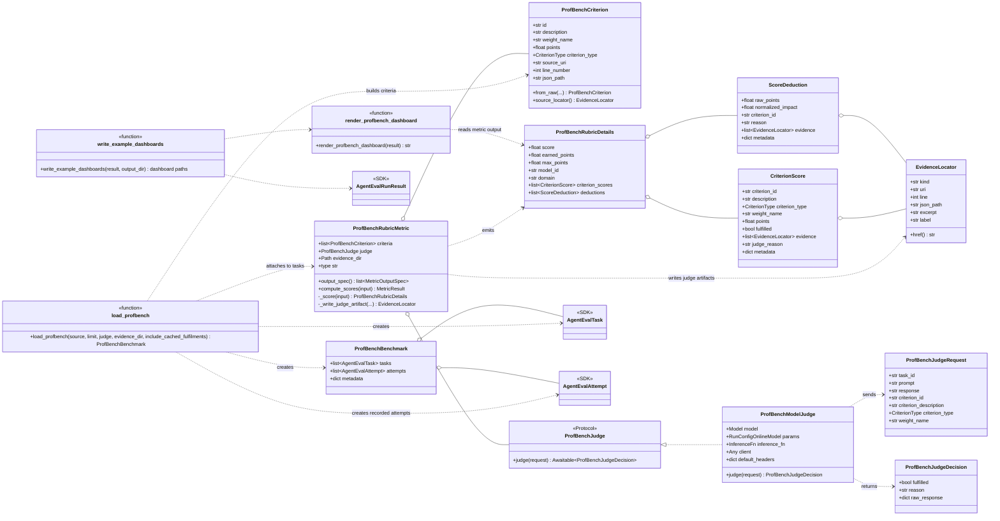

# ProfBench Class Diagram

## How to read this diagram

This diagram shows how the ProfBench example adapts the generic SDK agent-eval types. The boxes marked `<<SDK>>` are imported from `nemo_evaluator_sdk.agent_eval`; the other boxes are ProfBench-specific.

Notation:

- `o--` means "contains" or "is made of". For example, `ProfBenchBenchmark o-- AgentEvalTask` means the loaded benchmark object contains SDK tasks.
- `..>` means "uses", "creates", or "depends on". For example, `load_profbench ..> ProfBenchCriterion` means the loader builds criterion objects.
- `<|..` means "implements protocol". Here, `ProfBenchModelJudge` implements the `ProfBenchJudge` protocol.
- `<<function>>` marks module-level helper functions rather than classes.
- `+` means public field/method. `-` means private/internal helper.

Main structure:

1. `load_profbench()` reads the JSONL dataset and returns a `ProfBenchBenchmark`.
2. `ProfBenchBenchmark` contains SDK `AgentEvalTask` objects and recorded SDK `AgentEvalAttempt` objects.
3. Each task gets one `ProfBenchRubricMetric` configured with a list of `ProfBenchCriterion` objects.
4. Baseline scoring uses cached fulfilment labels from the dataset.
5. Live scoring uses a `ProfBenchJudge`; the concrete implementation is `ProfBenchModelJudge`.
6. The metric emits generic SDK metric outputs, but the detailed output value is a `ProfBenchRubricDetails` object.
7. The ProfBench dashboard reads those detailed outputs to render model scores, criterion scores, deductions, and evidence links.

Evidence model:

- `ProfBenchCriterion.source_locator()` links each criterion back to the local copied dataset JSONL.
- Live judge decisions can be written as `judge-*.json` artifacts.
- `CriterionScore` and `ScoreDeduction` both point at `EvidenceLocator` entries so the report can link back to source and judge evidence.
