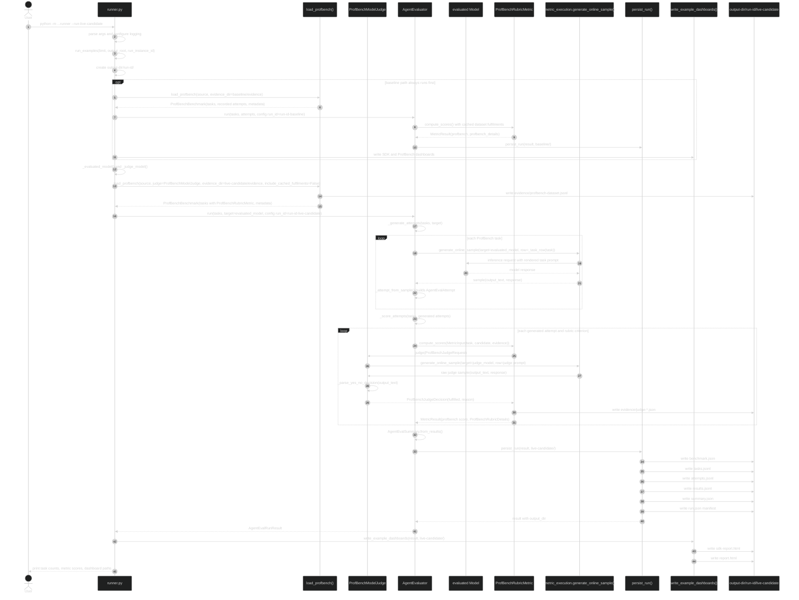

# ProfBench Live LLM-Judge Execution Sequence

## Details

What happens in the full live-candidate path:

1. `runner.py` parses CLI args, resolves the output root, creates one run id, and creates `<output-dir>/<run-id>/`.
2. Baseline runs first. It loads ProfBench, scores recorded attempts with dataset labels, persists baseline files, and writes dashboards.
3. The live-candidate path resolves two models: the evaluated model and the judge model.
4. `load_profbench()` loads tasks with `include_cached_fulfilments=False`, so cached labels are removed and the metric must call the judge.
5. `AgentEvaluator.run(tasks=..., target=evaluated_model, ...)` first generates fresh candidate attempts.
6. For each task, the evaluator calls `generate_online_sample()` against the evaluated model and converts the returned sample into an `AgentEvalAttempt`.
7. The evaluator then scores those generated attempts with `ProfBenchRubricMetric`.
8. For each rubric criterion, `ProfBenchRubricMetric` calls `ProfBenchModelJudge`.
9. `ProfBenchModelJudge` calls `generate_online_sample()` against the judge model, parses the judge output into a yes/no decision, and returns it to the metric.
10. The metric writes `evidence/judge-*.json` files and returns `MetricResult` outputs.
11. `AgentEvaluator` builds the summary and persists the run bundle.
12. `write_example_dashboards()` writes both `sdk-report.html` and the ProfBench-specific `report.html`.

Important distinction:

- The evaluated model produces the candidate answer.
- The judge model evaluates each rubric criterion.
- They can point to the same model configuration, but the code treats them as separate roles.

## Execution Flow Diagram

```mermaid
---
config:
  theme: dark
---
flowchart TD
    Start([CLI starts runner.py])
    Parse[Parse args and configure logging]
    ResolveRun[Resolve output root and create run id]
    CreateRunDir[Create output-dir/run-id]

    Start --> Parse --> ResolveRun --> CreateRunDir

    subgraph Baseline["Baseline path - always runs"]
        LoadBaseline[load_profbench with cached fulfilments]
        ScoreBaseline[AgentEvaluator.run with recorded attempts]
        DatasetLabels[ProfBenchRubricMetric uses dataset labels]
        PersistBaseline[Persist baseline run bundle]
        DashBaseline[Write baseline sdk-report.html and report.html]

        LoadBaseline --> ScoreBaseline --> DatasetLabels --> PersistBaseline --> DashBaseline
    end

    CreateRunDir --> LoadBaseline

    DashBaseline --> RunLiveJudge{run_live_judge?}
    RunLiveJudge -- no --> SkipJudge[Skip live-judge directory]
    RunLiveJudge -- yes --> LoadLiveJudge[load_profbench recorded answers without cached fulfilments]

    subgraph LiveJudge["Live judge path - recorded answers, live rubric judge"]
        LoadLiveJudge --> ScoreRecorded[AgentEvaluator.run with recorded attempts]
        ScoreRecorded --> JudgeRecorded[For each criterion call ProfBenchModelJudge]
        JudgeRecorded --> JudgeArtifactsA[Write live-judge/evidence/judge-*.json]
        JudgeArtifactsA --> PersistLiveJudge[Persist live-judge run bundle]
        PersistLiveJudge --> DashLiveJudge[Write live-judge dashboards]
    end

    SkipJudge --> RunLiveCandidate{run_live_candidate?}
    DashLiveJudge --> RunLiveCandidate

    RunLiveCandidate -- no --> SkipCandidate[Skip live-candidate directory]
    RunLiveCandidate -- yes --> ResolveModels[Resolve evaluated model and judge model]

    subgraph LiveCandidate["Live candidate path - fresh answers, live rubric judge"]
        ResolveModels --> LoadLiveCandidate[load_profbench tasks without cached fulfilments]
        LoadLiveCandidate --> GenerateAttempts[Generate fresh attempts with evaluated model]
        GenerateAttempts --> ScoreFresh[Score generated attempts]
        ScoreFresh --> JudgeFresh[For each criterion call ProfBenchModelJudge]
        JudgeFresh --> JudgeArtifactsB[Write live-candidate/evidence/judge-*.json]
        JudgeArtifactsB --> PersistLiveCandidate[Persist live-candidate run bundle]
        PersistLiveCandidate --> DashLiveCandidate[Write live-candidate dashboards]
    end

    SkipCandidate --> Done([Runner prints paths and exits])
    DashLiveCandidate --> Done
```

How this differs from the sequence diagram:

- The sequence diagram shows call timing and who calls whom.
- This flow diagram shows decisions and branches.
- Baseline always runs first.
- `live-judge` reuses recorded dataset answers and only calls the judge model.
- `live-candidate` calls the evaluated model first, then calls the judge model for rubric scoring.
