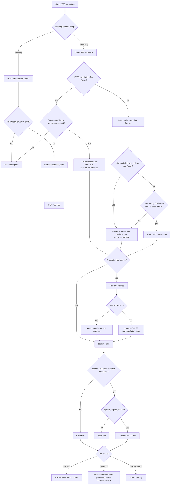

# Agent Evaluation Architecture

## GenericAgent and NemoAgentToolkitAgent evaluation paths

The architecture is application-agnostic. Its central mental model is:

> `GenericAgent` and `NemoAgentToolkitAgent` have different public
> configurations, but both normalize into the same internal HTTP invocation.
> Hermes is one real-world example of how a streaming `GenericAgent` can add
> domain-specific interpretation through a translator while keeping the
> transport shared; it is not the scope of the architecture itself.

### 1. Complete architecture flow

```mermaid
flowchart TB
    %% ─────────────────────────────
    %% APPLICATION CONFIGURATION
    %% ─────────────────────────────

    subgraph HERMES["Example: Hermes Responses SSE evaluation"]
        HM0["Load streaming smoke task"]
        HM1["GenericAgent<br/>format = generic"]
        HM2["Responses request<br/>model, input, stream, store"]
        HM3["response_path = $..text<br/>stream = true"]
        HM4["HermesStreamTranslator"]
        HM5["partial make_agent_inference_fn<br/>translator = Hermes translator<br/>capture_evidence = true"]
        HM6["AgentEvaluator<br/>agent_inference_fn_factory = Hermes factory"]

        HM0 --> HM1 --> HM2 --> HM3 --> HM6
        HM4 --> HM5 --> HM6
    end

    subgraph GENERIC["Example: customer-support evaluation"]
        G0["Load application tasks"]
        G1["GenericAgent<br/>format = generic<br/>body = request template<br/>response_path = $.answer"]
        G2{"Streaming endpoint?"}
        G3["stream = true<br/>optional trajectory_path"]
        G4["stream = false<br/>blocking JSON"]
        G5["AgentEvaluator<br/>default factory"]
        G6["Optional custom factory<br/>capture_evidence = true<br/>optional translator"]

        G0 --> G1 --> G2
        G2 -- JSON SSE --> G3 --> G5
        G2 -- JSON response --> G4 --> G5
        G6 -. optional override .-> G5
    end

    subgraph NAT["NeMo Agent Toolkit evaluation"]
        NT0["Load NAT workflow tasks"]
        NT1["NemoAgentToolkitAgent<br/>format = nemo_agent_toolkit"]
        NT2["Optional NatAgentConfig<br/>endpoint, request mode,<br/>query params, response_path"]
        NT3["AgentEvaluator<br/>default factory"]

        NT0 --> NT1 --> NT2 --> NT3
    end

    %% ─────────────────────────────
    %% EVALUATOR ORCHESTRATION
    %% ─────────────────────────────

    HM6 --> E0
    G5 --> E0
    NT3 --> E0

    subgraph EVALUATOR["Shared AgentEvaluator orchestration"]
        E0["run_sync → run"]
        E1["Validate tasks and target"]
        E2["Assign run_id"]
        E3["Resolve RunConfigOnline"]
        E4["Create concurrency semaphore"]
        E5["For each task"]
        E6["Build agent_eval_context<br/>run_id<br/>task_id<br/>invocation_id"]
        E7["Build safe per-task evidence directory"]
        E8{"Direct inference_fn supplied?"}
        E9["Use direct function<br/>factory is bypassed"]
        E10["Select configured factory<br/>or make_agent_inference_fn"]
        E11["Factory receives<br/>AgentInferenceContext"]
        E12["Returns AgentInferenceFn<br/>partial invoke_agent"]

        E0 --> E1 --> E2 --> E3 --> E4 --> E5
        E5 --> E6 --> E7 --> E8
        E8 -- yes --> E9
        E8 -- no --> E10 --> E11 --> E12
    end

    %% ─────────────────────────────
    %% REQUEST CREATION
    %% ─────────────────────────────

    E9 --> S0
    E12 --> S0

    subgraph SAMPLE["Shared sample generation"]
        S0["Render prompt_template<br/>using task row and agent_eval context"]
        S1["Run request preprocessing hooks"]
        S2["Call AgentInferenceFn"]
        S0 --> S1 --> S2
    end

    %% ─────────────────────────────
    %% PUBLIC MODEL NORMALIZATION
    %% ─────────────────────────────

    S2 --> N0

    subgraph NORMALIZE["Normalize public agent into immutable HTTP invocation"]
        N0{"Which discriminator variant?"}

        N1["NemoAgentToolkitAgent"]
        N2["Resolve NAT endpoint"]
        N3["Apply input_message or passthrough mode"]
        N4["Forward NAT query parameters"]
        N5["Set response mode = SSE"]

        N6["GenericAgent"]
        N7["Render GenericAgent.body"]
        N8["Use GenericAgent.url"]
        N9["Copy response_path and trajectory_path"]
        N10{"GenericAgent.stream?"}
        N11["Set response mode = SSE"]
        N12["Set response mode = blocking JSON"]

        N0 -- nemo_agent_toolkit --> N1 --> N2 --> N3 --> N4 --> N5
        N0 -- generic --> N6 --> N7 --> N8 --> N9 --> N10
        N10 -- true --> N11
        N10 -- false --> N12
    end

    %% ─────────────────────────────
    %% SHARED HTTP ENGINE
    %% ─────────────────────────────

    N5 --> H0
    N11 --> H0
    N12 --> H1

    subgraph HTTP["One shared HTTP engine"]
        H0["Streaming HTTP POST"]
        H1["Blocking HTTP POST"]
        H2["Apply headers and authentication"]
        H3["Execute through resilience scheduler"]
        H4["Decode response.json"]
        H5["Extract response_path"]
        H6["Return completed AgentInvocationResult"]

        H7["Read response line by line"]
        H8["Retain raw line"]
        H9["Parse supported payload field"]
        H9A{"SseFrame parsed?"}
        H10{"Frame channel?"}
        H11["Retain application-specific channels<br/>for evidence or translation"]
        H12{"Payload is DONE?"}
        H13["Ignore terminal marker"]
        H14["Apply response_path"]
        H15["Last non-null response match wins"]
        H16["Apply trajectory_path when configured"]
        H17["Last non-null trajectory match wins"]
        H18["Record stream or payload error"]

        H0 --> H2 --> H3 --> H7
        H1 --> H2
        H2 --> H3
        H3 --> H4 --> H5 --> H6

        H7 --> H8 --> H9 --> H9A
        H9A -- "no: event line" --> H7
        H9A -- yes --> H10
        H10 -- non-data field --> H11 --> H7
        H10 -- data --> H12
        H12 -- yes --> H13 --> H7
        H12 -- no --> H14 --> H15 --> H16 --> H17 --> H18 --> H7
    end

    %% ─────────────────────────────
    %% STREAM INTERPRETATION
    %% ─────────────────────────────

    H7 --> T0

    subgraph TRANSLATION["Optional stream translation and evidence"]
        T0["SSE stream ends"]
        T1["Build standard stream evidence<br/>raw_stream<br/>stream_events<br/>request_payload<br/>request_headers<br/>http_metadata"]
        T2{"Translator configured<br/>and frames exist?"}
        T3["Build AgentStreamTranslationContext"]
        T4["Call AgentStreamTranslator"]
        T5{"Translation valid?"}
        T6["Merge canonical ATIF trace<br/>and application evidence"]
        T7["Set invocation status = FAILED<br/>add translation_error evidence"]
        T8{"Evidence directory configured?"}
        T9["Persist evidence safely<br/>replace inline data with file refs"]
        T10["Return AgentInvocationResult"]

        T0 --> T1 --> T2
        T2 -- yes --> T3 --> T4 --> T5
        T5 -- yes --> T6 --> T8
        T5 -- no --> T7 --> T8
        T2 -- no --> T8
        T8 -- yes --> T9 --> T10
        T8 -- no --> T10
    end

    %% ─────────────────────────────
    %% EXAMPLE TRANSLATOR DETAILS
    %% ─────────────────────────────

    HM4 -. implementation of generic protocol .-> HMT0

    subgraph HERMES_TRANSLATOR["Example: Hermes semantic adapter"]
        HMT0["Receive all SseFrame objects"]
        HMT1["Select JSON data payloads"]
        HMT2["Require final JSON data payload<br/>type = response.completed"]
        HMT3["Validate completed status<br/>and output text"]
        HMT4["Build ATIF-v1.7<br/>user and agent steps"]
        HMT5["Map input and output<br/>token usage"]
        HMT6["Return AgentStreamTranslation"]

        HMT0 --> HMT1 --> HMT2 --> HMT3 --> HMT4 --> HMT5 --> HMT6
    end

    HMT6 -. returned to shared engine .-> T5

    %% ─────────────────────────────
    %% SAMPLE, TRIAL, SCORING
    %% ─────────────────────────────

    H6 --> A0
    T10 --> A0

    subgraph RESULT["Adapt invocation into evaluation result"]
        A0["Process response and output text"]
        A1["Build generated sample"]
        A2["Attach invocation status, metadata and evidence"]
        A3["Convert sample into AgentEvalTrial"]
        A4{"Evidence precedence"}
        A5["trajectory exists:<br/>merge without replacing typed trace"]
        A6["typed evidence only:<br/>preserve unchanged"]
        A7["neither exists:<br/>create fallback trace"]
        A8["Keep evaluator metadata authoritative"]
        A9["Run every task metric"]
        A10["Build scores and diagnostics"]
        A11["Build AgentEvalResult and summary"]
        A12["Persist result bundle and dashboard"]

        A0 --> A1 --> A2 --> A3 --> A4
        A4 -- trajectory --> A5 --> A8
        A4 -- typed evidence --> A6 --> A8
        A4 -- neither --> A7 --> A8
        A8 --> A9 --> A10 --> A11 --> A12
    end

    %% ─────────────────────────────
    %% APPLICATION CONSUMERS
    %% ─────────────────────────────

    A12 --> HMO["Example: Hermes evaluation writes reports"]
    A12 --> GO["Generic application consumes<br/>scores, trials and evidence"]
    A12 --> NTO["NAT application consumes<br/>scores, trials and evidence"]
    A12 -. explicit optional consumer .-> INTAKE["publish_to_intake result<br/>does not rerun the agent"]

    classDef hermes fill:#fde68a,stroke:#b45309,color:#111827;
    classDef generic fill:#bfdbfe,stroke:#1d4ed8,color:#111827;
    classDef nat fill:#cffafe,stroke:#0e7490,color:#111827;
    classDef shared fill:#dcfce7,stroke:#15803d,color:#111827;
    classDef evidence fill:#f3e8ff,stroke:#7e22ce,color:#111827;
    classDef output fill:#fee2e2,stroke:#b91c1c,color:#111827;

    class HM0,HM1,HM2,HM3,HM4,HM5,HM6,HMT0,HMT1,HMT2,HMT3,HMT4,HMT5,HMT6,HMO hermes;
    class G0,G1,G2,G3,G4,G5,G6,GO generic;
    class NT0,NT1,NT2,NT3,NTO nat;
    class E0,E1,E2,E3,E4,E5,E6,E7,E8,E9,E10,E11,E12,S0,S1,S2,N0,N1,N2,N3,N4,N5,N6,N7,N8,N9,N9A,H10,H11,H12,H13,H14,H15,H16,H17,H18 shared;
    class T0,T1,T2,T3,T4,T5,T6,T7,T8,T9,T10 evidence;
    class A0,A1,A2,A3,A4,A5,A6,A7,A8,A9,A10,A11,A12,INTAKE output;
```



The critical convergence point is `_resolve_http_agent_invocation()`. Everything above it is public application configuration; everything below it is shared transport and evaluation infrastructure.

### 2. Debugger-style sequence

```mermaid
sequenceDiagram
    autonumber

    actor Caller as Application
    participant AE as AgentEvaluator
    participant F as AgentInferenceFnFactory
    participant SG as generate_online_sample
    participant IA as invoke_agent
    participant NR as Agent normalizer
    participant HTTP as httpx + resilience
    participant API as Agent endpoint
    participant TR as AgentStreamTranslator
    participant FS as Evidence filesystem
    participant MT as Metrics
    participant OUT as Result persistence

    alt Example: Hermes Responses SSE
        Caller->>Caller: Load streaming smoke task
        Caller->>Caller: Construct GenericAgent
        Caller->>Caller: Configure Responses body and response_path=$..text
        Caller->>Caller: Set stream=true and configure HermesStreamTranslator
        Caller->>AE: run_sync(tasks, generic target, config)
    else NeMo Agent Toolkit workflow
        Caller->>Caller: Construct NemoAgentToolkitAgent
        Caller->>Caller: Optionally override NatAgentConfig
        Caller->>AE: run_sync(tasks, NAT target, config)
    else Generic application
        Caller->>Caller: Construct GenericAgent
        Caller->>Caller: Select stream=false or stream=true
        Caller->>AE: run_sync(tasks, generic target, config)
    end

    AE->>AE: Validate exactly one live target
    AE->>AE: Resolve run_id and RunConfigOnline
    AE->>AE: Create shared httpx client

    loop Once per task, bounded by parallelism
        AE->>AE: Build task row
        AE->>AE: Build run_id, task_id and invocation_id
        AE->>AE: Build safe evidence directory

        alt Direct inference_fn supplied
            AE->>AE: Use direct function
        else Hermes configured factory
            AE->>F: factory(AgentInferenceContext)
            F-->>AE: partial(invoke_agent, translator, capture=true)
        else Shared default factory
            AE->>F: make_agent_inference_fn(context)
            F-->>AE: partial(invoke_agent, capture=false)
        end

        AE->>SG: Generate sample
        SG->>SG: Render prompt template
        SG->>SG: Run preprocessing hooks
        SG->>IA: AgentInferenceFn(target, request)

        IA->>NR: Normalize public target

        alt NemoAgentToolkitAgent
            NR->>NR: Resolve NAT endpoint
            NR->>NR: Apply passthrough or input_message
            NR->>NR: Copy query params and response path
            NR-->>IA: HTTP invocation with stream=true
        else GenericAgent
            NR->>NR: Render agent.body using request
            NR->>NR: Copy URL and JSONPaths
            NR-->>IA: HTTP invocation with stream=agent.stream
        end

        alt Blocking GenericAgent
            IA->>HTTP: POST JSON
            HTTP->>API: Request with retries
            API-->>HTTP: JSON response
            HTTP-->>IA: Parsed JSON
            IA->>IA: Extract response_path
            IA-->>SG: COMPLETED AgentInvocationResult
        else NAT or streaming GenericAgent
            IA->>HTTP: Open streaming POST
            HTTP->>API: Request with retries

            loop Each SSE line
                API-->>HTTP: SSE line
                HTTP->>IA: Raw line
                IA->>IA: Preserve raw line
                IA->>IA: Ignore event: lines; parse payload fields into SseFrame

                alt data frame
                    IA->>IA: Ignore DONE marker
                    IA->>IA: Apply response_path
                    IA->>IA: Keep last non-null value
                    IA->>IA: Apply optional trajectory_path
                else application-specific channel
                    IA->>IA: Retain frame for evidence or translator
                end
            end

            opt Capture or translation enabled
                IA->>IA: Build standard stream evidence
            end

            opt Hermes translator configured
                IA->>TR: frames + AgentStreamTranslationContext
                TR->>TR: Require terminal response.completed data payload
                TR->>TR: Validate status and output text
                TR->>TR: Build ATIF-v1.7 user and agent steps
                TR->>TR: Map usage to final token metrics
                TR-->>IA: canonical trajectory
                IA->>IA: Merge typed trace
            end

            opt Evidence directory configured
                IA->>FS: Persist evidence files
                FS-->>IA: File-backed descriptors
            end

            IA-->>SG: AgentInvocationResult
        end

        SG->>SG: Apply postprocessing hooks
        SG->>SG: Build sample with output, status, metadata and evidence
        SG-->>AE: Generated sample

        AE->>AE: Convert sample to AgentEvalTrial
        AE->>AE: Apply trace precedence rules
    end

    loop Every task × trial × metric
        AE->>MT: Score trial
        MT-->>AE: Score or diagnostic
    end

    AE->>AE: Build AgentEvalSummary
    AE->>OUT: Persist AgentEvalResult and dashboard
    OUT-->>Caller: Durable local result

    alt Example: Hermes
        Caller->>Caller: Write Hermes evaluation reports
        opt Explicit Intake publishing
            Caller->>OUT: publish_to_intake(existing result)
            Note over Caller,OUT: Publishing consumes the result.<br/>It does not invoke Hermes again.
        end
    else NeMo Agent Toolkit workflow
        Caller->>Caller: Display, export, or compare scores
    else Generic application
        Caller->>Caller: Display, export, or compare scores
    end
```

### 3. Status and failure behavior



Important nuance: `PARTIAL` is still inspectable and can be scored. `FAILED` is reserved for cases such as translation failure or an evaluator-converted request failure.

### 4. Application configurations

As a concrete example, Hermes supplies domain knowledge through a translator
while using a `GenericAgent` for its Responses HTTP and SSE contract:

```python
target = GenericAgent(
    url="http://127.0.0.1:8642/v1/responses",
    name="hermes-agent",
    api_key_secret=SecretRef("HERMES_TOKEN"),
    body={
        "model": "hermes-agent",
        "input": "{{ instruction }}",
        "stream": True,
        "store": False,
    },
    response_path="$..text",
    stream=True,
)

evaluator = AgentEvaluator(
    agent_inference_fn_factory=partial(
        make_agent_inference_fn,
        stream_translator=HermesStreamTranslator(),
        capture_evidence=True,
    ),
    default_headers={"Accept": "text/event-stream"},
)
```

A generic streaming application needs no NAT configuration:

```python
target = GenericAgent(
    url="https://support.example.com/answer/stream",
    name="customer-support-agent",
    body={"question": "{{ prompt }}"},
    response_path="$.answer",
    trajectory_path="$.trajectory",
    stream=True,
)

evaluator = AgentEvaluator(
    agent_inference_fn_factory=partial(
        make_agent_inference_fn,
        capture_evidence=True,
    ),
)
```

A NeMo Agent Toolkit workflow uses its fixed request and JSON SSE response
protocol, so it does not define a generic `body`, `response_path`, or `stream`
field. `NatAgentConfig` can override the NAT defaults when needed:

```python
target = NemoAgentToolkitAgent(
    url="http://127.0.0.1:8000",
    name="nat-agent",
)

evaluator = AgentEvaluator()
```

For blocking JSON, the generic application only changes `stream=False`.

### 5. What belongs where

| Layer | Hermes example | Generic application | NeMo Agent Toolkit | Shared SDK |
| --- | --- | --- | --- | --- |
| Public target | `GenericAgent` | `GenericAgent` | `NemoAgentToolkitAgent` | Discriminated `Agent` union |
| Request defaults | Responses `body`, URL, JSONPaths | `body`, URL, JSONPaths | `NatAgentConfig` | Normalization |
| Transport | JSON SSE | JSON or JSON SSE | JSON SSE | One HTTP engine |
| Domain interpretation | `HermesStreamTranslator` | Usually none; optional custom translator | NAT response path; optional custom translator | Generic translator protocol |
| Evidence | ATIF, token usage, raw stream | Raw stream and optional trajectory | Raw stream and optional translated ATIF | Capture and persistence |
| Evaluation | `KeywordMatchMetric` | Application metrics | Application metrics | Trial creation, scoring, summary |
