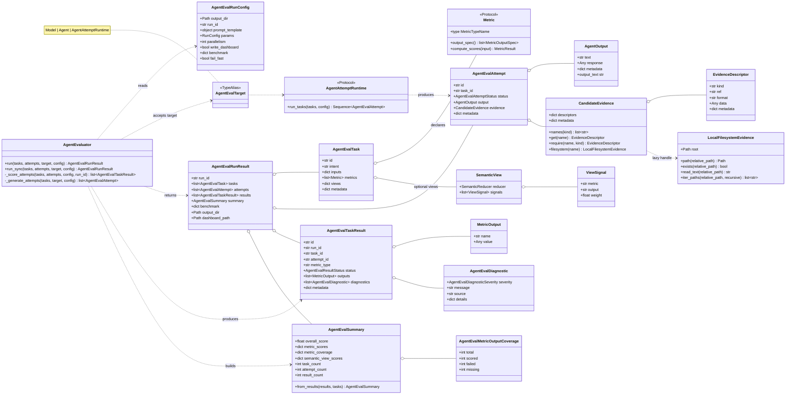

## Agent Eval Class Diagram

Main flow:

1. `AgentEvaluator.run()` is the orchestrator.
2. A run evaluates `AgentEvalTask` objects with either supplied `AgentEvalAttempt` objects or a live `AgentEvalTarget`.
3. Each task declares concrete `Metric` instances and optional `SemanticView` reporting definitions.
4. Each attempt carries `AgentOutput` plus optional `CandidateEvidence`.
5. Metric execution produces `AgentEvalTaskResult` rows.
6. Results roll up into `AgentEvalSummary`, then `AgentEvalRunResult` holds the complete run bundle.

Evidence model:

- `CandidateEvidence` is descriptor-first. It stores named `EvidenceDescriptor` values.
- `filesystem(name)` is lazy: metrics only get a `LocalFilesystemEvidence` handle if they ask for filesystem evidence.
- `AgentEvalTaskResult` diagnostics represent metric-level failures without necessarily failing the whole run.

## Execution Flow Diagram

```mermaid
---
config:
  theme: dark
---
flowchart TD
    OfflineCmd["uv run --frozen python -m packages.nemo_evaluator_sdk.examples.profbench.examples offline"]
    
    LocalCmd["uv run --frozen python -m packages.nemo_evaluator_sdk.examples.profbench.examples local --agent-model gpt-5.5"]

    subgraph ProfBenchCLI["ProfBench CLI and adapter"]
        Parse["examples.py parses args"]
        Select{"selected example"}
        OfflineEntry["run_offline_profbench_adapter_smoke()"]
        LocalEntry["run_local_codex_profbench_live_candidate_smoke()"]
        OfflineBenchmark["ProfBenchAgentEvalBenchmark()"]
        LocalTarget["resolve_codex_target(runtime=LOCAL, model=gpt-5.5)"]
        LocalBenchmark["ProfBenchAgentEvalBenchmark(judge_factory=ProfBenchModelJudge)"]
        LoadStored["benchmark.load(STORED_ATTEMPTS)\nreturns tasks + recorded attempts"]
        LoadLive["benchmark.load(LIVE_TARGET)\nreturns tasks only"]
    end

    subgraph RunnerEvaluator["agent_eval runner and evaluator"]
        Runner["runner.py::run_benchmark_bundle()"]
        BundleKind{"bundle.evaluation_kind"}
        StoredGuard["validate stored_attempts\nno target, attempts required"]
        LiveGuard["validate live_target\ntarget required, no attempts"]
        RunStored["AgentEvaluator.run(tasks, attempts, config)"]
        RunLive["AgentEvaluator.run(tasks, target, config)"]
        Generate{"attempts supplied?"}
        RuntimeGenerate["_generate_attempts()\ncall target.run_tasks() for AgentAttemptRuntime"]
        Score["_score_attempts()\nscore each task/attempt/metric"]
        MetricInput["build_metric_input()"]
        Fulfilments{"cached fulfilments present?"}
        MetricResult["validate metric result\ncreate AgentEvalTaskResult"]
        Summary["AgentEvalSummary.from_results()"]
        Persist["persist_run()\nbenchmark.json, tasks.jsonl, attempts.jsonl,\nresults.jsonl, summary.json, run.json"]
        OptionalSDKReport{"write_dashboard?"}
        SDKReport["write SDK dashboard"]
        Result["return AgentEvalRunResult"]
    end

    subgraph RuntimeReports["Runtime, metric scoring, and reports"]
        CodexRuntime["CodexCliAgentRuntime.run_tasks()\nhost codex exec with local auth"]
        GeneratedAttempts["fresh AgentEvalAttempt values\nwith output + evidence"]
        CachedLabels["ProfBenchRubricMetric\nuses cached dataset fulfilments"]
        LiveJudge["ProfBenchRubricMetric\ncalls ProfBenchModelJudge per criterion"]
        JudgeEvidence["write evidence/judge-*.json"]
        ReportWriter["benchmark_report_writer(benchmark).write_reports()"]
        Reports["write sdk-report.html and report.html"]
    end

    OfflineCmd --> Parse
    LocalCmd --> Parse
    Parse --> Select
    Select -- offline --> OfflineEntry
    Select -- local --> LocalEntry
    OfflineEntry --> OfflineBenchmark --> LoadStored
    LocalEntry --> LocalTarget --> LocalBenchmark --> LoadLive

    LoadStored --> Runner
    LoadLive --> Runner
    Runner --> BundleKind
    BundleKind -- stored_attempts --> StoredGuard --> RunStored
    BundleKind -- live_target --> LiveGuard --> RunLive
    RunStored --> Generate
    RunLive --> Generate
    Generate -- yes --> Score
    Generate -- no --> RuntimeGenerate --> CodexRuntime --> GeneratedAttempts --> Score
    Score --> MetricInput --> Fulfilments
    Fulfilments -- yes --> CachedLabels --> MetricResult
    Fulfilments -- no --> LiveJudge --> JudgeEvidence --> MetricResult
    MetricResult --> Summary --> Persist --> OptionalSDKReport
    OptionalSDKReport -- yes --> SDKReport --> Result
    OptionalSDKReport -- no --> Result
    Result --> ReportWriter --> Reports
```

The offline command loads a `stored_attempts` bundle, so `runner.py` rejects any live target and passes recorded
ProfBench attempts directly into `AgentEvaluator.run()`. Those attempts already contain dataset fulfilments, so
`ProfBenchRubricMetric` can score them without calling a model or judge.

The local Codex command loads a `live_target` bundle, so `runner.py` requires a target and passes the resolved host
Codex runtime into `AgentEvaluator.run()`. The evaluator asks `CodexCliAgentRuntime.run_tasks()` to generate fresh
attempts, then scores those attempts with `ProfBenchRubricMetric`; because cached fulfilments are absent in this path,
the metric calls `ProfBenchModelJudge` for each rubric criterion.

`runner.py` is not the module entrypoint for these commands. The example CLI invokes it through
`run_benchmark_bundle()`, which validates the benchmark bundle shape, calls `AgentEvaluator`, and then delegates to the
benchmark report writer for `sdk-report.html` and `report.html`.
