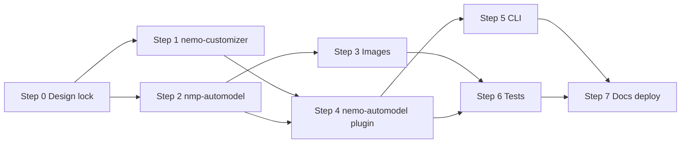
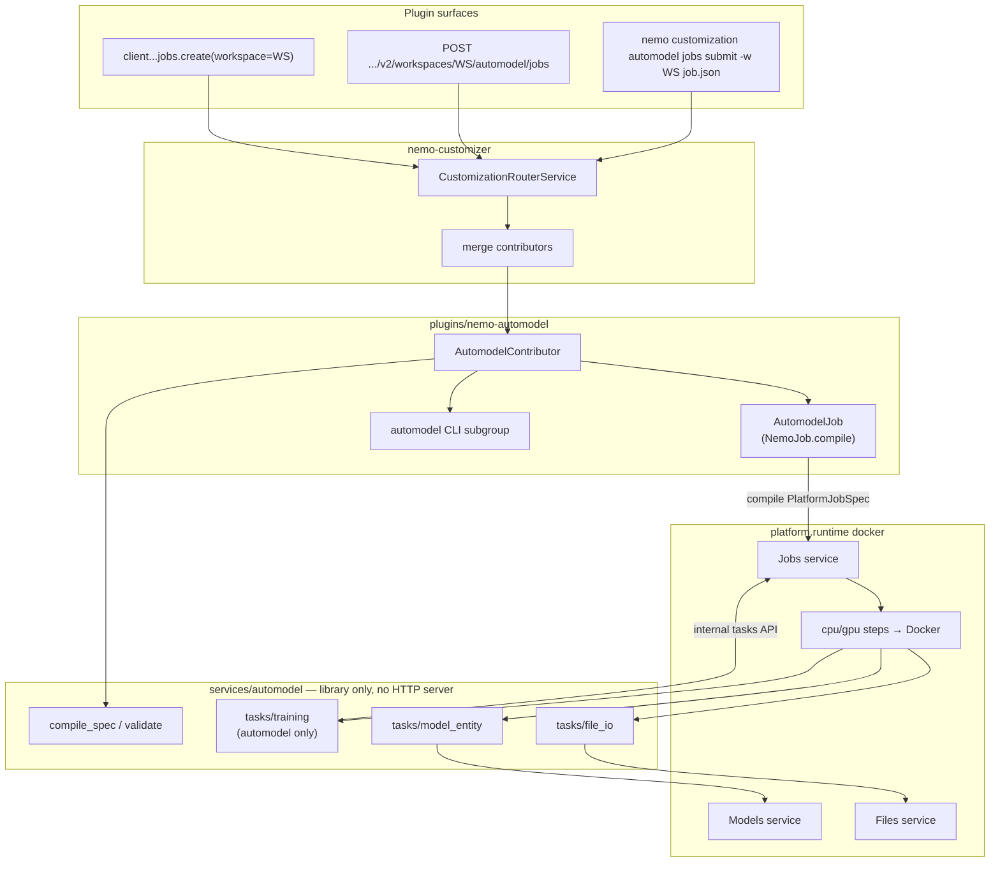

# NeMo Automodel Plugin — Work Scope

**Start here:** [Implementation order](#implementation-order) (sequence, checklists, success criteria).

This document scopes the work to replace the legacy Customizer Automodel path with a first-party **NeMo Automodel plugin** (customization **contributor**), the **`nemo-customizer-plugin`** router at `/apis/customization`, and the **`nmp-automodel`** task/compiler package (no standalone HTTP server). Legacy `Platform/services/customizer/` is reference only. New work: `plugins/nemo-customizer/`, `plugins/nemo-automodel/`, `services/automodel/`.

Training is powered by the upstream **`nemo_automodel`** library (repo: `Automodel/` at workspace root, NGC image `nvcr.io/nvidia/nemo-automodel:25.11.00`).

---

## Implementation order

Canonical sequencing for this scope. **Work breakdown** (below) and design sections add detail; checklists live here only.

### Sequence overview

| Step | Focus | Package / area | Blocks |
|------|--------|----------------|--------|
| **0** | Design lock + platform Jobs flag | cross-cutting | — |
| **1** | Customization router | `plugins/nemo-customizer` | Automodel HTTP (step 4) |
| **2** | Task/compiler library | `services/automodel` (`nmp-automodel`) | Images (step 3), contributor compile (step 4) |
| **3** | Container images | `nmp-automodel` Dockerfiles | E2E GPU runs |
| **4** | Automodel plugin + Docker gate | `plugins/nemo-automodel` | CLI submit (step 5), integration (step 6) |
| **5** | CLI submit path | `nemo-automodel` + router CLI | — |
| **6** | Tests & contracts | `Platform/tests/...` | — |
| **7** | SDK, OpenAPI, docs, deploy | platform + plugins | — |

**Parallel OK:** Step 0 Jobs flag with step 1–2. Step 2 compiler port with step 1 router (after contributor protocol is sketched).



---

### Step 0 — Design lock & platform prerequisites

Lock names, routes, schemas, and cross-cutting Jobs config before feature PRs. First implementation PR can be plugin + `nmp-automodel` without Studio migration.

**Design lock checklist**

- [x] **Name & routes:** Router `NemoService.name = customization`; Automodel contributor prefix `v2/workspaces/{workspace}/automodel` → `/apis/customization/v2/workspaces/{workspace}/automodel/...`; CLI `nemo customization automodel` — [URL routing](#url-routing-decided), [Customization router](#customization-router-in-scope--v1).
- [x] **Workspace contract:** Path `{workspace}` authoritative; spec uses workspace-relative names + optional `ws/name` qualifiers; dataset URI rules documented; **no** `workspace` key in JSON body — [Workspace scoping](#workspace-scoping-required).
- [x] **Simplified JSON schema:** Publish `AutomodelJobInput` (v1) for POST/CLI; `AutomodelJobOutput` for stored/GET; `extra="forbid"` — [Simplified JSON spec](#simplified-json-spec-draft--automodeljobinput-only).
- [x] **Schema validators (legacy parity):** Reject `output_model` with message to use `output` (legacy `CustomizationJobInput`); `model_config` / field validators for distillation-only fields when `training_type: sft`.
- [x] **Dataset shape:** `{ training, validation? }` fileset URIs; `to_spec()` runs `check_dataset_access` per ref (port `platform_client`) — legacy API used a single `dataset` string; mapping documented in migration guide.
- [x] **Integrations:** `wandb` / `mlflow` accept `api_key_secret` (`SecretRef`) plus enabled/project fields — not only `null` placeholders.
- [x] **v1 exclusions (locked):** `deployment_config` (post-train NIM deploy), embedding-model SFT, DPO/GRPO — see [Decisions](#decisions-resolved).
- [x] **Input vs canonical spec (Option A):** Two schemas + `to_spec()` — port `transform_input_to_output` — [Input vs canonical spec](#input-vs-canonical-spec--decided-option-a).
- [x] **Deprecation / Studio:** Legacy customizer not in default `AVAILABLE_SERVICES`; UI feature-flagged off — [Deprecation](#deprecation--platform-spin-up-and-studio-verified).

**Workspace registration (do before first integration test):**

- [x] Add `plugins/nemo-customizer`, `plugins/nemo-automodel`, `services/automodel` to root `Platform/pyproject.toml` workspace members.
- [x] Add `nemo-customizer-plugin` and `nemo-automodel-plugin` to `[dependency-groups] enabled-plugins` (pattern: `nemo-evaluator-plugin`).

**Platform Jobs — `jobs.enable_subprocess_executor`** (cross-cutting, not Automodel-only; rationale in [Platform jobs: `runtime` vs step executors](#platform-jobs-runtime-vs-step-executors)):

- [x] Add field to `JobsServiceConfig` (`Platform/services/core/jobs/src/nmp/core/jobs/config.py`).
- [x] Gate `SubprocessJobExecutionProfile` in `get_default_executor_profiles_for_runtime()` (K8s default `false`, docker local default `true`).
- [ ] Document in `Platform/services/core/jobs/README.md`.
- [ ] Expose in `packages/nmp_platform/config/local.yaml` and `nmp_platform_runner` local config.
- [ ] `GET /v2/execution-profiles` reflects the flag.

---

### Step 1 — `nemo-customizer` (blocks Automodel HTTP)

**Problem:** `discover_services()` maps each `nemo.services` key to one `/apis/<key>/` mount — only one owner for `customization`. Training backends (Automodel, RL, Megatron, Unsloth) must share one URL tree without a monolithic `nmp-customizer` or per-backend top-level services.

**Solution:** New package `plugins/nemo-customizer/` (`nemo_customizer`) ships the sole `nemo.services` → `customization` registration. Backends register as **contributors** via `nemo.customization.contributors`. Full design: [Customization router](#customization-router-in-scope--v1).

**Router behavior (implement in this step):**

1. `discover_customization_contributors()` — fault-isolated; allowlist `NEMO_PLUGIN_CUSTOMIZATION_CONTRIBUTORS_ALLOWLIST` (or `NEMO_PLUGIN_ALLOWLIST`).
2. **Zero contributors** → fail startup with clear error.
3. `CustomizationRouterService.get_routers()` — merge `RouterSpec` lists; **`dependencies`** = union of contributor + platform deps.
4. `CustomizationCLI.get_cli()` — `typer.Typer(name="customization")` + mount contributor subgroups (`automodel`, …).
5. OpenAPI / SDK — single service name `customization` when router + ≥1 contributor enabled.
6. **Route collision guard** — distinct segment per contributor under `.../workspaces/{workspace}/`; legacy `.../jobs` unmounted in v1.

**`nemo-customizer-plugin` pyproject.toml:**

```toml
[project.entry-points."nemo.services"]
customization = "nemo_customizer.router:CustomizationRouterService"

[project.entry-points."nemo.cli"]
customization = "nemo_customizer.cli:CustomizationCLI"
```

**Deliverables**

- [x] `CustomizationContributor` protocol in `nemo_platform_plugin/customization_contributor.py`; `discover_customization_contributors()` in `nemo_platform_plugin/discovery.py` (fault-isolated via `discover_entry_points`; allowlist `NEMO_PLUGIN_CUSTOMIZATION_CONTRIBUTORS_ALLOWLIST` or `NEMO_PLUGIN_ALLOWLIST`). `nemo_customizer/discovery.py` re-exports for backward compatibility.
- [x] **Zero contributors:** fail router startup with a clear error (do not mount an empty `/apis/customization` tree silently).
- [x] `CustomizationRouterService` + `CustomizationCLI` (merge contributors); **`dependencies`** = union of all contributor `dependencies` plus platform deps (`entities`, `jobs`, `auth`, …).
- [x] Entry points: `nemo.services` + `nemo.cli` → key `customization`.
- [x] Unit tests: two fake contributors → merged routes; prefix collision detection; zero contributors → startup error.
- [x] `OPENAPI_SERVICES` / registry: include `customization` when router plugin enabled **and** ≥1 contributor discovered.
- [x] `docs/CUSTOMIZATION.md` — contributor author guide (RL / Megatron / Unsloth).
- [x] Workspace members + `enabled-plugins` — [Step 0 workspace registration](#step-0--design-lock--platform-prerequisites).

**Out of scope:** Legacy `POST .../workspaces/{ws}/jobs` multi-backend path; Studio cutover.

---

### Step 2 — `nmp-automodel` package core

`Platform/services/automodel/` — Python package **`nmp-automodel`**: compilers, task entrypoints, Dockerfiles. **No HTTP server** (unlike legacy `customizer-server`). Reference port: `Platform/services/customizer/` (trim multi-backend paths only).

**4-step `PlatformJobSpec` pipeline** (Automodel-only):

1. `file_io` (CPU) — download model + datasets (`nmp/automodel-tasks` image).
2. Training (GPU) — `finetune.py` + `nemo_automodel` recipes (SFT + KD); `nmp/automodel-training` image.
3. `file_io` upload.
4. `model_entity` — register model in Models service (behavior unchanged from legacy).

| Area | Source | Action |
|------|--------|--------|
| Automodel config compiler | `tasks/training/backends/automodel/config.py` | Move; drop non-automodel imports; SFT + `_configure_kd()` |
| Training runner/backend | `backend.py`, `finetune.py`, `callbacks.py`, `checkpoints.py` | Move; keep `JobsServiceProgressReporter` + `TrainingProgressCallback` (rank-0) |
| Training step compiler | `app/jobs/training/compiler.py` | **Strip** to automodel-only; fixed `nmp/automodel-training` image ref |
| Job compiler | `app/jobs/compiler.py` | **Strip** DPO/RL/`nemo_rl`/`megatron_bridge`; keep distillation (KD); 4-step only |
| File I/O tasks | `tasks/file_io/` | Ported: `run.py`, `callbacks.py`, `utils.py`, `progress_reporter.py` |
| Model entity task | `tasks/model_entity/` | Move unchanged behavior |
| Schemas | `api/v2/jobs/schemas.py` | `AutomodelJobInput` + `AutomodelJobOutput` (+ sub-models) for plugin `to_spec` / compiler |

**Deliverables**

- [x] `nmp-automodel` installable; task entry points via console scripts + `nemo-platform run task --task nmp.automodel.tasks.*`.
- [x] Unit tests: adapter + compiler (`services/automodel/tests/`); contract `generate_configs.py` imports `nmp.automodel`.
- [x] Prove `PlatformJobSpec` generation for SFT (4-step pipeline, `nmp.automodel.tasks.*` commands, `nmp/automodel-training` / `nmp/automodel-tasks` images).
- [x] `validate_for_training()` on legacy `CustomizationJobOutput` (compiler); plugin `AutomodelJobOutput` has parallel validator in `nemo_automodel_plugin.schema`.
- [x] `platform_client.py` — `fetch_model_entity`, `check_dataset_access`.
- [x] `_resolve_v4_compatible()` in training compiler.
- [x] Task modules `nmp.automodel.tasks.{file_io,training,model_entity}`; compiled steps use `nmp.automodel.tasks.*`.
- [x] `AutomodelConfig.default_training_execution_profile` (`NMP_AUTOMODEL_*`); adapter + compile wrapper apply request `profile`.

**Internal Jobs callback path** (not a new public route — same contract as legacy customizer):

- [x] `NMPJobContext` env vars for job id, step, workspace, task name.
- [x] `JobsServiceProgressReporter` / `TrainingProgressCallback` → `sdk.jobs.tasks.create_or_update` (rank-0 only).
- [ ] Document as internal; exclude from public OpenAPI if auxiliary routes are added.

*Optional later:* webhook-style callbacks — out of initial scope.

---

### Step 3 — Container images

Two runtime images (`nmp/automodel-tasks`, `nmp/automodel-training`) built from `nmp/automodel-base` (PyTorch + `nemo_automodel` deps), published under `nvcr.io/0921617854601259/nemo-platform-dev/nmp/...` — not the upstream NGC `nvcr.io/nvidia/nemo-automodel` training container name and not full `nmp-customizer` / RL / Megatron stack. Do **not** reuse or extend `customizer-automodel` during transition.

| Image key | Dockerfile | Used by | Contents |
|-----------|------------|---------|----------|
| `nmp/automodel-training` | `Dockerfile.nmp-automodel-training` | GPU training step | `nmp/automodel-base` + `nmp-automodel` finetune backend (SFT + KD recipes) |
| `nmp/automodel-tasks` | `Dockerfile.nmp-automodel-tasks` | CPU steps (`file_io`, `model_entity`) | Slim glue; task entrypoints without customizer API server / RL / Megatron |

**Deliverables**

- [ ] Wire both keys in plugin `get_qualified_image()` / `NMP_AUTOMODEL_*` env overrides.
- [ ] CI: smoke import on **training** image (pattern: `Platform/tests/smoke_gpu/test_customizer_automodel.py`); lighter smoke on **tasks** image.
- [ ] Plugin README: size/dependency audit vs `customizer-automodel`.
- [ ] Helm/assets: image refs (Studio cutover to new URLs still out of scope).

---

### Step 4 — `nemo-automodel` plugin (contributor + job)

Plugin HTTP only — merged by router at `/apis/customization/.../automodel/...`. Requires **step 1** (`nemo-customizer-plugin`) in workspace. **`compile()`** depends on **step 2** (`nmp-automodel`).

**Automodel plugin `pyproject.toml` (contributor — not `nemo.services`):**

```toml
[project.entry-points."nemo.customization.contributors"]
automodel = "nemo_automodel_plugin.contributor:AutomodelContributor"

[project.entry-points."nemo.jobs"]
"customization.automodel.jobs" = "nemo_automodel_plugin.jobs.jobs:AutomodelJob"
```

**Deliverables**

- [x] **pyproject.toml:** `nemo-platform-plugin`, `nmp-automodel` (no `nemo-customizer-plugin` wheel dep — router installed via `enabled-plugins` only). Entry points:
  - `nemo.customization.contributors` → `AutomodelContributor` (`automodel`)
  - `nemo.jobs` → `customization.automodel.jobs` → `AutomodelJob`
  - optional `nemo.docs` (no `nemo.services` / no top-level `nemo.cli`)
- [x] **`AutomodelContributor.get_routers()`** — optional `.../automodel/healthz`; mount jobs via `add_job_routes` (see wiring below); prefix `v2/workspaces/{workspace}/automodel`; `job_collection_path = "/automodel/jobs"`.
- [x] **`add_job_routes` wiring (required):**
  - `service_name="customization"` — Jobs `source`, list filters, and OpenAPI service segment (default `_derive_service_name()` → `nemo-automodel-plugin` is **wrong**).
  - `generate_job_name=generate_automodel_id` — `automodel-{uuid.hex[:12]}` when body omits `name` (same pattern as legacy `generate_customization_id`).
  - `route_options=[JobRouteOption.CORE]` — create/list/get/delete/status/cancel/results; **no** PAUSE_RESUME in v1 (legacy parity).
  - `default_profile` from plugin config when spec omits `training.execution_profile`.
  - Request-body `profile` on `BaseJobRequest` — **deferred** (platform `add_job_routes` still drops it); v1 uses **`training.execution_profile`** in JSON only.
- [x] **`AutomodelJob`:** `description` set; `input_spec_schema` / `spec_schema` / `to_spec()` (Option A); `compile()` on `AutomodelJobOutput` only; `dependencies`: `entities`, `auth`, `jobs`, `secrets`, `files`, `models`.
- [ ] **Job envelope:** `description`, `project`, `ownership`, `custom_fields` — inherited from `job_route_factory` (no Automodel-specific fields); document in README.
- [x] **`get_cli()`** — `automodel` Typer subgroup via `add_job_commands` (`jobs` → `run` / `submit` / `explain` to `.../automodel/jobs`). Data Designer–style `cli/inputs.py` simplified JSON is [Step 5](#step-5--cli-submit-path), not required for Step 4.
- [x] SDK: `nemo-customizer-plugin` owns `nemo.sdk` → `customization`; composes `client.customization.automodel` from `nemo-automodel-plugin`. `nemo.docs` if user docs ship with plugin.
- [x] Workspace members + `enabled-plugins` — [Step 0 workspace registration](#step-0--design-lock--platform-prerequisites).

**Docker enforcement & GPU validation** (`nemo_platform_plugin.jobs.docker` today: `validate_gpu_available_for_docker` only when `runtime == DOCKER` and reserved GPU list is empty — **extend for all Automodel jobs**):

- [x] At **compile** (plugin `compile()` or shared helper): require `NemoPlatformConfig.runtime == DOCKER`.
- [x] Require `validate_docker_available()` (daemon reachable).
- [x] Require GPU pool configured (reuse or extend `validate_gpu_available_for_docker`).
- [x] `PlatformJobCompilationError` → 422, e.g. *“Automodel training requires `platform.runtime: docker` with GPU-backed container execution (Docker daemon reachable and GPUs configured).”*
- [x] Do **not** silently downgrade `platform.runtime` to `NONE` for this plugin.
- [ ] Do **not** conflate with `jobs.enable_subprocess_executor` — Automodel never schedules `subprocess` training steps.

---

### Step 5 — CLI submit path

First-class CLI for simplified JSON jobs (pattern: Data Designer `[CONFIG_SOURCE]` → canonical spec in `plugins/nemo-data-designer/.../cli/inputs.py`). Commands hang under `nemo customization automodel` (router CLI + contributor subgroup).

**Submit URL** (via `nemo_platform_plugin.commands` job submit helper):

`/apis/customization/v2/workspaces/{workspace}/automodel/jobs`

Custom wrappers must **forward** `--workspace` / `-w` to the framework callback (default `"default"` for local dev only).

**Deliverables**

- [x] `nemo customization automodel jobs submit <job.json> --workspace <ws>` — `cli/inputs.py` validates `AutomodelJobInput` and POSTs to `.../automodel/jobs` (`tests/test_cli.py`).
- [x] `jobs explain` — exposes `input_spec_schema` + `spec_schema` via framework `explain` (`tests/test_cli.py`).
- [x] CLI tests: `-w` / `--workspace` in submit URL (`submit_path_for` + mocked `submit_remote`).

---

### Step 6 — Tests & contract continuity

Relocate contract tests from legacy `customizer-automodel` path; validate router + contributor + compiler together.

**Deliverables**

- [x] Contract script import path fixed (`generate_configs.py` → `backends.config`); `services/automodel/tests/test_contract_configs.py` parses SFT/packing inputs + optional `--check` (embedding gated/skipped for v1).
- [x] Unit/API: Automodel + customization router routes under `/v2/workspaces/{workspace}/automodel/...` (`plugins/nemo-automodel/tests/test_api.py`).
- [x] Integration: compile-only via `services/automodel/tests/test_compiler.py` (contract fixture when present); CLI submit mocked in `test_cli.py`.
- [ ] Agentic smoke: adapt `Platform/tests/agentic-use/customizer-lora-job-cli` → `nemo customization automodel` CLI.
- [ ] E2E: job completes → **Model** entity exists → fileset populated → LoRA metadata when `finetuning_type=lora`.
- [x] Workspace isolation: routes scoped by `{workspace}` path segment (`test_api.py`); full cross-workspace API test deferred to Jobs service integration.

---

### Step 7 — SDK, OpenAPI, docs & rollout

**API & SDK polish**

- [ ] OpenAPI tags: “Automodel Training Jobs”.
- [ ] List/get/delete/results routes via `add_job_routes` defaults under `/v2/workspaces/{workspace}/automodel/jobs`.
- [x] SDK hub: `client.customization.automodel.jobs.create(workspace=..., spec=...)` — paths under `/v2/workspaces/{workspace}/automodel/jobs`; **no** silent global namespace default (document `workspace="default"` for local dev).
- [ ] Error mapping: `PlatformJobCompilationError` / `validate_for_training` → 422; `check_dataset_access` / model entity auth failures → 403 or 422 with clear copy.
- [ ] Migration guide field table: legacy flat `training` + single `dataset` string → `AutomodelJobInput` sections; `output_model` → `output`.

**Docs & deploy**

- [ ] Automodel plugin README: install, enabled-plugins, CLI examples, sample `job.json`.
- [ ] Config reference: `NMP_AUTOMODEL_*` (training/tasks image overrides, resource defaults); link `NMP_JOBS_ENABLE_SUBPROCESS_EXECUTOR` / [Step 0](#step-0--design-lock--platform-prerequisites).
- [ ] Migration guide: `CustomizationJob` / `CustomizationJobInput` → `AutomodelJobInput` field mapping.
- [ ] Helm/assets: deploy `nmp/automodel-training` + `nmp/automodel-tasks` (replace `customizer-automodel` on product cutover — Studio migration still out of scope).

---

### Success criteria (exit checks)

- [ ] `nemo customization automodel jobs submit job.json -w acme-corp` → `/apis/customization/v2/workspaces/acme-corp/automodel/jobs`; fails fast without Docker/GPU.
- [ ] `POST` accepts `AutomodelJobInput`; GET returns enriched `AutomodelJobOutput` in `acme-corp`.
- [ ] Completed job: **Model** entity + fileset + adapter metadata in same workspace.
- [ ] Training progress on Jobs task `status_details.metrics`.
- [ ] Training image CI smoke passes.
- [ ] No legacy `platform_job_config_compiler` / multi-backend customizer dependency.
- [ ] Router test: second fake contributor merges without router code changes.

---

## Goals (from requirements)

| Requirement | Intent |
|-------------|--------|
| **First-class CLI** | Submit/run jobs from a **simplified JSON** job config (not the full CustomizationJob API surface). Pattern: Data Designer’s `[CONFIG_SOURCE]` → canonical spec (`plugins/nemo-data-designer/.../cli/inputs.py`). |
| **Fail if Docker disabled for jobs** | Automodel training is GPU + container-only. Reject compile/submit when `platform.runtime` is not `docker` or Docker daemon/GPUs are unavailable (stricter than today’s “warn and set runtime NONE”). Independent of `jobs.enable_subprocess_executor`. |
| **First-class API** | Workspace-scoped REST under `/apis/customization/v2/workspaces/{workspace}/automodel/...` — `{workspace}` is a **required path segment** on every job route (create, list, get, delete, results). Served via the **customization router** (single `/apis/customization` mount); Automodel is the first contributor. |
| **Customization router** | **`nemo-customizer-plugin`** owns `/apis/customization` and merges HTTP/CLI/SDK from contributors (Automodel v1; RL / Megatron / Unsloth later) — no monolithic `nmp-customizer`, no per-backend top-level `/apis/*` services. |
| **Automodel-only job path** | No NeMo RL, Megatron-Bridge, DPO, GRPO, or multi-backend dispatch. Single compiler → single training step image. |
| **Internal callback API** | Keep task-level progress updates to the Jobs service (`sdk.jobs.tasks.create_or_update`) from training subprocesses — not a public user API. |
| **Simplified training image** | New image derived from `nemo-automodel` NGC base with only platform task glue + `nemo_automodel`, not full `nmp-customizer` / RL / Megatron stack. |
| **Entity lifecycle** | Jobs still: download artifacts → train → upload checkpoint → **create/update Model entity** (and LoRA adapter metadata where applicable). |
| **Jobs API parity** | `service_name="customization"` on `add_job_routes`; auto `automodel-{id}` names; `training.execution_profile` in spec; CORE routes only. |

---

## Platform jobs: `runtime` vs step executors

Two layers are easy to conflate; this plugin only cares about the second for **training steps**, but operators need both clear in config and docs.

| Layer | Config | Cardinality | Meaning |
|-------|--------|-------------|---------|
| **Platform deployment** | `platform.runtime` | **One value** per process (`docker` \| `kubernetes` \| `none`) | How the platform orchestrates container workloads (Docker daemon vs K8s vs neither). **Not** “how every job step runs.” |
| **Job step execution** | `platform_spec.steps[].executor` | **Per step** | Backend for that step: `cpu`/`gpu` + container → Docker or K8s; `subprocess` → host process (local dev / lightweight tasks). |

Today, when `platform.runtime: docker`, the Jobs service **implicitly** also registers `subprocess/default` (host execution) alongside `cpu/default` and `gpu/default` (Docker). That coupling is what makes `runtime: docker` sound like “everything runs in Docker.”

### Proposed: `jobs.enable_subprocess_executor`

Make host subprocess execution an **explicit** platform choice instead of a side effect of `runtime: docker`.

| Field | Type | Default | Behavior |
|-------|------|---------|----------|
| `jobs.enable_subprocess_executor` | `bool` | `true` when `platform.runtime == docker` (local dev); **`false` on Kubernetes** unless explicitly set `true` | When `true`, register `subprocess/default` and allow steps with `provider: subprocess`. When `false`, omit subprocess from default profiles; CPU/GPU container steps use Docker (or K8s) only. Dev clusters may opt in explicitly; production K8s should leave host execution disabled. |

**Implementation:** [Step 0 — Platform Jobs flag](#step-0--design-lock--platform-prerequisites) (cross-cutting, not Automodel-only).

**Automodel plugin implications:**

- Training steps are **always** `cpu`/`gpu` + container → Docker; Automodel does **not** depend on `enable_subprocess_executor`.
- Compile gate ([Step 4](#step-4--nemo-automodel-plugin-contributor--job)): **`platform.runtime == docker`** + daemon + GPUs — not “subprocess enabled.”
- Optional `jobs run` ([Step 4](#step-4--nemo-automodel-plugin-contributor--job) 2b): subprocess only if the flag is enabled.
- Prefer error copy: *“Automodel training requires `platform.runtime: docker` with GPU-backed container execution”* — avoid *“Docker job runtime”* without qualification.

**Example local config (explicit):**

```yaml
platform:
  runtime: docker

jobs:
  enable_subprocess_executor: true   # host steps for dev; training still uses cpu/gpu + container
  executor_defaults:
    docker:
      launcher_tool_path: ./services/core/jobs/jobs-launcher/jobs-launcher
    subprocess:
      working_directory: /tmp/nmp-subprocess-jobs
```

Production / GPU-only deployments can set `enable_subprocess_executor: false` to avoid registering host execution while keeping `runtime: docker` for Automodel and other container jobs.

---

## Current state (reference)

### Legacy Customizer (`Platform/services/customizer/`)

- **API**: `CustomizationJobInput` / `CustomizationJobOutput` via `job_route_factory` (`api/v2/jobs/endpoints.py`).
- **Compiler**: `platform_job_config_compiler` builds a **4-step** `PlatformJobSpec`:
  1. `nmp.customizer.tasks.file_io` (CPU) — download model + datasets
  2. Training (GPU) — backend selected in training compiler (`automodel` \| `nemo_rl` \| `megatron_bridge`)
  3. `file_io` upload
  4. `nmp.customizer.tasks.model_entity` — register model in Models service
- **Automodel backend**: `tasks/training/backends/automodel/` — `compile_automodel_config()`, `AutomodelBackend`, `finetune.py` (wraps `nemo_automodel` recipes + `TrainingProgressCallback`).
- **Image**: `nmp/automodel-training` (see `services/automodel/docker/`); contract tests in `services/automodel/tests/contract/`.
- **Progress “callbacks”**: `JobsServiceProgressReporter` + `TrainingProgressCallback` call Jobs internal task API (rank-0 only).

### Platform plugin patterns (`Platform/plugins/`)

- Entry points: training plugins use `nemo.customization.contributors`; **`nemo-customizer-plugin`** uses `nemo.services` + `nemo.cli` key `customization`; jobs via `nemo.jobs` (`customization.<backend>.<job>`).
- Jobs: `NemoJob` + `add_job_routes()` (`nemo_platform_plugin.jobs.routes`).
- Reference plugins: `nemo-evaluator` (service + job scaffold), `nemo-data-designer` (CLI config file → spec), `nemo-agents` (service + multiple routers).

### Simplified config shape (already validated)

Contract input JSONs under `services/automodel/tests/contract/input_configs/` are a good starting point for the **CLI/API simplified spec** (e.g. `llama_3_2_1b_lora.json`): `model`, `dataset`, `training`, `schedule`, `batch`, `optimizer`, `parallelism`, `output_model`, optional `seed`.

---

## Target architecture



### Package layout (proposed)

```
Platform/
  plugins/nemo-customizer/  # router + contributor protocol (v1)
    pyproject.toml
    src/nemo_customizer/
      router.py                       # CustomizationRouterService (nemo.services → customization)
      cli.py                          # CustomizationCLI
      contributor.py                  # re-export CustomizationContributor from nemo_platform_plugin
      discovery.py                    # re-export discover_customization_contributors
    docs/CUSTOMIZATION.md             # contributor author guide

  plugins/nemo-automodel/
    SCOPE.md                          # this file
    pyproject.toml
    src/nemo_automodel_plugin/
      contributor.py                  # AutomodelContributor (routers + CLI subgroup)
      cli.py + cli/inputs.py          # JSON config → spec
      config.py                       # NemoConfig (image names, defaults)
      schema.py                       # AutomodelJobInput, AutomodelJobOutput, sub-models
      jobs/
        jobs.py                       # AutomodelJob (compile + optional local run)
      sdk/                            # optional hub resources
      docs/

  services/automodel/            # Python package nmp-automodel — tasks/compiler only (no HTTP server)
    pyproject.toml
    src/nmp/automodel/
      config.py
      platform_client.py              # model entity fetch (from customizer)
      app/jobs/
        compiler.py                   # Automodel-only PlatformJobSpec (4 steps, slim)
        training/
          compiler.py                 # single GPU step
          schemas.py
        file_io/                      # port or thin wrapper from customizer
        model_entity/                 # port from customizer
      tasks/
        training/backends/automodel/  # port: config, backend, finetune, callbacks
        file_io/
        model_entity/
    docker/
      Dockerfile.nmp-automodel-training  # GPU: nmp-automodel-base + finetune
      Dockerfile.nmp-automodel-tasks     # CPU: file_io / model_entity glue (slimmer)
    tests/

```

**Dependency rule**:

| Package | Depends on | Provides |
|---------|------------|----------|
| **`nemo-customizer-plugin`** | `nemo-platform-plugin` | Router service/CLI; `CustomizationContributor` protocol and `discover_customization_contributors()` live in **`nemo_platform_plugin`** |
| **`nemo-automodel`** (plugin) | `nemo-platform-plugin`, `nmp-automodel` (+ `nemo-customizer-plugin` at runtime via `enabled-plugins`) | `AutomodelContributor`, schemas; Step 5 `cli/inputs.py` optional |
| **`nmp-automodel`** (service) | `nmp-common`, platform SDK types | Compilers, task entrypoints, Dockerfiles |

Avoid pulling entire legacy `nmp-customizer`. **`nemo-platform-plugin`** holds the contributor protocol and discovery (IGW-aligned); **`nemo-customizer-plugin`** holds only the router service/CLI merge logic.

### Customization router (in scope — v1)

**Problem:** `discover_services()` maps `nemo.services` entry-point **keys** 1:1 to mounted apps (`/apis/<key>/...`). Only one plugin can own `customization`. A monolithic customizer is out; multiple training backends (Automodel, RL, Megatron, Unsloth) must share one URL tree without boxing future plugins into Automodel’s package.

**Solution:** **`nemo-customizer-plugin`** ships **`CustomizationRouterService`** as the sole `nemo.services` registration for `customization`. Training plugins register as **contributors** via a new entry-point group; they do **not** register their own top-level `nemo.services` key.

| Piece | Owner | Registration |
|-------|--------|----------------|
| `/apis/customization/...` mount | `nemo-customizer-plugin` | `nemo.services` → `customization` = `CustomizationRouterService` |
| Automodel routes | `nemo-automodel` plugin | `nemo.customization.contributors` → `automodel` = `AutomodelContributor` |
| Future RL / Megatron / Unsloth | Each backend’s plugin | Same group, distinct keys: `rl`, `megatron`, `unsloth`, … |
| Task/compiler library | `nmp-automodel` | No HTTP; imported by plugin + Jobs task images |

**Contributor contract** (protocol in `nemo_customizer.contributor`):

```python
class CustomizationContributor(Protocol):
    """One training backend under /apis/customization."""

    name: ClassVar[str]  # must match entry-point key, e.g. "automodel"

    def get_routers(self) -> list[RouterSpec]:
        """e.g. prefix v2/workspaces/{workspace}/automodel + job routes."""

    def get_cli(self) -> typer.Typer | None:
        """Subgroup mounted at `nemo customization <name>`."""
```

SDK: **`nemo-customizer-plugin`** registers `nemo.sdk` → `customization` and composes per-contributor SDK modules (e.g. `nemo_automodel_plugin.sdk.resources` → `client.customization.automodel`).
```

**Router behavior:**

1. `discover_customization_contributors()` loads all `nemo.customization.contributors` entry points (fault-isolated, allowlist via `NEMO_PLUGIN_CUSTOMIZATION_CONTRIBUTORS_ALLOWLIST` or `NEMO_PLUGIN_ALLOWLIST`).
2. If **zero** contributors load, **fail startup** with a clear configuration error (router enabled but no backends).
3. `CustomizationRouterService.get_routers()` concatenates each contributor’s `RouterSpec` list (stable sort by `name`); `dependencies` = union of contributor + platform service deps (`merge_router_dependencies()` at router startup).
4. `CustomizationCLI.get_cli()` builds `typer.Typer(name="customization")` and mounts each contributor subgroup (`automodel`, …).
5. OpenAPI / SDK generation includes the merged tree under service name `customization` only.
6. **No route collision:** each contributor owns a distinct path segment after `.../workspaces/{workspace}/` (Automodel → `automodel`; legacy multi-backend `jobs` stays unmounted until a contributor revives it intentionally).

**Automodel plugin wiring (v1):**

| Surface | Entry point | Notes |
|---------|-------------|--------|
| HTTP | `nemo.customization.contributors.automodel` | **Not** `nemo.services` — router owns the mount |
| Jobs | `nemo.jobs` → `customization.automodel.jobs` | Unchanged |
| CLI | Via contributor `get_cli()` | `nemo customization automodel jobs ...` |
| SDK | `nemo-customizer-plugin` → `nemo.sdk:customization` composes contributor SDKs | `client.customization.automodel.jobs` |
| Tasks | `nmp-automodel` package | No server |

**pyproject.toml (Automodel plugin):**

```toml
[project.entry-points."nemo.customization.contributors"]
automodel = "nemo_automodel_plugin.contributor:AutomodelContributor"

[project.entry-points."nemo.jobs"]
"customization.automodel.jobs" = "nemo_automodel_plugin.jobs.jobs:AutomodelJob"
```

**`nemo-customizer-plugin` pyproject.toml:**

```toml
[project.entry-points."nemo.services"]
customization = "nemo_customizer.router:CustomizationRouterService"

[project.entry-points."nemo.cli"]
customization = "nemo_customizer.cli:CustomizationCLI"

[project.entry-points."nemo.sdk"]
customization = "nemo_customizer.sdk.resources:customization_sdk_resources"
```

Enable in platform workspace / `enabled-plugins` alongside `nemo-automodel`.

**Implementation checklist:** [Step 1 — `nemo-customizer-plugin`](#step-1--nemo-customizer-blocks-automodel-http).

### URL routing (decided)

Platform mounts the router at `/apis/customization/<RouterSpec.prefix>/...`. Automodel contributor prefix:

| Piece | Value |
|-------|--------|
| Router `NemoService.name` | `customization` |
| Contributor key | `automodel` |
| Automodel `RouterSpec.prefix` | `v2/workspaces/{workspace}/automodel` |
| Example job create | `POST /apis/customization/v2/workspaces/{workspace}/automodel/jobs` |
| Legacy (deprecated) | `POST /apis/customization/v2/workspaces/{workspace}/jobs` — **not registered** in v1 |

**No `/train/` segment:** Flat `/jobs` under `.../automodel/` (`NemoJob.job_collection_path = "/jobs"`).

| Job wiring | Value |
|----------|--------|
| `NemoJob.job_collection_path` | `"/jobs"` |
| `NemoJob.name` | `"jobs"` (CLI/SDK subgroup suffix only) |
| `nemo.jobs` entry key | `customization.automodel.jobs` |
| `add_job_routes(..., service_name=)` | **`"customization"`** (required; sets Jobs `source` + filters) |
| `generate_job_name` | **`generate_automodel_id`** → `automodel-{hex}` |
| `route_options` | **`[JobRouteOption.CORE]`** (no pause/resume v1) |
| `training.execution_profile` | Spec field → GPU step profile; default from `NMP_AUTOMODEL_DEFAULT_TRAINING_EXECUTION_PROFILE` |
| Request `profile` body | **Deferred** — use spec field until `BaseJobRequest` plumbing lands |

Do **not** register `nemo.services` = `automodel` (would split the product URL tree).

**Contributor job mount (reference):**

```python
from nmp.common.jobs.api_factory import JobRouteOption
from nemo_platform_plugin.jobs.routes import add_job_routes

def get_routers(self) -> list[RouterSpec]:
    return [
        RouterSpec(
            prefix="v2/workspaces/{workspace}/automodel",
            router=add_job_routes(
                AutomodelJob,
                service_name="customization",
                generate_job_name=generate_automodel_id,
                route_options=[JobRouteOption.CORE],
                default_profile=plugin_config.default_training_execution_profile,
            ),
        ),
    ]
```

**CLI:** `nemo customization automodel jobs submit job.json` — router CLI + Automodel contributor subgroup.

### Workspace scoping (required)

All Automodel resources are scoped to a **platform workspace** (tenant/project boundary). The workspace is carried on the URL path for HTTP, on CLI/SDK calls for clients, and in job/task runtime env — it is **not** a separate top-level field in the simplified job JSON body.

#### API routes (full pattern)

Mount prefix: `v2/workspaces/{workspace}/automodel` → base:

`/apis/customization/v2/workspaces/{workspace}/automodel`

| Operation | Method | Path (after base) |
|-----------|--------|-------------------|
| Create job | `POST` | `/jobs` |
| List jobs | `GET` | `/jobs` |
| Get job | `GET` | `/jobs/{job_name}` |
| Delete job | `DELETE` | `/jobs/{job_name}` |
| Job results | `GET` | `/jobs/{job_name}/results/...` |

Example:

```http
POST /apis/customization/v2/workspaces/acme-corp/automodel/jobs
Content-Type: application/json

{ "model": "llama-3-8b-base", "dataset": { ... }, ... }
```

`acme-corp` is the scope for: authz checks, Jobs service record, Models/Filesets entities, and compiled fileset `workspace` fields.

#### Workspace in the job spec (body vs path)

| Source | Role |
|--------|------|
| **Path `{workspace}`** | Authoritative scope for the job and all entities created by it (output model, output fileset, Jobs record). |
| **Spec `model`** | Model entity **name** in the path workspace, or qualified `other-workspace/model-name` for cross-workspace reads (same as legacy `CustomizationJobInput.model`). |
| **Spec `dataset`** | `{ training: "name" }` or `{ training: "workspace/name" }` — bare names resolve in the path workspace (no `fileset://` prefix). |
| **Spec `output.name`** | New or updated `ModelEntity` **in the path workspace** only. |
| **Body `workspace` field** | **Do not add** — avoids conflicting with the path param. |

`compile(workspace, spec, ...)` and `to_spec(..., workspace=...)` receive the path workspace from `add_job_routes` / `job_route_factory` (same contract as `nemo_platform_plugin.jobs.routes`).

#### CLI

Auto-generated `submit` / `run` include `--workspace` / `-w` (default `"default"`). Custom wrappers must **forward** it to the framework callback:

```bash
nemo customization automodel jobs submit job.json --workspace acme-corp
nemo customization automodel jobs submit job.json -w acme-corp
# execution profile: set training.execution_profile in job.json (request --profile body deferred)
```

Submit URL (see `nemo_platform_plugin.commands` job submit helper):

`/apis/customization/v2/workspaces/{workspace}/automodel/jobs`

i.e. `/apis/{NemoService.name}/{RouterSpec.prefix}/...` with `name=customization` and prefix `v2/workspaces/{workspace}/automodel`.

#### SDK

Hub resources take `workspace` on every call (pattern: evaluator `client.evaluator...`):

```python
job = client.customization.automodel.jobs.create(
    workspace="acme-corp",
    spec=AutomodelJobInput(...),
)
status = client.customization.automodel.jobs.retrieve(
    workspace="acme-corp",
    name=job.name,
)
```

SDK must not default silently to a global namespace; document `workspace="default"` for local dev only.

#### Runtime (compiled job + tasks)

| Stage | Workspace usage |
|-------|------------------|
| **Compile** | `fetch_model_entity(spec.model, workspace, sdk)`; output fileset refs use `workspace=None` in compile JSON and are resolved at runtime to the job workspace (legacy customizer pattern). |
| **Jobs service** | Job created in path workspace. |
| **Task containers** | `NEMO_JOB_WORKSPACE` (and `JobContext.workspace` / `get_workspace()`) set from job; `model_entity` task creates entities in that workspace. |
| **Progress callbacks** | `sdk.jobs.tasks.create_or_update(..., workspace=job_ctx.workspace, job=job_ctx.job_id, ...)`. |
| **List/filter** | API list endpoints return only jobs in the path workspace. |

#### Tests

→ [Step 5](#step-5--cli-submit-path) (CLI `-w`), [Step 6](#step-6--tests--contract-continuity) (API, integration, workspace isolation).

---

## Work breakdown

Phases map to [Implementation order](#implementation-order). **Checklists and step-level detail live in the steps above**; sections below add design reference (Option A wiring, Studio verification, JSON spec) without duplicating deliverables.

| Phase | Implementation step(s) | Topic |
|-------|------------------------|--------|
| 0 | [Step 0](#step-0--design-lock--platform-prerequisites) | Design lock, Jobs flag, schemas |
| 1 | [Step 1](#step-1--nemo-customizer-blocks-automodel-http) | Customization router |
| 2 | [Step 2](#step-2--nmp-automodel-package-core) | `nmp-automodel` compiler/tasks |
| 3 | [Step 3](#step-3--container-images) | Docker images |
| 4 | [Step 4](#step-4--nemo-automodel-plugin-contributor--job) | Automodel plugin + Docker gate |
| 5 | [Step 5](#step-5--cli-submit-path) | CLI |
| 6 | [Step 6](#step-6--tests--contract-continuity) | Tests |
| 7 | [Step 7](#step-7--sdk-openapi-docs--rollout) | SDK / docs / deploy |
| — | [Step 2](#step-2--nmp-automodel-package-core) (callbacks) | Internal Jobs task API (not public) |

### Phase 0 — Design lock

→ [Step 0](#step-0--design-lock--platform-prerequisites). Router design: [Customization router](#customization-router-in-scope--v1).

#### Input vs canonical spec — **decided: Option A**

On job **create**, the platform always:

1. Validates the POST body against **`AutomodelJobInput`** (`input_spec_schema`).
2. Runs **`AutomodelJob.to_spec()`** → **`AutomodelJobOutput`** stored on the Jobs record (`spec_schema`).
3. Runs **`compile()`** on the canonical output → `platform_spec` for execution.

Enrichment (auto output name/fileset, adapter vs model type, dataset ACL, model entity fetch) happens in step 2 — the Jobs service persists that result, not a post-compile rewrite. Rejected alternatives: single-schema POST (manual output fields), enrich-only-in-`compile()` (broken persistence), renamed input fields (unnecessary vs legacy).

**`AutomodelJob` wiring:**

```python
class AutomodelJobInput(BaseModel):  # POST body / CLI JSON
    model: str  # name or workspace/name
    dataset: DatasetSpec  # training + optional validation fileset URIs
    training: TrainingSpec  # includes training_type, execution_profile, ...
    output: OutputRequest | None = None  # optional name only
    # @model_validator: reject "output_model" key with legacy error message

class AutomodelJobOutput(BaseModel):  # stored spec + GET response shape
    output: OutputResponse  # required: name, fileset, type (model | adapter)
    # ... enriched fields from input ...

    def validate_for_training(self) -> None:
        # Port MoE / parallelism rules from CustomizationJobOutput

class AutomodelJob(NemoJob):
    name = "jobs"
    job_collection_path = "/jobs"
    input_spec_schema = AutomodelJobInput
    spec_schema = AutomodelJobOutput
    dependencies = ["entities", "auth", "jobs", "secrets", "files", "models"]

    @classmethod
    async def to_spec(cls, input_spec, *, workspace, entity_client, async_sdk, is_local):
        # Port transform_input_to_output + check_dataset_access per fileset

    @classmethod
    async def compile(cls, *, workspace, spec: AutomodelJobOutput, ...):
        spec.validate_for_training()
        # nmp.automodel.app.jobs.compiler → PlatformJobSpec (4 steps)
```

**Implementation notes:**

- Port source: `Platform/services/customizer/src/nmp/customizer/utils.py` (`transform_input_to_output`).
- `to_spec()` generates `output.fileset`, infers `output.type`, runs `fetch_model_entity` + `check_dataset_access`.
- `compile()` receives **`AutomodelJobOutput` only**; calls `validate_for_training()` before building `PlatformJobSpec`.
- Mount via `add_job_routes(..., service_name="customization", generate_job_name=generate_automodel_id)` — [URL routing](#url-routing-decided).
- **CLI JSON** = `AutomodelJobInput`. **`jobs explain`** exposes both schemas.

#### Deprecation — Platform spin-up and Studio (verified)

**Platform `AVAILABLE_SERVICES`** (`packages/nmp_platform_runner/src/nmp/platform_runner/registry.py`) does **not** include `customization` / `customizer`:

```18:33:packages/nmp_platform_runner/src/nmp/platform_runner/registry.py
AVAILABLE_SERVICES: dict[str, str] = {
    "hello-world": "nmp.hello_world.main:service",
    "studio": "nmp.studio.main:service",
    ...
    "inference-gateway": "nmp.core.inference_gateway.main:service",
}
```

`API_SERVICES` and `OPENAPI_SERVICES` likewise omit customization. Plugin services are merged at runtime via `discover_services()` (e.g. future `customization` from `nemo.services`), but the **legacy `nmp.customizer` microservice is not started** by default platform spin-up in this repo.

**Note:** The older `nmp/` tree still lists `"customization": "nmp.customizer.main:service"` in its copy of the registry — do not treat that as Platform default behavior.

**Studio today:**

| Signal | Status |
|--------|--------|
| `VITE_FF_CUSTOMIZER_ENABLED` | Default **`false`** (`featureFlags.ts`) |
| Routes | Gated via `CUSTOMIZER_ENABLED` / `gateRoutes` — customization pages hidden when flag off |
| Live API | Vendored hooks target `/apis/customization/v2/.../jobs`; comment states service removed and UI must not call at runtime |
| Tests | MSW handlers in `mocks/handlers/customizer.ts`; `create-a-customization.spec.tsx` is **`describe.skip`** |

```8:9:Platform/web/packages/sdk/vendored/customizer/api.ts
// Note: these hooks call /apis/customization/v2/... endpoints that won't exist while the customizer
// service is removed. The customizer UI is feature-flagged off, so they should never be invoked at runtime.
```

**First PR implication:** Safe to register **`CustomizationRouterService`** plus **`AutomodelContributor`** without legacy `nmp-customizer`. Studio/SDK migration **out of scope**.

### Phase 1 — `nmp-automodel` package core

→ [Step 2](#step-2--nmp-automodel-package-core). Port table and deliverables are defined there.

### Phase 2 — Plugin surfaces

→ [Step 4](#step-4--nemo-automodel-plugin-contributor--job) + [Step 5](#step-5--cli-submit-path). Requires [Step 1](#step-1--nemo-customizer-blocks-automodel-http).

### Phase 3 — Docker enforcement & GPU validation

→ [Step 4](#step-4--nemo-automodel-plugin-contributor--job) (compile-time checks). Today `validate_gpu_available_for_docker` only runs when `runtime == DOCKER` and reserved GPU list is empty — extend for all Automodel jobs.

### Phase 4 — Container images

→ [Step 3](#step-3--container-images).

### Phase 5 — Internal Jobs callback path

→ [Step 2](#step-2--nmp-automodel-package-core) (not a new public route). Optional later: webhooks.

### Phase 6 — API & SDK polish

→ [Step 7](#step-7--sdk-openapi-docs--rollout).

### Phase 7 — Testing & contract continuity

→ [Step 6](#step-6--tests--contract-continuity).

### Phase 8 — Docs & rollout

→ [Step 7](#step-7--sdk-openapi-docs--rollout).

---

## Simplified JSON spec (draft) — `AutomodelJobInput` only

POST body and CLI JSON file use **`AutomodelJobInput`** only. After create, GET returns **`AutomodelJobOutput`** with enriched `output` (fileset, type). Validated in the context of the path **`workspace`** (or CLI `-w`). Entity names below are relative to that workspace unless qualified as `other-ws/name`.

```json
{
  "name": "optional-job-name",
  "model": "llama-3-8b-base",
  "dataset": {
    "training": "my-sft-train",
    "validation": "my-sft-val"
  },
  "training": {
    "training_type": "sft | distillation",
    "finetuning_type": "lora | all_weights | lora_merged",
    "lora": { "rank": 16, "alpha": 32, "merge": false, "target_modules": null },
    "max_seq_length": 2048,
    "execution_profile": "gpu",
    "teacher_model": "meta/llama-3.2-3b-instruct",
    "distillation_ratio": 0.5,
    "distillation_temperature": 1.0,
    "teacher_precision": "bf16",
    "offload_teacher": false
  },
  "schedule": { "epochs": 1, "max_steps": 50, "val_check_interval": 25, "seed": 42 },
  "batch": { "global_batch_size": 8, "micro_batch_size": 1, "sequence_packing": false },
  "optimizer": {
    "learning_rate": 5e-6,
    "weight_decay": 0.01,
    "warmup_steps": 0
  },
  "parallelism": {
    "num_nodes": 1,
    "num_gpus_per_node": 1,
    "tensor_parallel_size": 1,
    "pipeline_parallel_size": 1,
    "context_parallel_size": 1
  },
  "output": { "name": "my-finetuned-model", "description": "optional" },
  "integrations": {
    "wandb": { "enabled": true, "project": "my-project", "api_key_secret": "wandb-api-key" },
    "mlflow": null
  }
}
```

**Validation rules:**

- **`output_model` is rejected** at parse time (legacy: *"spec.output_model was removed. Use spec.output instead."*).
- `teacher_model`, `distillation_*`, and `offload_teacher` only when `training_type` is `distillation` (omit for `sft`).
- Optional `dataset.prompt_template` for non-chat prompt/completion data (chat datasets use tokenizer chat template — document in README).
- Compiler may accept additional optimizer/parallelism fields required by contract JSONs even if omitted from this minimal example (`adam_beta1`, `expert_parallel_size`, …).

**Training types in v1:**

| `training_type` | Automodel recipe | Notes |
|-----------------|------------------|-------|
| `sft` | `TrainFinetuneRecipeForNextTokenPrediction` | Default; LoRA / all_weights / lora_merged |
| `distillation` | `KnowledgeDistillationRecipeForNextTokenPrediction` | Requires `teacher_model`; maps to Automodel `teacher_model`, `kd_ratio`, `kd_loss_fn` ([`nemo_automodel/recipes/llm/kd.py`](https://github.com/NVIDIA-NeMo/Automodel/blob/main/nemo_automodel/recipes/llm/kd.py), example [`examples/llm_kd/llama3_2/llama3_2_1b_kd.yaml`](https://github.com/NVIDIA-NeMo/Automodel/blob/main/examples/llm_kd/llama3_2/llama3_2_1b_kd.yaml)) |

**KD / distillation fields** (when `training_type: distillation`): mirror legacy Customizer API — `teacher_model` (entity ref in path workspace), `distillation_ratio` (→ `kd_ratio`, default `0.5`), `distillation_temperature` (→ `kd_loss_fn.temperature`, default `1.0`), `teacher_precision` (default `bf16`), optional `offload_teacher` (→ `offload_teacher_model`). Compiler port: `_configure_kd()` in legacy `automodel/config.py`. Validate tokenizer compatibility student/teacher before submit.

**Explicitly out of scope (v1):** DPO, GRPO, `nemo_rl`, `megatron_bridge`, quantized LoRA, DoRA, **embedding-model SFT** (`embed_1b` / biencoder recipe), **`deployment_config`** (post-train NIM deploy), request-body **`profile`** on job create (use `training.execution_profile`).

**Compiler responsibilities** (unchanged from legacy):

1. Resolve `model` → `ModelEntity` in **path workspace** (or explicit `ws/name` ref).
2. Resolve dataset filesets in **path workspace** → local paths in download step.
3. `compile_automodel_config()` → YAML/JSON for `finetune.py`.
4. Generate output fileset + `ModelEntityTaskConfig` with `workspace` = path workspace (output model and fileset live in that workspace).

---

## Risk & complexity notes

| Topic | Note |
|-------|------|
| **Largest port** | `compile_automodel_config()` (~800 LOC) and `validate_for_training()` (MoE/parallelism). `deployment_config` and embedding SFT are **out of scope v1**. |
| **Shared code** | File I/O and model_entity tasks are backend-agnostic — candidate for `nmp-common` or small `nmp-training-tasks` lib later; v1 can duplicate to ship faster. |
| **Python version** | NGC automodel uses 3.12; platform pins 3.11 for API — task image runs 3.12 (existing customizer pattern). |
| **KD / distillation** | In v1 JSON as `training_type: distillation`; compiler maps to Automodel KD recipe (see simplified JSON section). |
| **Customizer service** | Remains in repo but unused; avoid dual registration in `NMP_SERVICES`. |
| **Studio cutover** | **Out of scope** — no feature flag or Studio migration in Automodel v1; `VITE_FF_CUSTOMIZER_ENABLED` stays off. |
| **Customization router** | v1 in scope: **`nemo-customizer-plugin`** (`CustomizationRouterService` + contributor protocol); Automodel first contributor; RL/Megatron/Unsloth add contributors later without new `/apis/*` services. |
| **`runtime` vs subprocess flag** | `platform.runtime: docker` enables Docker-backed job profiles; `jobs.enable_subprocess_executor` separately controls host subprocess. Automodel training requires the former, not the latter. |

---

## Non-critical follow-ups (post-v1)

Merged into [Implementation order](#implementation-order) and [Decisions](#decisions-resolved). Remaining items are not blocking the first PR:

| Topic | Notes |
|-------|--------|
| **`nemo.customization.contributors` in `_ALL_SURFACE_GROUPS`** | **Done:** `nemo_platform_plugin.discovery` — manifests + `discover_customization_contributors()` (IGW-aligned). |
| **Request-body `profile` on job create** | Platform follow-up MR on `BaseJobRequest` + `add_job_routes`; until then CLI `--profile` may only map to `training.execution_profile` in JSON. |
| **`custom_fields` passthrough** | Factory already supports; document if customers rely on it. |
| **Full optimizer / MoE parallelism in public JSON** | Compiler + contracts may need fields beyond the minimal example; expand OpenAPI as contract port discovers gaps. |
| **Chat dataset contract tests** | Port `*_full_sft_chat.json` when `prompt_template` behavior is documented. |

---

## Decisions (resolved)

| # | Topic | Decision |
|---|--------|----------|
| 1 | **Service vs plugin-only** | **No standalone `nmp-automodel` HTTP server.** Automodel HTTP lives on **`AutomodelContributor`** merged by **`nemo-customizer-plugin`** (`CustomizationRouterService`) at `/apis/customization`. `nmp-automodel` is compiler + tasks only. |
| 2 | **KD / distillation** | **Include in v1** simplified JSON when `training_type: distillation`. Map to [Automodel KD recipe](https://github.com/NVIDIA-NeMo/Automodel/tree/main/nemo_automodel/recipes/llm/kd.py) (`teacher_model`, `kd_ratio`, `kd_loss_fn`, optional `offload_teacher_model`). Port legacy `_configure_kd()` / `DistillationConfig` from customizer automodel backend. |
| 3 | **Image naming** | **`nvcr.io/0921617854601259/nemo-platform-dev/nmp/automodel-training`** (GPU) and **`.../nmp/automodel-tasks`** (CPU). Do **not** reuse `customizer-automodel` or the upstream `nvcr.io/nvidia/nemo-automodel` image name. |
| 4 | **Workspace package name** | **`nmp-automodel`** (PyPI upstream library remains `nemo-automodel` / NGC image name unchanged). |
| 5 | **Studio cutover** | **Punted** — no Studio feature flag or migration to `.../automodel/...` in this scope. |
| 6 | **`customization` owner** | **In scope v1:** dedicated **`nemo-customizer-plugin`** owns `nemo.services` key `customization`; backends register via **`nemo.customization.contributors`** (Automodel first; RL / Megatron / Unsloth later). `nemo-automodel` must **not** register `nemo.services` directly. |
| 7 | **`enable_subprocess_executor` on K8s** | **Default `false` on Kubernetes**; explicit `true` only when dev clusters need host subprocess. Default `true` for `platform.runtime: docker` local dev. |
| 8 | **Jobs `source` / naming** | **`service_name="customization"`** on `add_job_routes` (never default `nemo-automodel-plugin`). Auto names: **`automodel-{hex}`** via `generate_automodel_id`. |
| 9 | **`execution_profile` v1** | In **`training.execution_profile`** on job spec; default from **`NMP_AUTOMODEL_DEFAULT_TRAINING_EXECUTION_PROFILE`**. Request-body `profile` on create — **deferred** (platform gap). |
| 10 | **Embedding SFT** | **Out of scope v1** (causal LM + KD only); `embed_1b` contracts gated in Step 6 until product expands. |
| 11 | **`deployment_config`** | **Out of scope v1** (post-train NIM deploy; Studio-adjacent). |
| 12 | **Router zero contributors** | **Fail startup** if customization plugin is enabled but no `nemo.customization.contributors` load. |

