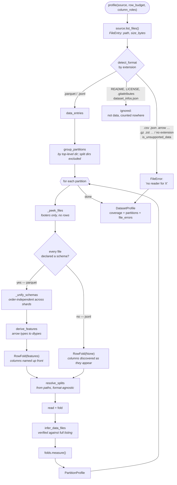
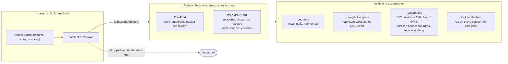
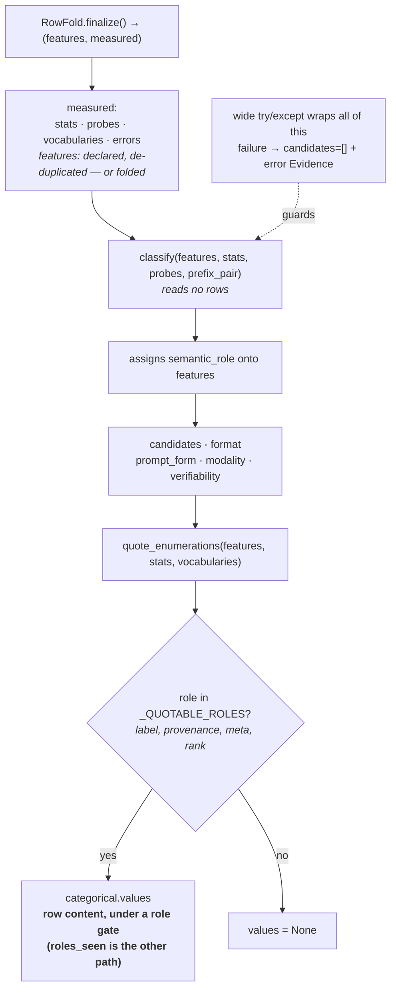

<!-- SPDX-FileCopyrightText: Copyright (c) 2025-2026 NVIDIA CORPORATION & AFFILIATES. All rights reserved. -->
<!-- SPDX-License-Identifier: Apache-2.0 -->

# NeMo Datasets Plugin

The dataset profiler. Reads a fileset of dataset files and produces a `DatasetProfile`: what
partitions and splits are there, what the row schema is, per-column statistics, and a classification
of what kind of training data this is.

A fileset lands in the platform and someone wants to fine-tune on it. To decide anything they need to
know whether it is trainable, in what shape, at what sequence budget, and which files are the train
split. Answering that by downloading is O(dataset) per question, per consumer, forever — so the
profiler reads it once and stores a typed description everyone else reads instead.

The hard part is not *what* gets measured; quantiles and counts are easy. It is measuring them
**without ever holding the data**. A fileset can be 50 GB and the profiler runs in an ordinary job,
so folds, bounded accumulators and bucketed histograms are all downstream of that one constraint.

## What it produces

One artifact, described by `nemo_platform_plugin.files.dataset_profile.DatasetProfile`:

| Block | Answers |
|---|---|
| `coverage` | how much of the dataset the profile is based on — rows scanned vs present, files read vs present, bytes |
| `partitions[].splits[]` | the splits, their exact row counts, and a glob that selects each one's files |
| `partitions[].features[]` | the row schema, with a `semantic_role` assigned per column |
| `partitions[].stats{}` | per-column measurements — length distributions, numeric ranges, chat structure, null rates |
| `partitions[].classification` | `candidates`, `format`, `prompt_form`, `modality`, `verifiability`, plus the evidence for each |
| `file_errors[]` | every file the profiler could not use, named, with a reason |

The profile is designed to be a **substitute for having the data**. A consumer picking a
`max_seq_len`, or deciding whether a dataset can drive a verifiable-reward RL run, should be able to
answer that from a few hundred bytes of profile rather than a pass over the fileset.

## Usage

The profiler runs as a job task, not a `nemo` CLI command:

```bash
python -m nemo_datasets_plugin.tasks.profile
```

Directly, against a directory:

```python
from nemo_datasets_plugin.profiler.file_source import LocalFileSource
from nemo_datasets_plugin.profiler.pipeline import profile

result = profile(LocalFileSource("/path/to/dataset"))
print(result.model_dump_json(indent=2))
```

`profile()` takes three optional arguments:

- `row_budget` — rows per *partition*, divided across its files. Defaults to `None`, which reads
  everything. See [Why reading everything is the default](#why-reading-everything-is-the-default).
- `column_roles` — `{"q": "prompt"}`, for datasets whose column names the role table does not
  recognise. Hints take precedence over name detection but still have to pass the dtype gates; a
  rejected hint is reported as evidence rather than dropped.
- `created_at` — injectable so a profile can be made byte-reproducible in tests.

Supported formats: **parquet** and **jsonl / ndjson**. A file that plainly holds records but has no
reader (`.csv`, `.json`, `.arrow`, `.avro`, `.orc`, …) is reported as a `FileError` rather than
ignored — otherwise a directory of CSV shards would profile as an exhaustively-scanned *empty*
dataset, which is indistinguishable from a dataset that really is empty.

Two shapes reach that rule without an extension it can match, and both are treated as data:

- **Compressed shards** (`.gz`, `.zst`, `.bz2`, `.xz`, `.lz4`, `.zip`). `train.jsonl.gz` reports
  `.gz` as its suffix, so the data extension underneath is invisible to a suffix lookup.
- **Files with no extension at all.** The ambiguous case resolves to data on purpose: guessing
  "data" wrongly costs one `FileError`, and guessing "not data" wrongly hides a whole dataset.
  Documentation is excluded by name (`README`, `LICENSE`, `NOTICE`, …), and a dotfile such as
  `.gitattributes` reports no suffix at all, so it is excluded the same way.

Going the other way, a **dataset card** (`dataset_infos.json`, `dataset_info.json`, `state.json`) is
metadata, not records, even though `.json` is on the unsupported list. One unreadable data file
unknows `rows_present` for the entire fileset, so without this the ordinary HuggingFace layout —
shards beside a card — reported an unknown size after reading every row of every shard.

## How the measurement works

The diagrams under [Architecture](#architecture) are the formal version of this. Read this section
first — `stats.py` is hard to follow top-to-bottom, because `RowFold` is the first class in the file
and depends on almost everything below it.

### The constraint everything follows from

A dataset can be tens of gigabytes. It is read once, and it cannot be held. So every question the
profile answers has to be answerable from state whose size is bounded by the **schema** rather than
by the row count.

That is what a *fold* means here:

```
update(batch)   # measure these rows, then release them
finalize()      # the input is exhausted; report
```

`update` keeps no reference to the batch it was handed, and splitting a column across many calls
gives the same answer as one call with all of it. That equivalence is what lets a caller stop
materialising a partition before measuring it. Everything that looks unusual in `stats.py` follows
from this one constraint.

### Accumulators

One accumulator per column, holding tallies rather than values:

```
rows seen    8
nulls        0
non-empty    8
```

Different dtypes call for different measurements, so there are four:

| Accumulator | For | Measures |
|---|---|---|
| `StringAccumulator` | text | length distribution, distinct values |
| `NumericAccumulator` | numbers | min, max, mean, distinct values |
| `BoolAccumulator` | true/false | class balance |
| `MessageAccumulator` | chat logs | turns, roles seen, whether it ends on the assistant |

### Choosing which measurement reports

**JSONL declares nothing.** It is lines of text with no header, so what the `messages` column *is*
cannot be known until the last row has been read — row 900,000 may hold a number and make the whole
column mixed. Three options, two of them unacceptable:

- read the file twice — too slow;
- decide from the first N rows — silently wrong on exactly the cases that matter;
- **route each value to the measurement that fits it, and let the resolved dtype decide which one
  reports.**

**Parquet does declare.** Its footer gives the schema before a row is parsed. That calls not for a
different mechanism but for skipping the inference: the same measurements run, and the declared dtype
selects the reporter instead of the observed types.

So both paths use one `RowFold` driving one `RoutedAccumulator` per column. A `RoutedAccumulator`
holds a measurement per shape, plus a `SchemaFold` on the inferred path to resolve the dtype.

Measurements are constructed **on first use**, so a column of a single type pays for one. The
per-value cost is unchanged either way — a string only ever reaches the string measurement, an int
only the numeric — and retained state stays flat whether the file holds 10,000 rows or 1,000,000.

### When a column's types disagree

Inference has to answer for the whole column, so `_resolve_scalar` decides what a mixture resolves
to. Ints and floats widen; **any other disagreement resolves to `json`**:

| column | values | dtype | stats |
|---|---|---|---|
| `widens` | `1, 2, 3.5, 4` | `float64` | `numeric`, `categorical` |
| `int_str` | `1, 2, "x", 4` | **`json`** | none |
| `str_list` | `"a", "b", ["a","b"], "c"` | **`json`** | none |
| `all_null` | all `None` | **`json`** | `null_rate` only |
| `grows` | `{a}, {a}, {a,b}, {a}` | `struct` | none — keys are unioned |

`json` is a claim, not a fallback: it says this column holds more than one shape. Nothing further is
asserted about it, because there is no measurement that would be true of all of its values.

The column is still measured, though. `null_rate` lives on `ColumnStats` itself rather than in a
dtype block, and the content probes are type-agnostic, so both survive:

```
ColumnProbes(rows=4, non_empty=4, texts=3, extractable_answer=0, transcript_marker=0)
stats entry for 'completion': None
```

**The case to watch** is a role-named column that disagrees. `json` fails the role dtype gates, so
the column loses its role — and that changes what the dataset is classified as:

```
completion = "a0", "a1", "a2", "a3"   ->  dtype=string  role=completion  ->  prompt_completion
completion = "a0", "a1", "a2",  42    ->  dtype=json    role=None        ->  prompt_only
```

One malformed row in four is enough. The profile is honest — it reports the column as mixed and
unroled — but nothing in `evidence` flags it as suspicious. Surfacing that is the gap tracked under
[Limitations](#limitations).

### Length distributions without retaining lengths

Exact quantiles require every length kept and sorted, which is state proportional to the dataset.
Lengths are tallied into fixed buckets instead.

Below 32 each length has its own counter and is recorded **exactly**. Above it the buckets widen with
the magnitude — 32 slices per doubling — so a bucket spans a roughly constant *fraction* of the value
rather than a constant amount:

| value | its bucket | width | relative |
|---:|---|---:|---:|
| 31 | `[31, 32)` | 1 | exact |
| 1,000 | `[992, 1008)` | 16 | 1.6% |
| 1,000,000 | `[999424, 1015808)` | 16,384 | 1.6% |

The bucket edges are fixed in advance and never adapted to the data, so two runs over the same bytes
always agree. Measured against exact quantiles on real shards: ~2%.

For a `messages` column holding six 2-turn chats, one 3-turn and one 4-turn, the entire retained
state is:

```python
_turns._counts == {2: 6, 3: 1, 4: 1}
```

which is enough to report a median of 2 and a max of 4. Turn counts fall in the exact region, so
these buckets are legible by hand; a `content_chars` histogram over real text has the same structure
with wider buckets at the top end.

The trade is deliberate. The **rank** is exact, since every row is counted and none sampled; only the
**value** is rounded. `max` is tracked exactly and separately, as the one number a reader may treat
as a hard bound.

→ `_LengthHistogram`. See also [Why a histogram and not a reservoir](#why-a-histogram-and-not-a-reservoir).

### Cardinality, bounded

Counting distinct values exactly means retaining them. For a `label` column of `{safe, unsafe}` that
is two strings; for a column of reasoning traces it is the whole dataset, which breaks the
constraint. So the vocabulary stops accumulating once the column stops resembling a controlled
vocabulary:

| Bound | Value |
|---|---|
| distinct values | 1,024 |
| characters in any one value | 256 |
| total bytes | 64 KB |

Crossing any bound discards what was held, permanently:

```
1,024 distinct values ->  84,548 bytes retained
1,025 distinct values ->     658 bytes retained, values discarded
```

The 256-character bound does the real work. It asks not how many values the column holds but what
kind of column it is: a category name is short by nature, so a single paragraph-length value settles
the question immediately rather than after 1,024 rows.

→ `_Vocabulary`.

### Content probes

Statistics measure magnitude; probes record whether a marker was present at all:

```
rows                 8
non_empty            8
texts                8    values readable as text
extractable_answer   0    contained "####" or "\boxed{}"
transcript_marker    0    matched "\n\nHuman:" / "\n\nAssistant:"
```

These are what decides whether a dataset is *verifiable* — whether an embedded grading answer exists
that a model's output could be checked against. They run on the same pass as the statistics, because
reading the row is the expensive part.

→ `ColumnProbes`.

### Classification reads measurements, not rows

`classify()` takes features, stats and probes, and never touches a row:

```
candidates    = ["messages"]    # most specific first; empty means nothing matched
format        = "conversational"
verifiability = None            # checked; there is nothing to auto-grade
```

That is the payoff of the constraint: the rows are long gone and the partition can still be
described. See [Why absence is a claim](#why-absence-is-a-claim) for why `None` there is an answer
rather than a gap.

### Why quoting runs after classification

For four roles — `label`, `provenance`, `meta`, `rank` — the values themselves belong in the report.
Knowing a label column is exactly `{safe, unsafe}` is useful; reproducing a prompt column's ten
thousand distinct prompts is not, and would leak the data the profile exists to describe.

Which columns qualify is not known until roles are assigned, so the order is forced:

1. during the pass, `_Vocabulary` retains the values it has seen;
2. `classify()` assigns roles;
3. `quote_enumerations` writes the values for quotable roles and discards the rest.

It only works because the values were held back — the rows cannot be revisited.

→ `quote_enumerations`, gated on `_QUOTABLE_ROLES`. See also
[Why the profile almost never contains row content](#why-the-profile-almost-never-contains-row-content).

### Reading `stats.py`

Not top to bottom. In this order:

1. `ColumnAccumulator` — the base measurement. Everything else is this plus specifics.
2. `StringAccumulator` — the simplest concrete one, barely 20 lines.
3. `_LengthHistogram` and `_Vocabulary` — the two bounded structures above.
4. `_MEASUREMENTS` and `_measurement_for` — five lines, and the only place a dtype becomes a
   measurement.
5. `RoutedAccumulator` — one column, measured by shape.
6. `RowFold` — the columns of a partition, declared or discovered.

## End to end: one SFT dataset

[How the measurement works](#how-the-measurement-works) is the mechanism in the abstract. This is the
same mechanism with real numbers, on a small SFT chat set — a `messages` column, a `source` column,
two splits:

```
sft-chat/
  README.md            11 bytes
  train.jsonl       2,379,659 bytes   2,400 rows
  validation.jsonl    303,265 bytes     300 rows
```

```json
{"messages": [{"role": "system", "content": "You are a concise technical assistant."},
              {"role": "user", "content": "Summarise the causes of the 1929 crash."},
              {"role": "assistant", "content": "the underlying reason worth noting that ..."}],
 "source": "oasst2"}
```

Synthetic, so the figures below can be regenerated exactly.

<details>
<summary>The generator</summary>

```python
import json, pathlib, random, shutil
random.seed(7)
d = pathlib.Path("sft-chat"); shutil.rmtree(d, ignore_errors=True); d.mkdir()
SOURCES = ["oasst2", "lmsys-chat", "self-instruct"]
Q = ["How do I reverse a linked list in Python?", "What causes the northern lights?",
     "Summarise the causes of the 1929 crash.", "Write a regex for an ISO-8601 date.",
     "Why is my Docker build so slow?", "Explain gradient clipping."]
def answer(n):
    return " ".join(random.choice(["The short version is that", "you can think of it as",
        "in practice this means", "the underlying reason", "a common approach",
        "worth noting that"]) for _ in range(n))
rows = []
for i in range(2700):
    t = []
    if i % 8 == 0: t.append({"role": "system", "content": "You are a concise technical assistant."})
    t.append({"role": "user", "content": random.choice(Q)})
    t.append({"role": "assistant", "content": answer(random.randint(6, 60))})
    if i % 5 == 0:
        t.append({"role": "user", "content": "Can you give an example?"})
        t.append({"role": "assistant", "content": answer(random.randint(8, 40))})
    rows.append({"messages": t, "source": SOURCES[i % 3]})
for split, chunk in (("train", rows[:2400]), ("validation", rows[2400:])):
    (d / f"{split}.jsonl").write_text("".join(json.dumps(r) + "\n" for r in chunk))
(d / "README.md").write_text("# sft-chat\n")
```

</details>

### Batching and the read loop

JSONL declares nothing — no schema, no row count — so `peek()` comes back empty and the reader hands
rows over in chunks of `_BATCH_ROWS = 1024`. The loop folds each chunk and drops it:

```
batch 1 of train.jsonl: 1024 rows -> folded, dropped
batch 2 of train.jsonl: 1024 rows -> folded, dropped
batch 3 of train.jsonl:  352 rows -> folded, dropped
train.jsonl       split=train       rows=2400  batches=3  glob='train*.jsonl'
validation.jsonl  split=validation  rows=300   batches=1  glob='validation*.jsonl'
```

Measured live — what arrives per batch, against what the fold keeps:

| after batch | rows folded | batch in memory | fold state |
|---:|---:|---:|---:|
| 1 | 1,024 | 2,111,743 B | 19,346 B |
| 2 | 2,048 | 2,130,343 B | 19,878 B |
| 3 | 2,400 | 731,497 B | **20,018 B** |

~2 MB arrives per batch and is released; ~20 KB is kept, and it barely moves across 2,400 rows. The
state is bounded by the schema, not the row count.

`num_rows` is exact here **only because the read reached EOF**. Under a row budget it would be
`None`, and `coverage.rows_present` would go `None` with it — unknown, not zero.

### Which accumulators get built

```
messages  RoutedAccumulator  built=['messages']  dtype=messages
source    RoutedAccumulator  built=['string']    dtype=string
```

One measurement each, and only the one the values called for. The dtype is not known until the last row —
a column can turn mixed at row 2,399 — so `SchemaFold` unions the observed types as it goes and
resolves at the end.

### The histogram is accurate enough to act on

Reported `content_chars` against exact quantiles over all 2,700 rows:

| | exact | reported | error |
|---|---:|---:|---:|
| p50 | 857 | 856 | 0.12% |
| p95 | 1,626 | 1,616 | 0.62% |
| p99 | 1,969 | 1,968 | 0.05% |
| max | 2,260 | 2,260 | **exact** |

Rank is exact — every row counted, none sampled — so only the value is rounded, and `max` not at all.

### What comes out

```json
"coverage": {"rows_scanned": 2700, "rows_present": 2700,
             "files_read": 2, "files_present": 2, "bytes_present": 2682924},
"splits": [
  {"name": "train",      "canonical": "train",      "data_files": "train*.jsonl",      "num_examples": 2400},
  {"name": "validation", "canonical": "validation", "data_files": "validation*.jsonl", "num_examples": 300}],
"features": [
  {"name": "messages", "dtype": "messages", "semantic_role": "messages",
   "items": {"dtype": "struct", "fields": [{"name": "role",    "dtype": "string"},
                                           {"name": "content", "dtype": "string"}]}},
  {"name": "source", "dtype": "string", "semantic_role": "provenance"}],
"stats": {
  "messages": {"null_rate": 0.0, "messages": {
      "turns":         {"p50": 2,   "p95": 4,    "p99": 5,    "max": 5},
      "content_chars": {"p50": 856, "p95": 1616, "p99": 1968, "max": 2260},
      "roles_seen": ["system", "user", "assistant"],
      "ends_with_assistant_rate": 1.0, "valid_alternation_rate": 1.0, "has_tool_calls": false}},
  "source": {"null_rate": 0.0,
      "text": {"chars": {"p50": 10, "p95": 13, "p99": 13, "max": 13}},
      "categorical": {"distinct_count": 3,
                      "values": ["lmsys-chat", "oasst2", "self-instruct"]}}},
"rows_complete": true,
"classification": {"modality": "text", "candidates": ["messages"], "format": "conversational",
                   "prompt_form": "n/a"}
```

`bytes_present` is 2,379,659 + 303,265. The README's 11 bytes are absent — it is not data, and is
counted nowhere.

**Reading it.** `content_chars.p99 = 1968` sets a sequence budget and `max = 2260` is the hard cap.
`turns` shows a mostly 2-turn set with a multi-turn tail. `ends_with_assistant_rate = 1.0` says every
row has a training target. `roles_seen` is verbatim and unsorted, because an unexpected role is the
finding. `rows_complete: true` is what licenses treating `source`'s three values as the *complete*
enumeration rather than a sample — and `source` got its values quoted only because it resolved to the
`provenance` role; `messages` is not quotable at any cardinality.

## Architecture

### Pipeline



### The fold

Batches are measured and released. Nothing retained grows with the file.



### The measure stage

Ordering is load-bearing: quoting a column's values is gated on its **role**, and roles do not exist
until classification assigns them.



## Module map

| Module | Responsibility |
|---|---|
| `profiler/file_source.py` | the `FileSource` seam — `list_files()` + `open()`, the only way the core touches storage. `LocalFileSource` covers a directory on disk; a ranged-read source over the Files API is a later drop-in behind the same two methods |
| `profiler/readers/` | one stateless handler per format, resolved by extension. `peek()` for what a file declares, `batches()` for its rows |
| `profiler/partition.py` | groups files into partitions by top-level directory |
| `profiler/splits.py` | resolves splits from paths, and rebuilds a `data_files` glob per split |
| `profiler/schema.py` | derives the `features` tree, from a declared arrow schema or folded out of rows |
| `profiler/stats.py` | the per-column accumulators and the content probes |
| `profiler/classify.py` | interprets schema + stats + probes into roles and classification axes |
| `profiler/pipeline.py` | drives all of the above and assembles the envelope |

## Design decisions

### Why reading everything is the default

`DEFAULT_ROW_BUDGET = None`. Every partition is **folded**: batches are measured and let go, and
nothing kept grows with the file, so an exhaustive read costs what a short one costs in memory. What
the budget bounded was never really rows — it was risk.

`row_budget` survives as a way to ask for a shorter run, and it is a *target* rather than a ceiling:
`MIN_ROWS_PER_FILE = 10` is a floor under each file's share when a budget is divided across several
files, so 20 files under a budget of 5 read 200 rows and not 5. A file sampled below that floor
cannot contribute the columns it alone witnesses, and file-level sampling would reintroduce the same
coverage hole from the other direction.

Two cases sit outside the floor rather than under it: a partition of one file is capped at the
budget itself, and a budget of `0` is passed through as `0`. Neither is the floor failing — a floor
exists to stop a *share* being whittled to nothing, and neither of those is a share.

### Why every file is opened

Sampling a *subset of files* hides columns that appear only in later shards. Schemas are unified
across every file in a partition (`_unify_schemas`), so a column introduced by shard 47 is in the
profile. Taking the first file's schema would make the result depend on which shard happens to sort
first.

### Why quantiles instead of mean

Mean and max cannot tell "uniformly medium-length" apart from "mostly short with a long tail", and
those call for opposite sequence budgets. Measured on two synthetic sets with near-identical means:

```
             mean     p50     p95     p99     max
uniform       999    1000    1040    1040    1050
tailed        936     103    8320    8832    8994

uniform  budget from mean -> 49.4% of rows truncated | from max ->  5% of window wasted
tailed   budget from mean -> 10.0% of rows truncated | from max -> 90% of window wasted
```

`p50` read against `p99` is what distinguishes them. `max` is exact and is the only number safe to
treat as a hard bound; `p50`/`p95`/`p99` are read off magnitude-bucketed counters and are accurate
to within a couple of percent. Every row is counted, so the *rank* is exact — only the value is
rounded, to a bound that does not grow with the dataset.

### Why a histogram and not a reservoir

A reservoir sample would give exact quantiles, but it needs an RNG seed, and a seed in a stored
contract is a number a consumer can come to depend on. Bucketed counters trade ~2% quantile error
for a profile whose reproducibility does not rest on a random draw.

### Why the profile almost never contains row content

There are two exceptions. `categorical.values` is gated on a column's **role** — `label`,
`provenance`, `meta`, `rank` — not on its cardinality. Cardinality inverts on small data: in a
three-row dataset every column holds few distinct values, free text included, so a cardinality gate
stored prompts verbatim. A role says what a column *is*, at any size. It is additionally withheld
whenever any file in the partition was read only part-way, by a budget or by a failure mid-read,
since a prefix of a vocabulary is indistinguishable from a vocabulary.

`messages.roles_seen` is the other, and it is gated on nothing: an unexpected role is exactly the
finding worth reporting, so normalising it away would defeat the field. It is bounded twice instead
— in how many distinct roles it holds, and in the length of each — so a mis-shaped export puts a
truncated fragment in the profile rather than whole message bodies.

### Why absence is a claim

`verifiability: null` means "not verifiable", not "not measured". `data_files: null` means "these
files are not expressible as one glob", which a consumer can handle — an approximate glob is not a
smaller version of the right answer, it silently pulls a README or a sibling split into a training
set. Every candidate pattern is verified against the **entire** file listing before it is emitted.

### Why failures are isolated per column and per file

Two guards. A narrow one per column per batch: a value no detector anticipated costs that column its
measurements and nothing else. A wide one around the whole measure stage for anything structural
that no single column owns. An unreadable file is named in `file_errors`, contributes no rows, flips
`rows_complete` off, and never aborts the profile.

## Worked examples

Verified against real Hugging Face datasets. Reproduce with:

```python
from huggingface_hub import snapshot_download
from nemo_datasets_plugin.profiler.file_source import LocalFileSource
from nemo_datasets_plugin.profiler.pipeline import profile

d = snapshot_download("openai/gsm8k", repo_type="dataset",
                      local_dir="gsm8k", allow_patterns=["*.parquet"])
print(profile(LocalFileSource(d)).model_dump_json(indent=2))
```

> **Note:** `snapshot_download` writes a `.cache/huggingface/` tree alongside the data, and the
> profiler does not skip dotted directories. Its bookkeeping `.json` files are reported as
> `FileError`s, which makes `coverage.rows_present` unknown for the whole dataset. Delete `.cache/`
> or point `LocalFileSource` at the data subdirectory.

### `openai/gsm8k` — verifiable reasoning, two configs

```
rows_present=17,584   bytes=5,889,887   partitions=['main', 'socratic']

partition 'main'
  split test   canonical=test   n=1319  glob='main/test*.parquet'
  split train  canonical=train  n=7473  glob='main/train*.parquet'
  features: question->prompt (string), answer->completion (string)
  -> prompt_completion / standard / explicit
  -> verifiability=extractable_final_answer coverage=1.000
     question  p50=218 p99=536  max=985
     answer    p50=260 p99=744  max=1228

partition 'socratic'
  ... same schema; answer p50=412 p99=1072 max=1657
```

Two configs become two **partitions**, each classified independently. The socratic answers are
~1.6× longer at the median — a real difference in sequence budget that a single merged profile would
have averaged away.

### `HuggingFaceH4/no_robots` — chat, and the sibling-split case

```
rows_present=20,000
  split test       canonical=test   n=500   glob='data/test-*.parquet'
  split test_sft   canonical=test   n=500   glob='data/test_sft*.parquet'
  split train      canonical=train  n=9500  glob='data/train-*.parquet'
  split train_sft  canonical=train  n=9500  glob='data/train_sft*.parquet'

  features: prompt->prompt, prompt_id->id, messages->messages, category->meta
  -> messages / mixed / explicit   candidates=['messages', 'prompt_only']

  messages  turns p50=2 p99=9  content_chars p99=5568
            roles=['system','user','assistant']  ends_with_assistant=1.00  alternation=1.00
  category  values=['Brainstorm','Chat','Classify','Closed QA','Coding',
                    'Extract','Generation','Open QA','Rewrite','Summarize']
```

Note `data/train-*.parquet` rather than `data/train*.parquet`: `train` sits beside `train_sft`, and
the simple pattern would have swallowed both. Verification is what demotes it, so the narrower form
is only reached when it is actually needed.

`category` has its values quoted because its detected role is `meta`; `prompt` does not, because its
role is `prompt`.

### `trl-lib/ultrafeedback_binarized` — preference pairs

```
rows_present=63,135
  split test   n=1000    glob='data/test*.parquet'
  split train  n=62135   glob='data/train*.parquet'

  features: chosen->chosen (messages), rejected->rejected (messages),
            score_chosen->score (float64), score_rejected->score (float64)
  -> preference_pair / conversational / implicit

  chosen          turns p50=2 p99=2  content_chars p99=6336  ends_with_assistant=1.00
  rejected        turns p50=2 p99=2  content_chars p99=6080  ends_with_assistant=1.00
  score_chosen    min=1.0 max=10.0 mean=7.83
  score_rejected  min=1.0 max=10.0 mean=5.96
```

The scores are on a **1–10** scale, not `[0, 1]`. A pipeline that assumes normalised rewards does
not crash on this — it trains badly. `min`/`max` are exact, so this is a fact rather than a sample.

`prompt_form: implicit` because the prompt is embedded in the first turn of both `chosen` and
`rejected` rather than sitting in its own column.

### `tatsu-lab/alpaca` — classic instruction SFT

```
rows_present=52,002
  split 'train-00000-of-00001-a09b74b3ef9c3b56'  canonical=train  n=52002

  features: instruction->prompt, input->context, output->completion, text->(no role)
  -> prompt_completion / standard / explicit

  instruction  p50=57  p99=127  max=489
  input        p50=0   p99=276  max=2467     <- half the rows have no context
  output       p50=186 p99=1200 max=4181
```

The split *name* is unlovely: `_SHARD_SUFFIX` anchors on end-of-string, and this file carries a
content hash *after* the shard marker. `canonical` still resolves to `train` because alias matching
is prefix-based, so downstream consumers keying on `canonical` are unaffected.

`input` having `p50=0` is the profile earning its keep — half of Alpaca's rows have an empty context
field, which changes how the prompt template should be built.

## Limitations

- **Two formats.** Parquet and jsonl/ndjson. Everything else is reported, not read.
- **Characters are not tokens.** Length quantiles are in characters. The ratio runs ~3–5 chars/token
  for English prose and shifts substantially for code and non-Latin scripts, so `p99` is a starting
  point for `max_seq_len`, not a substitute for tokenizing.
- **Shape, not quality.** No duplication or contamination detection, no content-quality scoring, no
  PII detection — PII belongs to the anonymizer.
- **It describes, it does not warn.** `evidence` explains what the profile concluded and why, but
  there is no findings channel for what looks *wrong* — a column whose types disagree and so lost its
  role, a constant completion column, a label set that is 99% one class. A consumer has to notice
  those by reading the profile rather than being told.
- **Dotted directories are not skipped.** See the `snapshot_download` note above.
- **No file-level sampling.** Every file is opened. A row budget bounds rows per partition, not
  files, so a fileset with very many shards still pays one open per shard.

## Tests

```bash
uv run pytest plugins/nemo-datasets/tests/ -q
```
