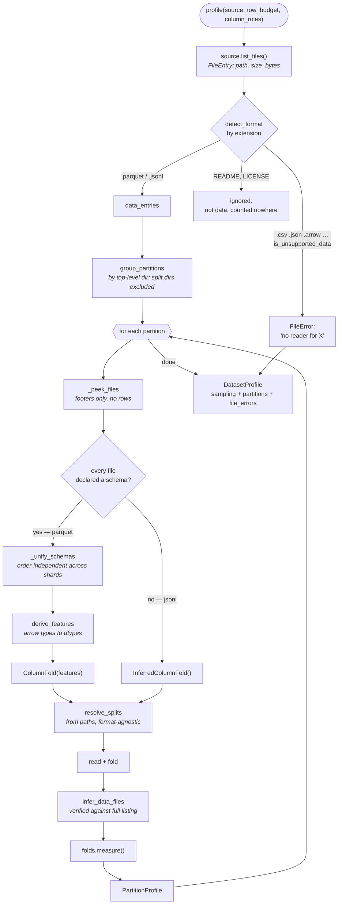
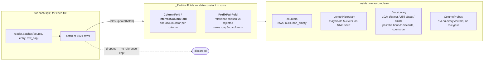
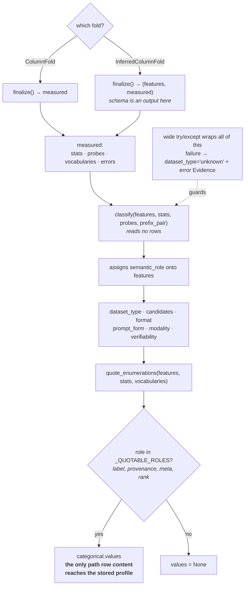

<!-- SPDX-FileCopyrightText: Copyright (c) 2025-2026 NVIDIA CORPORATION & AFFILIATES. All rights reserved. -->
<!-- SPDX-License-Identifier: Apache-2.0 -->

# NeMo Datasets Plugin

The dataset profiler. Reads a fileset of dataset files and produces a `DatasetProfile`: what
partitions and splits are there, what the row schema is, per-column statistics, and a classification
of what kind of training data this is.

## What it produces

One artifact, described by `nemo_platform_plugin.files.dataset_profile.DatasetProfile`:

| Block | Answers |
|---|---|
| `sampling` | how much of the dataset the profile is based on — rows scanned vs present, files read vs present, bytes |
| `partitions[].splits[]` | the splits, their exact row counts, and a glob that selects each one's files |
| `partitions[].features[]` | the row schema, with a `semantic_role` assigned per column |
| `partitions[].stats{}` | per-column measurements — length distributions, numeric ranges, chat structure, null rates |
| `partitions[].classification` | `dataset_type`, `format`, `prompt_form`, `modality`, `verifiability`, plus the evidence for each |
| `file_errors[]` | every file the profiler could not use, named, with a reason |

The profile is designed to be a **substitute for having the data**. A consumer picking a
`max_seq_len`, or deciding whether a dataset can drive a verifiable-reward RL run, should be able to
answer that from a few hundred bytes of profile rather than a pass over the fileset.

## Usage

The profiler runs as a job task, not a `nemo` CLI command:

```bash
python -m nemo_datasets_plugin.tasks.profile
```

Directly, against a directory:

```python
from nemo_datasets_plugin.profiler.file_source import LocalFileSource
from nemo_datasets_plugin.profiler.pipeline import profile

result = profile(LocalFileSource("/path/to/dataset"))
print(result.model_dump_json(indent=2))
```

`profile()` takes three optional arguments:

- `row_budget` — rows per *partition*, divided across its files. Defaults to `None`, which reads
  everything. See [Why reading everything is the default](#why-reading-everything-is-the-default).
- `column_roles` — `{"q": "prompt"}`, for datasets whose column names the role table does not
  recognise. Hints take precedence over name detection but still have to pass the dtype gates; a
  rejected hint is reported as evidence rather than dropped.
- `created_at` — injectable so a profile can be made byte-reproducible in tests.

Supported formats: **parquet** and **jsonl / ndjson**. A file that plainly holds records but has no
reader (`.csv`, `.json`, `.arrow`, `.avro`, `.orc`, …) is reported as a `FileError` rather than
ignored — otherwise a directory of CSV shards would profile as an exhaustively-scanned *empty*
dataset, which is indistinguishable from a dataset that really is empty.

## Architecture

### Pipeline



### The fold

Batches are measured and released. Nothing retained grows with the file.



### The measure stage

Ordering is load-bearing: quoting a column's values is gated on its **role**, and roles do not exist
until classification assigns them.



## Module map

| Module | Responsibility |
|---|---|
| `profiler/file_source.py` | the `FileSource` seam — `list_files()` + `open()`, the only way the core touches storage. `LocalFileSource` covers a directory on disk; a ranged-read source over the Files API is a later drop-in behind the same two methods |
| `profiler/readers/` | one stateless handler per format, resolved by extension. `peek()` for what a file declares, `batches()` for its rows |
| `profiler/partition.py` | groups files into partitions by top-level directory |
| `profiler/splits.py` | resolves splits from paths, and rebuilds a `data_files` glob per split |
| `profiler/schema.py` | derives the `features` tree, from a declared arrow schema or folded out of rows |
| `profiler/stats.py` | the per-column accumulators and the content probes |
| `profiler/classify.py` | interprets schema + stats + probes into roles and classification axes |
| `profiler/pipeline.py` | drives all of the above and assembles the envelope |

## Design decisions

### Why reading everything is the default

`DEFAULT_ROW_BUDGET = None`. Every partition is **folded**: batches are measured and let go, and
nothing kept grows with the file, so an exhaustive read costs what a short one costs in memory. What
the budget bounded was never really rows — it was risk.

`row_budget` survives as a way to ask for a shorter run, and it is a *target* rather than a ceiling:
`MIN_ROWS_PER_FILE = 10` is the floor every file is read to, however thin its share gets. A file
sampled below that cannot contribute the columns it alone witnesses, and file-level sampling would
reintroduce the same coverage hole from the other direction.

### Why every file is opened

Sampling a *subset of files* hides columns that appear only in later shards. Schemas are unified
across every file in a partition (`_unify_schemas`), so a column introduced by shard 47 is in the
profile. Taking the first file's schema would make the result depend on which shard happens to sort
first.

### Why quantiles instead of mean

Mean and max cannot tell "uniformly medium-length" apart from "mostly short with a long tail", and
those call for opposite sequence budgets. Measured on two synthetic sets with near-identical means:

```
             mean     p50     p95     p99     max
uniform       999    1000    1040    1040    1050
tailed        936     103    8320    8832    8994

uniform  budget from mean -> 49.4% of rows truncated | from max ->  5% of window wasted
tailed   budget from mean -> 10.0% of rows truncated | from max -> 90% of window wasted
```

`p50` read against `p99` is what distinguishes them. `max` is exact and is the only number safe to
treat as a hard bound; `p50`/`p95`/`p99` are read off magnitude-bucketed counters and are accurate
to within a couple of percent. Every row is counted, so the *rank* is exact — only the value is
rounded, to a bound that does not grow with the dataset.

### Why a histogram and not a reservoir

A reservoir sample would give exact quantiles, but it needs an RNG seed, and a seed in a stored
contract is a number a consumer can come to depend on. Bucketed counters trade ~2% quantile error
for a profile whose reproducibility does not rest on a random draw.

### Why the profile almost never contains row content

`categorical.values` is the single exception, and it is gated on a column's **role** — `label`,
`provenance`, `meta`, `rank` — not on its cardinality. Cardinality inverts on small data: in a
three-row dataset every column holds few distinct values, free text included, so a cardinality gate
stored prompts verbatim. A role says what a column *is*, at any size.

### Why absence is a claim

`verifiability: null` means "not verifiable", not "not measured". `data_files: null` means "these
files are not expressible as one glob", which a consumer can handle — an approximate glob is not a
smaller version of the right answer, it silently pulls a README or a sibling split into a training
set. Every candidate pattern is verified against the **entire** file listing before it is emitted.

### Why failures are isolated per column and per file

Two guards. A narrow one per column per batch: a value no detector anticipated costs that column its
measurements and nothing else. A wide one around the whole measure stage for anything structural
that no single column owns. An unreadable file is named in `file_errors`, contributes no rows, flips
`rows_complete` off, and never aborts the profile.

## Worked examples

Verified against real Hugging Face datasets. Reproduce with:

```python
from huggingface_hub import snapshot_download
from nemo_datasets_plugin.profiler.file_source import LocalFileSource
from nemo_datasets_plugin.profiler.pipeline import profile

d = snapshot_download("openai/gsm8k", repo_type="dataset",
                      local_dir="gsm8k", allow_patterns=["*.parquet"])
print(profile(LocalFileSource(d)).model_dump_json(indent=2))
```

> **Note:** `snapshot_download` writes a `.cache/huggingface/` tree alongside the data, and the
> profiler does not skip dotted directories. Its bookkeeping `.json` files are reported as
> `FileError`s, which makes `sampling.rows_present` unknown for the whole dataset. Delete `.cache/`
> or point `LocalFileSource` at the data subdirectory.

### `openai/gsm8k` — verifiable reasoning, two configs

```
rows_present=17,584   bytes=5,889,887   partitions=['main', 'socratic']

partition 'main'
  split test   canonical=test   n=1319  glob='main/test*.parquet'
  split train  canonical=train  n=7473  glob='main/train*.parquet'
  features: question->prompt (string), answer->completion (string)
  -> prompt_completion / standard / explicit
  -> verifiability=extractable_final_answer coverage=1.000
     question  p50=218 p99=536  max=985
     answer    p50=260 p99=744  max=1228

partition 'socratic'
  ... same schema; answer p50=412 p99=1072 max=1657
```

Two configs become two **partitions**, each classified independently. The socratic answers are
~1.6× longer at the median — a real difference in sequence budget that a single merged profile would
have averaged away.

### `HuggingFaceH4/no_robots` — chat, and the sibling-split case

```
rows_present=20,000
  split test       canonical=test   n=500   glob='data/test-*.parquet'
  split test_sft   canonical=test   n=500   glob='data/test_sft*.parquet'
  split train      canonical=train  n=9500  glob='data/train-*.parquet'
  split train_sft  canonical=train  n=9500  glob='data/train_sft*.parquet'

  features: prompt->prompt, prompt_id->id, messages->messages, category->meta
  -> messages / mixed / explicit   candidates=['messages', 'prompt_only']

  messages  turns p50=2 p99=9  content_chars p99=5568
            roles=['system','user','assistant']  ends_with_assistant=1.00  alternation=1.00
  category  values=['Brainstorm','Chat','Classify','Closed QA','Coding',
                    'Extract','Generation','Open QA','Rewrite','Summarize']
```

Note `data/train-*.parquet` rather than `data/train*.parquet`: `train` sits beside `train_sft`, and
the simple pattern would have swallowed both. Verification is what demotes it, so the narrower form
is only reached when it is actually needed.

`category` has its values quoted because its detected role is `meta`; `prompt` does not, because its
role is `prompt`.

### `trl-lib/ultrafeedback_binarized` — preference pairs

```
rows_present=63,135
  split test   n=1000    glob='data/test*.parquet'
  split train  n=62135   glob='data/train*.parquet'

  features: chosen->chosen (messages), rejected->rejected (messages),
            score_chosen->score (float64), score_rejected->score (float64)
  -> preference_pair / conversational / implicit

  chosen          turns p50=2 p99=2  content_chars p99=6336  ends_with_assistant=1.00
  rejected        turns p50=2 p99=2  content_chars p99=6080  ends_with_assistant=1.00
  score_chosen    min=1.0 max=10.0 mean=7.83
  score_rejected  min=1.0 max=10.0 mean=5.96
```

The scores are on a **1–10** scale, not `[0, 1]`. A pipeline that assumes normalised rewards does
not crash on this — it trains badly. `min`/`max` are exact, so this is a fact rather than a sample.

`prompt_form: implicit` because the prompt is embedded in the first turn of both `chosen` and
`rejected` rather than sitting in its own column.

### `tatsu-lab/alpaca` — classic instruction SFT

```
rows_present=52,002
  split 'train-00000-of-00001-a09b74b3ef9c3b56'  canonical=train  n=52002

  features: instruction->prompt, input->context, output->completion, text->(no role)
  -> prompt_completion / standard / explicit

  instruction  p50=57  p99=127  max=489
  input        p50=0   p99=276  max=2467     <- half the rows have no context
  output       p50=186 p99=1200 max=4181
```

The split *name* is unlovely: `_SHARD_SUFFIX` anchors on end-of-string, and this file carries a
content hash *after* the shard marker. `canonical` still resolves to `train` because alias matching
is prefix-based, so downstream consumers keying on `canonical` are unaffected.

`input` having `p50=0` is the profile earning its keep — half of Alpaca's rows have an empty context
field, which changes how the prompt template should be built.

## Limitations

- **Two formats.** Parquet and jsonl/ndjson. Everything else is reported, not read.
- **Characters are not tokens.** Length quantiles are in characters. The ratio runs ~3–5 chars/token
  for English prose and shifts substantially for code and non-Latin scripts, so `p99` is a starting
  point for `max_seq_len`, not a substitute for tokenizing.
- **Shape, not quality.** No duplication or contamination detection, no content-quality scoring, no
  PII detection — PII belongs to the anonymizer.
- **Dotted directories are not skipped.** See the `snapshot_download` note above.
- **No file-level sampling.** Every file is opened. A row budget bounds rows per partition, not
  files, so a fileset with very many shards still pays one open per shard.

## Tests

```bash
uv run pytest plugins/nemo-datasets/tests/ -q
```
