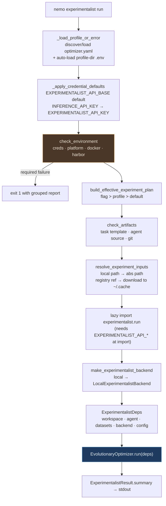
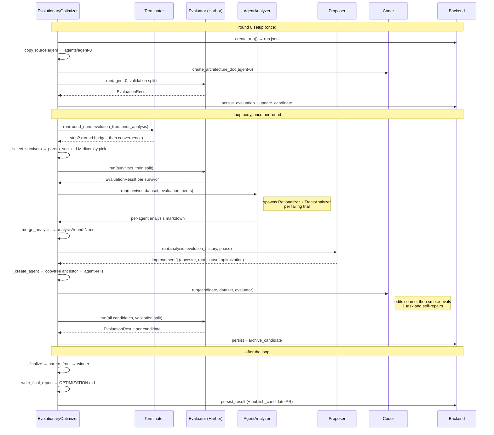
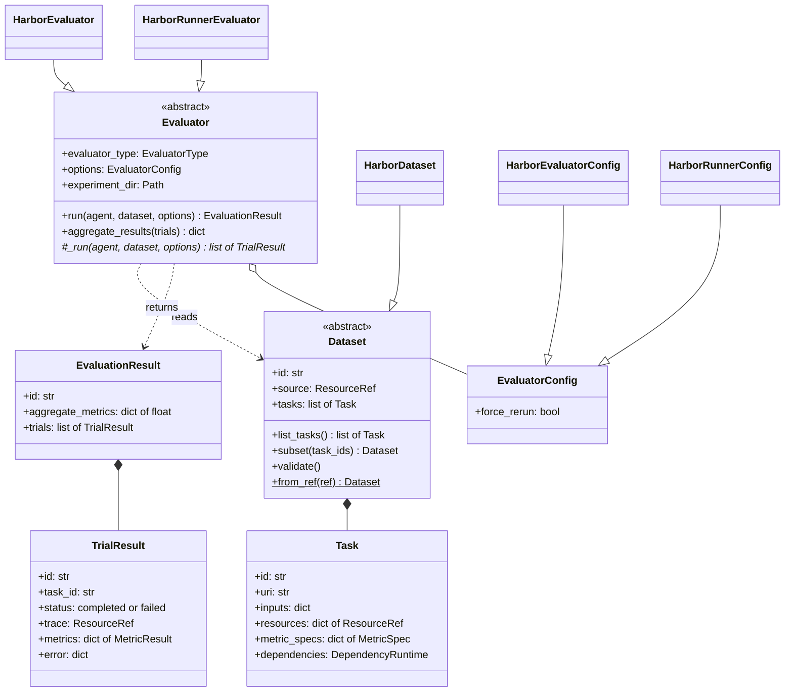
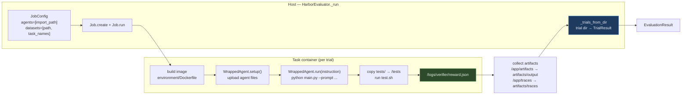

<!-- SPDX-FileCopyrightText: Copyright (c) 2025-2026 NVIDIA CORPORATION & AFFILIATES. All rights reserved. -->
<!-- SPDX-License-Identifier: Apache-2.0 -->

# NeMo Experimentalist — architecture

An onboarding map: what the Experimentalist does, how a run flows through the
code, and where the evaluator plugs in. Every data example below is real output
from `examples/hello-harbor-agent`, the minimal local example built for this
purpose.

- [1. What it is](#1-what-it-is)
- [2. Command to loop](#2-command-to-loop)
- [3. One evolutionary round](#3-one-evolutionary-round)
- [4. The evaluator seam](#4-the-evaluator-seam)
- [5. Anatomy of one Harbor trial](#5-anatomy-of-one-harbor-trial)
- [6. Data examples](#6-data-examples)
- [7. On-disk layout](#7-on-disk-layout)
- [8. Concepts cheat-sheet](#8-concepts-cheat-sheet)
- [9. Running and debugging it](#9-running-and-debugging-it)

---

## 1. What it is

The Experimentalist is an **evolutionary code optimizer for AI agents**. Given a
baseline agent and a benchmark, it repeatedly:

1. runs the agent on tasks and scores it,
2. reads the failures (including execution traces),
3. proposes *one architectural change* per candidate,
4. has an LLM coder actually edit the agent's source,
5. re-scores the mutated agent,
6. keeps the Pareto-best variants and repeats.

The output is a modified agent directory plus a report. Nothing about the model
weights changes — this optimizes **agent code**: prompts, tool wiring, control
flow, model selection.

Two entry modes:

| Mode | Flag | Baseline agent from | Datasets from | Needs NeMo Platform |
|---|---|---|---|---|
| **Mode 1** — Insight-driven | `--insight <file\|id>` | the Insight | profile, plus tasks synthesized from production traces by the **Eval Author** | yes (traces, Insight) |
| **Mode 2** — dataset-driven | `--no-insight` | `--agent` / profile `agent_source` | profile `datasets.train` / `datasets.validation` | no |

**Mode 2 is the one to learn on** — it is fully local, and it is what every debug
launch config uses. An "Insight" is a diagnosis produced by the separate
Platform-owned `nemo insights analyze` command; the Experimentalist only
consumes it.

---

## 2. Command to loop



Key files, in flow order:

| Step | File |
|---|---|
| CLI, flags, preflight orchestration | [`cli.py`](../src/nemo_experimentalist_plugin/cli.py) |
| Environment/artifact checks | [`preflight.py`](../src/nemo_experimentalist_plugin/preflight.py) |
| `optimizer.yaml` schema | [`profile.py`](../src/nemo_experimentalist_plugin/profile.py) |
| Flag/profile merge, dataset resolution, `EvolutionaryOptimizerConfig` | [`resolve.py`](../src/nemo_experimentalist_plugin/resolve.py) |
| Thin run wrapper | [`experimentalist/run.py`](../src/nemo_experimentalist_plugin/experimentalist/run.py) |
| Persistence + git/PR + Intake upload | [`experimentalist_backend.py`](../src/nemo_experimentalist_plugin/experimentalist/experimentalist_backend.py) |
| **The loop itself** | [`components/loop.py`](../src/nemo_experimentalist_plugin/experimentalist/components/loop.py) |

Two non-obvious behaviors worth knowing:

- **`.env` is auto-loaded from the profile directory** before credential
  defaults are applied ([`cli.py:462`](../src/nemo_experimentalist_plugin/cli.py:461)),
  so `INFERENCE_API_KEY=sk-...` next to `optimizer.yaml` is enough on the NVIDIA
  gateway. Shell exports win over the file.
- **`experimentalist.run` is imported lazily** — importing it constructs LLM
  clients at class-definition time (`class EvolutionaryOptimizer(Agent,
  llm=get_smart_model())`), which requires credentials. Deferring the import is
  what lets `doctor` diagnose missing credentials instead of crashing on them.

---

## 3. One evolutionary round

`EvolutionaryOptimizer._run` ([`loop.py:358`](../src/nemo_experimentalist_plugin/experimentalist/components/loop.py:357))
does a one-time round-0 setup, then loops.



### What each component is for

| Component | Model tier | Job |
|---|---|---|
| **Terminator** ([terminator.py](../src/nemo_experimentalist_plugin/experimentalist/components/terminator.py)) | fast | Stop? Round budget first (cheap, deterministic), then Pareto-stagnation, then a qualitative LLM tie-break. |
| **Evaluator** ([evaluator/](../src/nemo_experimentalist_plugin/experimentalist/components/evaluator/)) | none | Run an agent on a dataset, return per-trial metrics. |
| **AgentAnalyzer** ([analyzer.py](../src/nemo_experimentalist_plugin/experimentalist/components/analyzer.py)) | smart | Turn trial results + traces into root causes. Spawns a **Rationalizer** (what a competent agent *should* have done) and a **TraceAnalyzer** (what it actually did) per failing trial. |
| **Proposer** ([proposer.py](../src/nemo_experimentalist_plugin/experimentalist/components/proposer.py)) | smart | Emit up to `max_candidates` `Improvement`s — each one root cause + a single graph-level change, described without file paths. |
| **Coder** ([coder.py](../src/nemo_experimentalist_plugin/experimentalist/components/coder.py)) | smart (arch doc: mid) | Actually edit the candidate's source, then `integration_check`: run a 1-task smoke eval and self-repair up to `coder.max_fix_attempts` times. |
| **GoalTreeGenerator / GroupLeafScorer** ([goal_tree.py](../src/nemo_experimentalist_plugin/experimentalist/components/goal_tree.py), [trace_scorer.py](../src/nemo_experimentalist_plugin/experimentalist/components/trace_scorer.py)) | fast / mid | Decompose the benchmark into subgoals and score *how* an agent got there, not just whether it passed. Skipped when `disable_trajectory_scoring: true`. |
| **EvalAuthor** ([eval_author/](../src/nemo_experimentalist_plugin/eval_author/)) | smart | Mode 1 only: turn production traces from an Insight into new Harbor tasks using the task template. |

All of these are [NOOA](https://github.com/NVIDIA-NeMo/labs-OO-Agents) `Agent`
subclasses. In NOOA, a method whose body is `...` under a `@strategy(...)`
decorator is **implemented by the LLM at runtime** from its docstring — so the
long docstrings in `loop.py` (`select_diverse_survivors`, `merge_analysis`,
`write_final_report`) are prompts, not documentation.

---

## 4. The evaluator seam

This is the part you are extending. The loop never mentions Harbor: it asks a
`DatasetFactory` and an `EvaluatorFactory` for objects keyed by
`deps.evaluator_type`, then talks to abstract types only.



**Dispatch** — [`factory.py`](../src/nemo_experimentalist_plugin/experimentalist/components/evaluator/factory.py):

```python
_SUPPORTED_EVALUATOR_TYPES = {
    "harbor": (HarborDataset, HarborEvaluator, HarborEvaluatorConfig),
    "harbor_agent_task_runner": (
        HarborDataset,
        HarborRunnerEvaluator,
        HarborRunnerConfig,
    ),
}
```

Both entries run Harbor; they differ in **who owns the orchestration**.
`HarborEvaluator` builds Harbor's `JobConfig` and drives `Job` itself.
`HarborRunnerEvaluator` hands that to the NeMo Evaluator SDK's
`HarborAgentTaskRunner`, which owns the `JobConfig`, the success-aware job-dir
cache, and the scoped agent import. Because they share `HarborDataset` and read
results back through the same
[`trials_from_job_dir`](../src/nemo_experimentalist_plugin/experimentalist/components/evaluator/harbor.py)
adapter, the trials the loop sees are equivalent — asserted live against Docker in
[`test_evaluator_harbor_ab_e2e.py`](../tests/experimentalist/test_evaluator_harbor_ab_e2e.py).

Two name spaces meet at this seam, and they are not the same:

| | Value for the hello example | Where it is used |
|---|---|---|
| Experimentalist task id | `sum-two` | `Task.id`, `TrialResult.task_id`, and Harbor's local-dataset `task_names` filter (which matches the task **directory**) |
| Full Harbor name | `hello/sum-two` | `[task].name` in `task.toml`, the `task_name` in each `result.json`, and the id the SDK's tasks and cache are keyed by |

`harbor_task_names()` translates between them by matching task **directories**,
never by name similarity.

`Evaluator.run()` is a **template method** in the base class: it normalizes
options, calls the abstract `_run`, aggregates metrics, and wraps everything in
an `EvaluationResult`. A subclass only implements `_run`.

### Adding another evaluator

Three touch points, all small.
[`harbor_agent_task_runner.py`](../src/nemo_experimentalist_plugin/experimentalist/components/evaluator/harbor_agent_task_runner.py)
is a worked example of exactly this.

| # | File | Change |
|---|---|---|
| 1 | [`evaluator/base.py`](../src/nemo_experimentalist_plugin/experimentalist/components/evaluator/base.py) | widen `EvaluatorType: TypeAlias = Literal[...]` |
| 2 | new `evaluator/<name>.py` | `class MyDataset(Dataset)` with `from_ref` / `subset` / `validate`; `class MyEvaluatorConfig(EvaluatorConfig)`; `class MyEvaluator(Evaluator)` implementing `_run`. Reuse an existing `Dataset` when the on-disk layout is unchanged |
| 3 | [`evaluator/factory.py`](../src/nemo_experimentalist_plugin/experimentalist/components/evaluator/factory.py) | add the `(Dataset, Evaluator, Config)` triple to `_SUPPORTED_EVALUATOR_TYPES` |

`evaluator/__init__.py` re-exports only the abstract seam (`base` and `models`),
not concrete evaluators — the factory is the only thing that needs to name them,
so there is nothing to add there.

Share what both types must agree on rather than copying it: a Harbor-backed
evaluator gets its inputs from
[`resolve_harbor_run_inputs`](../src/nemo_experimentalist_plugin/experimentalist/components/evaluator/harbor.py)
and its results from `trials_from_job_dir` in the same file. Entry and exit stay
symmetric, so two evaluators cannot silently drift on what the same run means.

Selection is already plumbed: set `evaluator_type` in the experiment config
(`EvolutionaryOptimizerConfig`) and `run_experimentalist` threads it into
[`ExperimentalistDeps`](../src/nemo_experimentalist_plugin/experimentalist/deps.py),
which is what both factories key off. It defaults to `harbor_agent_task_runner`;
`harbor` remains selectable as the A/B baseline and as the fallback when the SDK
is unavailable.

If your evaluator needs an optional third-party runtime, import it **lazily inside
`_run`** and raise an actionable error. A broken install of your dependency must
not stop the other evaluator types from being importable.

Contracts your `_run` must honor, because the loop depends on them:

- **Every trial must report the same metric keys.** `aggregate_results` raises
  `ValueError` on inconsistent metric sets across completed trials
  ([`base.py:65`](../src/nemo_experimentalist_plugin/experimentalist/components/evaluator/base.py:64)).
  Emit a 0 rather than omitting a key.
- **Failed trials are excluded, not zeroed.** Only `status != "failed"` trials are
  averaged, and failures leave the denominator too — a crash shrinks the sample
  rather than pulling the mean down, and an all-failed round aggregates to `{}`.
  If you want a failure to score against a candidate, emit a completed trial with
  a `0` metric rather than failing it.
- **`TrialResult.trace`** should point at something the `TraceAnalyzer` can read
  (`file://` JSONL, or `intake://` with a Platform client). `None` is legal; it
  just disables trace-level analysis for that trial.
- **`Dataset.subset(task_ids)`** must work — batch-mode training and the Coder's
  smoke eval both slice datasets.
- **`options.job_name`** is overwritten per candidate by the loop
  ([`loop.py:1191`](../src/nemo_experimentalist_plugin/experimentalist/components/loop.py:1190))
  so concurrent candidates do not collide on one results directory. Respect it,
  or make your config ignore it safely.

---

## 5. Anatomy of one Harbor trial



The **verifier is the metric definition**. `tests/test.sh` runs inside the
container after the agent and writes a flat JSON object of plain numbers to
`/logs/verifier/reward.json`; Harbor calls `float()` on each entry and silently
drops anything non-numeric. Adding a metric means adding a key there — which is
exactly what the Experimentalist's Coder is told to do when it wants new signal.

`HarborEvaluator` never talks to the agent directly. It hands Harbor an
`import_path` (default `harbor_wrapper:WrappedAgent`), scoped to a synthetic
package per agent directory so several candidates can be evaluated concurrently
in one process without module-name collisions
([`_scoped_import_path`](../src/nemo_experimentalist_plugin/experimentalist/components/evaluator/harbor.py:386)).

---

## 6. Data examples

All captured from a real `examples/hello-harbor-agent` run.

### 6.1 Profile — `optimizer.yaml`

```yaml
agent: hello-harbor-agent
agent_source: .
agent_spec: ./AGENT-SPEC.md
task_template: ./dataset/task-template
datasets:
  train: ./dataset/train
  validation: ./dataset/validation
workspace: default
```

### 6.2 Resolved input — `DatasetRef`

`resolve_experiment_inputs` turns each profile value into a URI. A `./` prefix is
always a local path; a bare `name@version` with a `registry_url` is downloaded to
`~/.cache/nemo-experimentalist/datasets/`.

```python
DatasetRef(
    uri="/Users/you/nemo-platform/plugins/nemo-experimentalist/examples/hello-harbor-agent/dataset/train",
    metadata={"id": "train"},
)
```

### 6.3 Evaluator-domain `Task` (after `HarborDataset.from_path`)

```json
{
  "uri": "file:///.../dataset/train/sum-two",
  "id": "sum-two",
  "inputs": {
    "instruction": "Compute the sum of 17 and 25.\n\nWrite a single line ...",
    "config": { "schema_version": "1.1", "task": { "name": "hello/sum-two" }, "...": "parsed task.toml" }
  },
  "resources": {
    "instruction":     { "uri": "file:///.../sum-two/instruction.md" },
    "task_dir":        { "uri": "file:///.../sum-two" },
    "task_config":     { "uri": "file:///.../sum-two/task.toml" },
    "environment_dir": { "uri": "file:///.../sum-two/environment" },
    "verifier_dir":    { "uri": "file:///.../sum-two/tests" }
  },
  "metric_specs": {
    "reward": { "name": "reward", "description": "Harbor verifier reward emitted for hello/sum-two." }
  },
  "dependencies": { "task_path": { "uri": "file:///.../sum-two" }, "environment_type": "docker" }
}
```

`resources` is how the LLM components navigate a task without shelling around:
the Coder and Analyzer are handed these URIs and told to read them.

### 6.4 Verifier output — `reward.json`

```json
{"reward": 0.0, "format_ok": 1.0}
```

### 6.5 `TrialResult` → `EvaluationResult`

```text
EvaluationResult(id="agent-0-validation", aggregate_metrics={"reward": 0.5, "format_ok": 1.0})
  TrialResult(id="greet-universe__5EDUAGS", task_id="greet-universe", status="completed",
              metrics={"reward": 1.0, "format_ok": 1.0},
              trace=file:///.../greet-universe__5EDUAGS/artifacts/traces/agent.jsonl)
  TrialResult(id="sum-three__heunLKU",     task_id="sum-three",     status="completed",
              metrics={"reward": 0.0, "format_ok": 1.0},
              trace=file:///.../sum-three__heunLKU/artifacts/traces/agent.jsonl)
```

`aggregate_metrics` is a plain mean per key over non-failed trials. Two metric
keys means candidates are compared in **2-D**, which is what makes the Pareto
machinery meaningful rather than a scalar sort.

### 6.6 `Improvement` (Proposer output)

```python
Improvement(
    ancestor="agent-0",
    root_cause="The agent underperforms because HelloAgent.solve dispatches only to "
               "handle_greeting, so any instruction requiring computation falls through "
               "to the fixed FALLBACK string.",
    optimization="Add an arithmetic handler node to the solve dispatch chain, ahead of "
                 "the fallback edge.",
    optimization_type="add_method",
    task_ids=["sum-two"],
)
```

Note the discipline the schema enforces: `root_cause` must complete "The agent
underperforms because…" and must not name a remedy; `optimization` must be
graph-level with no file paths. The Coder is what translates it into edits.

### 6.7 `Candidate` — `agents/agent-1/metadata.json`

```json
{
  "id": "agent-1",
  "label": "agent-1",
  "run_id": "8f1c...",
  "ancestor": "agent-0",
  "round": 1,
  "optimization": "Add an arithmetic handler node to the solve dispatch chain ...",
  "optimization_type": "add_method",
  "task_ids": ["sum-two"],
  "train_reward": {"reward": 1.0, "format_ok": 1.0},
  "validation_reward": {"reward": 1.0, "format_ok": 1.0},
  "validation_reward_details": [ "...TrialResult objects..." ],
  "killed_round": null,
  "workspace": "default"
}
```

`label` is the run-scoped handle *and* the directory name. `killed_round: null`
means "still a survivor" — that is the single source of truth when a run resumes.

---

## 7. On-disk layout

Everything a run produces lives under `--experiment-dir`:

```text
tmp/exp-hello-eval/
├── resolved/                       # normalized insight file (Mode 1 only)
└── eval-and-optimize/
    ├── run.json                    # ExperimentRun: status, rounds, winner, config snapshot
    ├── source-agent/               # agent code as fetched (local copy or git clone)
    ├── agents/
    │   ├── agent-0/                # baseline: the agent's own source files
    │   │   ├── metadata.json       # ← the Candidate entity
    │   │   ├── architecture.md     # Coder-generated map of the agent
    │   │   ├── agent.py  main.py  harbor_wrapper.py  tracing.py
    │   └── agent-1/                # candidate: ancestor copy + the Coder's edits
    ├── analysis/
    │   ├── round-0.md              # merged round analysis (the AnalysisSkill format)
    │   └── round-0-goal.json       # goal tree for trajectory scoring
    ├── results/                    # evaluator output, one dir per job
    │   └── agent-0-validation/
    │       ├── greet-universe__5EDUAGS/
    │       │   ├── config.json     # what Harbor ran
    │       │   ├── result.json     # rewards, timings, exception info
    │       │   ├── trial.log
    │       │   ├── verifier/{reward.json,test-stdout.txt}
    │       │   └── artifacts/{manifest.json,output/output.txt,traces/agent.jsonl}
    │       └── sum-three__heunLKU/
    ├── smoke-dataset/  smoke-results/   # Coder's integration_check scratch
    ├── .aad-heldout/                    # validation split while it is hidden
    └── OPTIMIZATION.md                  # final report
```

The winner's files are also copied to the **root** of the experiment directory at
finalize time, so `tmp/exp-hello-eval/agent.py` is the optimized agent.

---

## 8. Concepts cheat-sheet

**`agent-0` is the baseline.** Every candidate is `agent-N`, created by
`copytree`-ing its ancestor's directory and letting the Coder edit the copy.
Lineage is `Candidate.ancestor`; the whole forest is an `EvolutionTree`.

**Train vs validation.** The loop *reacts* to train scores (analyze, propose,
fix), so the winner must be chosen on data it never optimized against. The
validation split is not merely unused during training — it is **physically
relocated** to `.aad-heldout/` and its paths are blocked in the shell tool
([`holdout_utils.py`](../src/nemo_experimentalist_plugin/experimentalist/components/holdout_utils.py)),
because the Coder is an LLM with shell access that would otherwise be free to
read the answers.

**Pareto instead of a single score.** Rewards are `dict[str, float]`, so
candidates are ranked by non-domination: A beats B only if it is ≥ on every
dimension and > on at least one. `pareto_sort` produces front 0, then front 1,
and an LLM (`select_diverse_survivors`) picks a *diverse* subset within a front —
it is explicitly told to keep at least one newly created candidate so the search
does not stall.

**Outcome vs trajectory reward.** Outcome reward is what the verifier emitted.
Trajectory reward decomposes the benchmark into a **goal tree** of subgoals and
scores each agent's trace against each leaf, so an agent that reasoned well but
failed at the last step is distinguishable from one that got lucky. It is the
expensive path; `disable_trajectory_scoring: true` skips it entirely.

**Exploration vs exploitation** alternates by round parity (`round_num % 2`) and
is passed to the Proposer as a hint — even rounds explore, odd rounds exploit.

**Model tiers.** Three clients from `EXPERIMENTALIST_*` env vars
([`model_config.py`](../src/nemo_experimentalist_plugin/experimentalist/components/model_config.py)):
`smart` (Coder, Analyzer, Proposer, Rationalizer, the loop itself), `mid`
(architecture docs, trajectory scoring), `fast` (Terminator, goal trees, every
component's context summarizer). `EXPERIMENTALIST_API_BASE` defaults to the
NVIDIA gateway, and on the gateway `INFERENCE_API_KEY` fills
`EXPERIMENTALIST_API_KEY` automatically.

**Backends.** `LocalExperimentalistBackend` writes every entity to the
`eval-and-optimize/` tree. If a Platform client is present it *additionally*
mirrors entities to native Experiments and uploads traces to Intake — always
best-effort, always swallowing failures, so no run dies because the platform is
down. `RemoteExperimentalistBackend` delegates persistence to the local one and
adds platform-native behavior on top.

**Resumability.** A rerun against the same `--experiment-dir` scans
`analysis/round-*.md`, rolls back everything after the last completed round, and
re-enters the loop there. Deleting the experiment directory is how you start
clean.

**Git storage is optional and off by default.** With `storage.archive_candidates`
each candidate is pushed as `optimizer/<run-id>/<label>`; with
`publish_winner` the winner gets a draft PR/MR. Both require the agent source to
be a git URL and are no-ops for a local directory.

---

## 9. Running and debugging it

### Prerequisites

Every command below runs from the **platform root**, not this plugin directory.

```bash
uv sync --group experimentalist    # installs harbor + nooa (both 3.12-only)
docker info                        # preflight hard-fails without a running daemon
export NVIDIA_INFERENCE_HUB_KEY=sk-...
bash tmp/run.sh                    # runs the eval-only config, writes tmp/debug.env
```

**Two different keys, easily confused.** `NVIDIA_INTERNAL_API_KEY` is only
`default_api_key_env` in the [model catalog](../src/nemo_experimentalist_plugin/assets/models.yaml) —
the key *candidate agents* use for the models they get switched to. The
Experimentalist's own components read `EXPERIMENTALIST_API_KEY`, which is what
`doctor`'s `credentials-experiment` check requires
([`preflight.py`](../src/nemo_experimentalist_plugin/preflight.py)); on the NVIDIA
gateway `INFERENCE_API_KEY` fills it automatically. Setting only the model-catalog
key leaves that check failing.

Sanity-check the setup at any time:

```bash
uv run nemo experimentalist doctor \
  --profile plugins/nemo-experimentalist/examples/hello-harbor-agent/optimizer.yaml
```

`platform-reachable` is advisory — Mode 2 does not need NeMo Platform.

### Model names need an extra `openai/` prefix

The most common setup failure. LiteLLM reads the **first path segment as the
provider** and strips it before calling the endpoint, so an
`EXPERIMENTALIST_*_MODEL_NAME` must be the served model id with one more
`openai/` in front of it:

| Env value | What the gateway receives | |
|---|---|---|
| `openai/openai/openai/gpt-5.6-luna` | `openai/openai/gpt-5.6-luna` | ✓ |
| `openai/openai/gpt-5.6-luna` | `openai/gpt-5.6-luna` | ✗ `key not allowed to access model` |
| `openai/azure/openai/gpt-5.6-terra` | `azure/openai/gpt-5.6-terra` | ✓ |
| `azure/openai/gpt-5.6-terra` | routed to LiteLLM's real Azure provider | ✗ `404 Not Found` |

That is why the built-in defaults in
[`model_config.py`](../src/nemo_experimentalist_plugin/experimentalist/components/model_config.py)
look triple-prefixed (`openai/openai/openai/gpt-5.5`). List what your key
actually serves with:

```bash
# `_apply_credential_defaults` fills EXPERIMENTALIST_API_BASE and maps
# INFERENCE_API_KEY -> EXPERIMENTALIST_API_KEY *inside the CLI process*; an
# interactive shell inherits neither, so mirror both defaults here or the
# request goes out with an empty bearer token.
curl -s "${EXPERIMENTALIST_API_BASE:-https://inference-api.nvidia.com/v1}/models" \
  -H "Authorization: Bearer ${EXPERIMENTALIST_API_KEY:-$INFERENCE_API_KEY}"
```

A wrong **fast** model surfaces loudly (the Analyzer's summarizer dies mid-round),
but a wrong **smart** model can hide: `_finalize` wraps `write_final_report` in a
`try/except` that logs `[FINAL] Failed to write final report` and continues, so
the run still reports success. Grep the log for that string if a run looks
suspiciously thin.

### Expected, harmless log noise

Mode 2 does not need NeMo Platform, but the CLI always builds a client, so
whatever state your local Platform is in leaks into the log. All of these are
best-effort paths that are caught and swallowed — the run still completes:

```text
[MIRROR] projection failed (run continues): Error code: 404 ...
[INTAKE] persist_evaluation failed for trial ...: Error code: 503 -
         {'detail': 'ClickHouse spans storage unavailable'}
```

The first appears when no Platform is running; the second when one *is* running
(so trace upload is attempted) but Intake's ClickHouse backing store is not.
Traces simply stay on local disk as `file://` URIs, which is what the Analyzer
reads anyway. Neither affects rewards or the winner.

### The launch configurations

`.vscode/launch.json` (gitignored, personal) provides four, all with
`justMyCode: false` so you can step into `harbor` and `nooa`:

| Config | What it exercises | Cost |
|---|---|---|
| `doctor (hello)` | profile discovery, `.env` load, preflight | seconds, no LLM |
| **`hello — eval only`** | baseline → **one Harbor evaluation** → finalize | ~30 s, 2 LLM calls |
| `hello — 1 round` | the whole loop: analyze → propose → code → re-eval | minutes, ~12 LLM calls |
| `tau2 — 1 round` | the realistic benchmark | slow; needs registry access + container credentials |

Start with `hello — eval only`.

### Breakpoints for a first pass

| Where | Why |
|---|---|
| [`factory.py:36`](../src/nemo_experimentalist_plugin/experimentalist/components/evaluator/factory.py:36) `DatasetFactory.build_dataset` | the type dispatch you will extend |
| [`harbor.py:1251`](../src/nemo_experimentalist_plugin/experimentalist/components/evaluator/harbor.py:1250) `HarborEvaluator._run` | `JobConfig` assembly — the whole Harbor contract in one frame |
| [`harbor.py:1293`](../src/nemo_experimentalist_plugin/experimentalist/components/evaluator/harbor.py:1292) `_trials_from_dir` | trial directory → `TrialResult`; the adapter boundary |
| [`base.py:84`](../src/nemo_experimentalist_plugin/experimentalist/components/evaluator/base.py:83) `Evaluator.run` | the generic template method every evaluator inherits |
| [`loop.py:358`](../src/nemo_experimentalist_plugin/experimentalist/components/loop.py:357) `EvolutionaryOptimizer._run` | orchestration; step over it once to see the whole shape |

### Verifying without credentials

The evaluator path needs no LLM at all. Driving it directly is the fastest way to
check a dataset, a wrapper, or a new evaluator:

```python
import asyncio
import shutil
from pathlib import Path

from nemo_experimentalist_plugin.experimentalist.components.evaluator.factory import (
    DatasetFactory,
    EvaluatorFactory,
)
from nemo_experimentalist_plugin.experimentalist.components.evaluator.models import DatasetRef

EXAMPLE = Path("plugins/nemo-experimentalist/examples/hello-harbor-agent")
WORK = Path("tmp/eval-smoke")


async def main() -> None:
    # Materialize the baseline the way the loop does; the dataset is evaluated
    # against the agent, not shipped inside it.
    agent = WORK / "eval-and-optimize" / "agents" / "agent-0"
    if not agent.exists():
        shutil.copytree(EXAMPLE, agent, ignore=shutil.ignore_patterns("dataset", "__pycache__"))

    dataset = DatasetFactory().build_dataset(
        "harbor",
        DatasetRef(uri=str(EXAMPLE / "dataset" / "validation"), metadata={"id": "validation"}),
    )
    evaluator = EvaluatorFactory().build_evaluator("harbor", {"force_rerun": True}, experiment_dir=WORK)
    result = await evaluator.run(agent=agent, dataset=dataset)
    print(result.aggregate_metrics)


asyncio.run(main())
```

[`docs/e2e/run-eval-only.py`](e2e/run-eval-only.py) is this same flow as a
ready-to-run script, with an `--evaluator-type` flag for A/B-ing the two.

Against the checked-in example this returns
`aggregate_metrics={"reward": 0.5, "format_ok": 1.0}` in about 8 seconds:
`greet-universe` passes, `sum-three` fails because the baseline agent has no
arithmetic handler. That gap is deliberate — it is the root cause the `1 round`
config gives the Analyzer and Proposer something real to work on.
