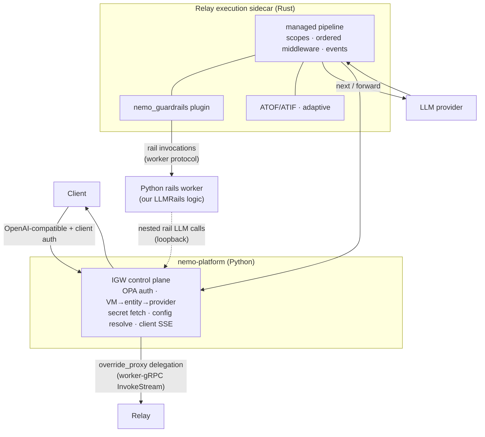
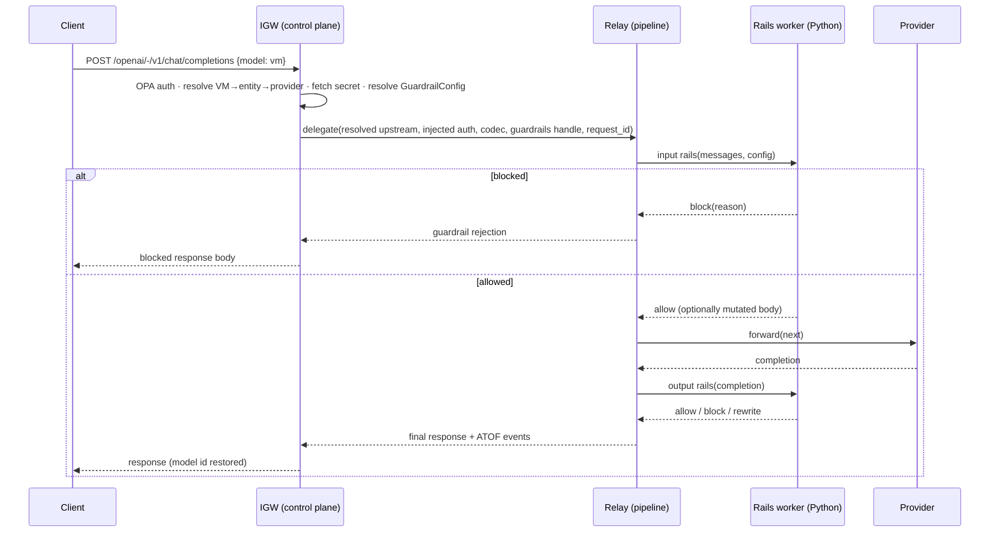

# Guardrails in the Merged IGW + Relay Runtime — Design

This document specifies **how** guardrails works once NeMo Relay and the Inference
Gateway (IGW) are merged into a single runtime. It deliberately does not argue *why*
we merge or *whether* to; it assumes the merge happens along the only shape where
guardrails is a real integration problem — **shared core** — and answers the open
mechanics end to end.

## Assumptions (the committed shape)

1. **Relay's `crates/core` managed pipeline is the execution engine (data plane).**
   Ordered middleware, scopes, lifecycle events, ATOF/ATIF, adaptive.
2. **IGW stays the control plane (Python/FastAPI).** HTTP ingress, OPA auth,
   VirtualModel → ModelEntity → Provider resolution, Secrets, config, client-facing
   streaming.
3. **IGW does not forward to providers itself anymore.** It resolves the call and
   **delegates execution to a Relay sidecar**, which runs the pipeline and forwards.
4. **Guardrails is a single component** in that pipeline. Relay's built-in Rust
   `nemo_guardrails` plugin is **disabled**; our platform guardrails logic (LLMRails)
   is the one rails brain.

## Target topology

Two boundaries, both reusing Relay's existing worker gRPC protocol
(`NeMo-Relay/crates/worker-proto/.../plugin_worker.proto`: `Invoke` / `InvokeStream`
/ `CancelInvocation`, with `RelayHostRuntime` callbacks for `LlmNext`):

- **IGW ↔ Relay** — execution delegation (control plane → data plane).
- **Relay ↔ rails worker** — the guardrails plugin calls Python LLMRails logic
  (a generalization of Relay's existing `local` mode, which already spawns a
  `python3` subprocess for `nemoguardrails`).

## Request flow

### Non-streaming

### Streaming

Relay owns the provider byte↔chunk boundary; IGW re-encodes the final chunk stream to
the client. This **removes IGW's current double-parse** (`_parse_sse_stream` →
transform → `_sse_gen`) and **fixes the gap where post-response middleware is skipped
for streaming**, because Relay's chunk-level event model runs output rails on the
decoded stream.

## Answers to the open questions (the "how")

### 1. The boundary — which mechanism, which process embeds which

**Relay runs as an execution sidecar; IGW is the caller.** IGW's proxy step delegates
via the **`override_proxy`** hook (already in the VirtualModel schema and CRUD at
`packages/nemo_platform_plugin/.../inference_middleware.py`, but **not yet wired** in
`services/core/inference-gateway/.../api/proxy.py::virtual_model_proxy`). Wiring it is
the single IGW code change that turns "aiohttp forwards" into "delegate to Relay."

Chosen wire contract: **Relay's worker-gRPC `InvokeStream`**, reused as the
execution-delegation RPC. Rationale (how, not why): it already exists, is
bidirectional/streaming, carries structured metadata, and supports host callbacks — so
Relay-side plugins can call back to the host if needed. This avoids PyO3 (Tokio↔asyncio
bridging, manylinux packaging, shared-process crash blast radius) and avoids the
"two proxies in series" of plain sidecar HTTP.

The delegation payload carries: resolved upstream URL, injected provider auth header,
`backend_format`/codec, the request body, a **resolved guardrails config handle**, and
the platform `request_id`.

### 2. Exactly-once enforcement (no double-fire, no bypass)

- Relay's built-in Rust `nemo_guardrails` plugin is **never enabled** in the platform
  build. The platform generates Relay plugin config (see #3); it emits **at most one**
  guardrails component, sourced from our Python rails worker.
- Because IGW delegates execution rather than forwarding, guardrails cannot both run
  in IGW *and* in Relay — it runs once, in the pipeline.
- Relay's `remote` mode (which **replaces** the provider call and would route around
  IGW) is **not used**; our worker wraps `next` (input rails → provider → output
  rails), so the provider forward always flows through the pipeline.

### 3. Config source of truth

**Entity-store `GuardrailConfig` stays canonical. `plugins.toml` is not used in
platform mode.** IGW already resolves `GuardrailConfig` at VirtualModel-resolve time
(`GuardrailsMiddleware.get_middleware_config` → `sdk.guardrail.configs.retrieve`). In
the target:

1. IGW resolves the `GuardrailConfig` for the VM (unchanged).
2. IGW passes it as the **guardrails config handle** in the delegation RPC.
3. Relay hands it to the rails worker; the worker builds/caches LLMRails from it
   (reusing `llmrails_cache.py`'s stabilization keyed on workspace/name/updated_at).

Relay's native plugin config (`plugins.toml`) is *generated* from VirtualModel entities
for any non-platform (CLI/OSS) use; the platform path never hand-authors it. This
kills the "two editors" problem: one editor (entity store), one generator.

### 4. Nested rail LLM calls (loopback)

Unchanged: the rails worker's internal LLM calls (e.g. a self-check rail) target IGW's
OpenAI-compatible loopback via `get_openai_compatible_inference_url_and_model()`.
IGW is still the ingress/control plane, so the loopback resolves exactly as today. The
rail model is a *different* VirtualModel (typically without guardrails), so there is no
recursion through the delegation path. We keep loopback pointed at IGW (not the Relay
sidecar) so rail traffic gets the same auth/secret/resolution treatment as user
traffic.

### 5. Streaming contract (who owns byte↔chunk)

**Relay owns the provider stream.** It decodes provider SSE per codec into chunks,
runs output rails through the worker on those chunks, and streams results back over
`InvokeStream`. IGW's streaming shrinks to re-encoding Relay's final chunk stream to
the client (its existing `_sse_gen`). Net: one decode (Relay), one client re-encode
(IGW), output rails run on streamed chunks, and post-response actions run for streaming
(fixing today's limitation). The blocking/rewrite semantics of
`plugins/nemo-guardrails/src/nemo_guardrails_plugin/streaming.py` port directly onto
the chunk iterator the worker receives.

### 6. Auth / secrets

**IGW keeps sole ownership of credentials.**
- Client `Authorization` is validated by OPA at ingress and **never forwarded** (IGW
  already drops it in `REQUEST_HEADERS_TO_DROP`).
- IGW fetches the provider secret (Secrets service) and injects the rendered auth
  header into the **delegation RPC**, not into anything client-visible.
- Relay forwards to the provider with that injected credential. The Relay sidecar lives
  on the trusted internal network; the delegation RPC is the only place the short-lived
  provider credential travels, host→sidecar.

### 7. `nemoguardrails` version

**Single pin, no conflict.** Guardrails runs in exactly one Python environment — the
platform-owned rails worker — so `nemoguardrails` is pinned once there (the platform's
current pin). Relay's `local`-mode hard-coded `0.22.0` is irrelevant because we replace
that stock worker with the platform worker. There is no two-version problem.

### 8. Cross-runtime correlation / observability

IGW generates a `request_id` at ingress and passes it in the delegation RPC. Relay maps
it onto a scope/session id and stamps it on ATOF/ATIF events; the rails worker logs
under the same id. Guardrail decisions (blocked/allowed, config id, rail timings)
surface as ATOF marks, so a single trace spans control plane → pipeline → rails →
provider.

## What changes in our plugin code

The rail *logic* is reused almost verbatim; only the **adapter layer** changes.

| Concern | Today (`NemoInferenceMiddleware`) | Target (Relay Python worker plugin) |
|---|---|---|
| Entry surface | `process_request` / `process_response` | LLM input-intercept (wrap `next`) / output-intercept |
| Request type | `InferenceRequest` (body/headers/path) | Relay `LlmRequest` (headers map + `content` JSON) |
| Block signal | return `ImmediateResponse` | worker block result → Relay `GuardrailRejected` |
| Forward | IGW aiohttp `func` | Relay `next` (`LlmNext` host callback) |
| Strip `guardrails` field | `sanitize_request_body_for_proxy` | same, before `next` |
| Config fetch | `get_middleware_config` (SDK) | receive resolved handle from Relay (config resolved by IGW) |
| Nested loopback | `get_openai_compatible_inference_url_and_model` | unchanged (targets IGW) |
| Reused verbatim | — | `llmrails_cache`, `rails`, `responses`, `streaming`, `transforms`, `requests` |

Net: a new thin `relay_worker.py` adapter that registers the intercepts and translates
Relay request/response shapes to the existing helpers. `middleware.py`'s IGW-specific
glue (`ctx.state`, `ImmediateResponse`, `InferenceRequest`) is replaced; everything
below it stays.

## Migration phases (how to get there)

- **Phase 0 (throwaway spike):** register Relay as a plain upstream provider (sidecar
  HTTP), keep guardrails as IGW middleware, disable Relay's built-in guardrails.
  Measure streaming correctness, latency, and where auth breaks. Uses existing
  `e2e/guardrails/test_chat_completions.py`.
- **Phase 1 (minimal real merge):** wire `override_proxy` in `virtual_model_proxy()`
  to delegate execution to the Relay sidecar over worker-gRPC. Guardrails **still runs
  as IGW middleware** wrapping the delegate — our plugin is unchanged. This proves the
  delegation path with zero guardrails risk.
- **Phase 2 (guardrails into the pipeline):** ship the `relay_worker.py` adapter; move
  guardrails from IGW middleware into the Relay pipeline as the Python rails worker;
  generate Relay guardrails config from VirtualModel entities; IGW stops running
  guardrails middleware. Now uniform and exactly-once by construction.
- **Phase 3 (cleanup):** retire duplicate config/observability paths; unify on
  ATOF/ATIF; delete the interim IGW-middleware guardrails path.

## Residual risks / things to validate in the spike

- Rail-call latency across the worker boundary under streaming load.
- Faithful port of streaming block/rewrite semantics onto Relay's chunk iterator.
- Config-handle size/serialization for large `GuardrailConfig` blobs in the RPC.
- Loopback auth when rail traffic re-enters IGW from the sidecar network.
- Backpressure/cancellation: map client disconnect → `CancelInvocation` → provider
  abort.

## Appendix — current state & references

| | Our plugin (`plugins/nemo-guardrails`) | Relay's built-in `nemo_guardrails` |
|---|---|---|
| Host | Python, in IGW | Rust, Relay `crates/core` |
| Interface | `NemoInferenceMiddleware` | execution intercepts wrapping `next` |
| Modes | in-process LLMRails | `remote` (HTTP) / `local` (python3 subprocess) |
| Config | entity store `GuardrailConfig` | `plugins.toml` |
| Blocking | `ImmediateResponse` | `remote` replaces provider call |

- Our middleware: `plugins/nemo-guardrails/src/nemo_guardrails_plugin/middleware.py`
- Middleware ABC + `override_proxy`: `packages/nemo_platform_plugin/src/nemo_platform_plugin/inference_middleware.py`
- IGW pipeline / streaming: `services/core/inference-gateway/src/nmp/core/inference_gateway/api/proxy.py`
- Relay guardrails: `NeMo-Relay/crates/core/src/plugins/nemo_guardrails/{python.rs,remote.rs}`
- Relay worker protocol: `NeMo-Relay/crates/worker-proto/proto/nemo/relay/worker/v1/plugin_worker.proto`
- Relay Python worker SDK: `NeMo-Relay/python/plugin/` + `nemo_relay_plugin`
