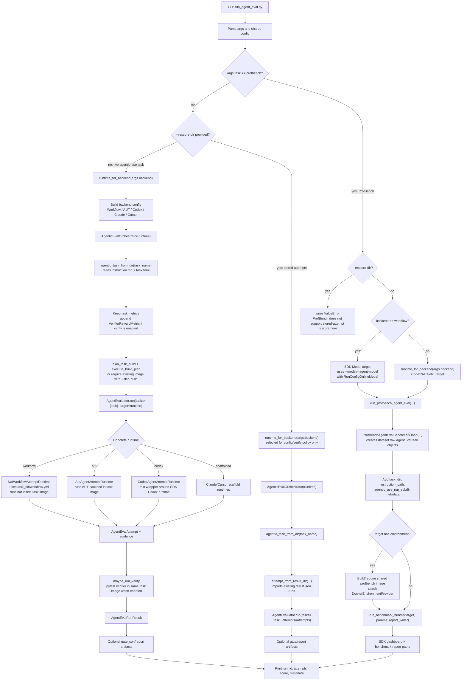

# Agentic-Use Runtime Architecture

This package adapts the task directories under `tests/agentic-use/` to the
Evaluator SDK `AgentEvaluator` APIs. It separates three concerns:

- CLI routing in `run_agent_eval.py`
- backend-specific attempt generation in runtime classes
- shared task loading, build, layout, verification, and reporting helpers

## Runtime Package Model

The core contract is simple: every backend runtime implements the SDK
`AgentAttemptRuntime` shape by exposing `run_tasks(tasks, config)`. A runtime
receives one or more `AgentEvalTask` objects and returns `AgentEvalAttempt`
objects containing the candidate answer plus evidence metadata.

`AgenticEvalOrchestrator` is the normal agentic-use path. It loads one task
directory, builds that task image, runs the selected runtime through
`AgentEvaluator`, optionally runs verify, and writes gate/report artifacts.

`run_agent_eval.py --task profbench` is intentionally special. ProfBench rows are
loaded from the SDK `ProfBenchAgentEvalBenchmark`, not from a task-local
`instruction.md`. For `--backend workflow`, candidate generation uses an SDK
`Model` target directly instead of the NAT `workflow.yml` runtime because
ProfBench prompts are pure model-answer tasks and do not need NeMo MCP tools.

## Execution Workflow

## Important Current Changes

- `run_agent_eval.py` now has explicit CLI parsing so tests can call `_main(argv)`.
  It routes normal tasks, stored-attempt rescoring, and ProfBench separately.
- `CodexAgentAttemptRuntime` is no longer a scaffold. It delegates to the SDK
  local Codex runtime, or the SDK Docker Codex runtime when `--codex-auth-json`
  is supplied.
- `runtimes/profbench.py` owns the special ProfBench path: it loads SDK benchmark
  rows, attaches live judge config, and only uses the task directory for runtime
  environment metadata.
- `shared/layout.py` honors `task.metadata["agentic_use_run_subdir"]` under an
  explicit SDK `output_dir`, and rejects subdirs that escape the output root.

## Why ProfBench Bypasses `workflow.yml`

Normal `--backend workflow` means: load a task directory, mount its
`workflow.yml`, and execute `nat run` inside the task image.

ProfBench `--backend workflow` currently means something different: use the
Evaluator SDK online `Model` target to answer ProfBench dataset prompts. That
path never constructs `NatWorkflowAttemptRuntime`, so it never reads the
ProfBench task directory's `workflow.yml`.

Because of that, a `tests/agentic-use/profbench/workflow.yml` file is not
required by the new ProfBench route. If kept, it should be renamed or clearly
excluded from generic task execution so it does not look like a normal runnable
agentic-use workflow.
