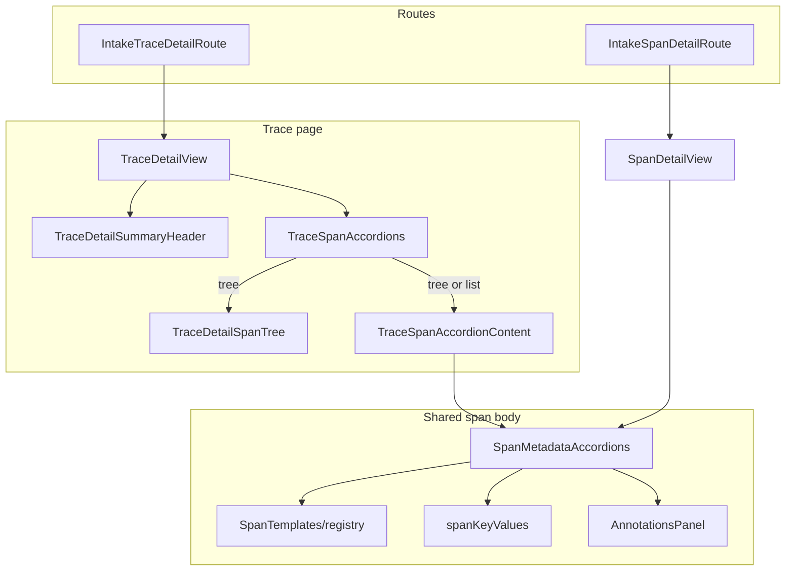

<!--
SPDX-FileCopyrightText: Copyright (c) 2025-2026 NVIDIA CORPORATION & AFFILIATES. All rights reserved.
SPDX-License-Identifier: Apache-2.0
-->

# Intake Detail

Trace and span detail UI: trajectory explorer, per-span bodies, kind templates, and shared atoms. List views (traces/spans tables) live in `IntakeLists/`.

## Architecture



| Layer                         | Role                                                                                     |
| ----------------------------- | ---------------------------------------------------------------------------------------- |
| **Routes**                    | Thin wrappers; resolve workspace + id, set breadcrumbs.                                  |
| **TraceDetailView**           | Page header, trace summary, span explorer, trace-level Metadata accordion.               |
| **TraceSpanAccordions**       | Fetches spans (detailed mode), annotations; Tree/List toggle; row headers + feedback.    |
| **TraceSpanAccordionContent** | Lazy `useGetSpan` when a row opens; merges list summary with full detail.                |
| **SpanMetadataAccordions**    | Single source of truth for span body — used in trace explorer and standalone span page.  |
| **SpanTemplates/**            | Per-`SpanKind` descriptors + content components; registered in `registry.ts`.            |
| **IntakeComponents/**         | Shared UI: key/value grids, payloads, status badges, `spanKeyValues` / `traceKeyValues`. |

## Tree vs list layout

`TraceSpanAccordions` exposes a **Tree | List** toggle. Both views share row headers (`SpanTriggerLabel`, `SpanTriggerMeta`, `SpanFeedbackControls`) and the same body via `TraceSpanAccordionContent` → `SpanMetadataAccordions`.

|                | **Tree**                                                           | **List**                                    |
| -------------- | ------------------------------------------------------------------ | ------------------------------------------- |
| **Layout**     | `TraceDetailSpanTree` (left) + one selected span (right)           | Flat `IntakeAccordion` of every span        |
| **Selection**  | Click tree node → show that span's body                            | Expand accordion row inline                 |
| **Expand all** | Opens every _section_ of the selected span                         | Opens every _span row_                      |
| **Data**       | `buildSpanTree` for nav; `buildSpanHierarchyRows` for row metadata | Same span rows, hierarchy indent in trigger |

Tree view defaults to the first (root) span. List view lazy-loads each span only when its row is open.

## Span templates

A template is two files plus a registry entry:

1. **`*SpanTemplate.ts`** — descriptor: `sections`, `defaultOpen`, `attributeNamespaces`, optional `headerTitle` / `headerBadge`
2. **`*SpanContent.tsx`** — elevated kind body (rendered above accordions when `sections` includes `'kind'`)
3. **`registry.ts`** — `SPAN_TEMPLATES[kind] = …`; unknown kinds fall back to `DefaultSpanTemplate`

### Data sources

| Source                  | Used for                                                                                |
| ----------------------- | --------------------------------------------------------------------------------------- |
| Typed `Span` fields     | Model, tokens, cost, input/output, status, errors, ids, timestamps                      |
| `raw_attributes` (JSON) | Kind-specific telemetry not promoted to typed fields (e.g. `retrieval.documents.*`)     |
| `useGetSpan`            | Full payload when a trace row expands (merged with list summary via `mergeSpanDetails`) |

Templates read `raw_attributes` through `SpanTemplates/rawAttributes.ts` (`parseRawAttribute`, `collectIndexedEntries`, kind-specific extractors). Display helpers live in `templateFields.tsx` (`TemplateKeyValues`, `RankedDocumentList`).

### How `SpanMetadataAccordions` renders

1. **Error banner** — failed spans
2. **Kind body** — `template.Content` when `sections` includes `'kind'`
3. **Section accordions** — driven by `template.sections` (subset of `kind`, `llm`, `input`, `output`, `metadata`, `annotations`):

| Section            | Body                                                             |
| ------------------ | ---------------------------------------------------------------- |
| `llm`              | Usage grid (tokens/cost; model params stay in kind body for LLM) |
| `input` / `output` | `SpanPayloadBlock`                                               |
| `metadata`         | `buildSpanSummaryEntries`                                        |
| `annotations`      | `AnnotationsPanel` (+ count badge)                         |

### Metadata catchall

Metadata is **maintenance-free**: whatever is not shown elsewhere.

`buildSpanSummaryEntries` concatenates:

1. **Catalogued fields** — `SPAN_SUMMARY_DESCRIPTORS` (minus keys already in the row header or error banner)
2. **Unmapped typed fields** — any `Span` property not handled by descriptors, LLM section, or templates
3. **Unclaimed `raw_attributes`** — dotted keys **not** under `template.attributeNamespaces`

Claiming a namespace (e.g. `retrieval` for RETRIEVER) removes those keys from Metadata so the kind body is the single source of truth. New telemetry in `raw_attributes` appears in Metadata automatically until a template claims it.

### Adding a kind

```text
SpanTemplates/MyKindSpanContent.tsx   # elevated UI
SpanTemplates/MyKindSpanTemplate.ts    # sections, attributeNamespaces, optional header overrides
registry.ts                            # register under SpanKind
```

Omit sections the kind does not need (e.g. RETRIEVER has no `input`/`output`/`llm`). Omit `'kind'` only for generic fallback behavior (`DefaultSpanTemplate`).
